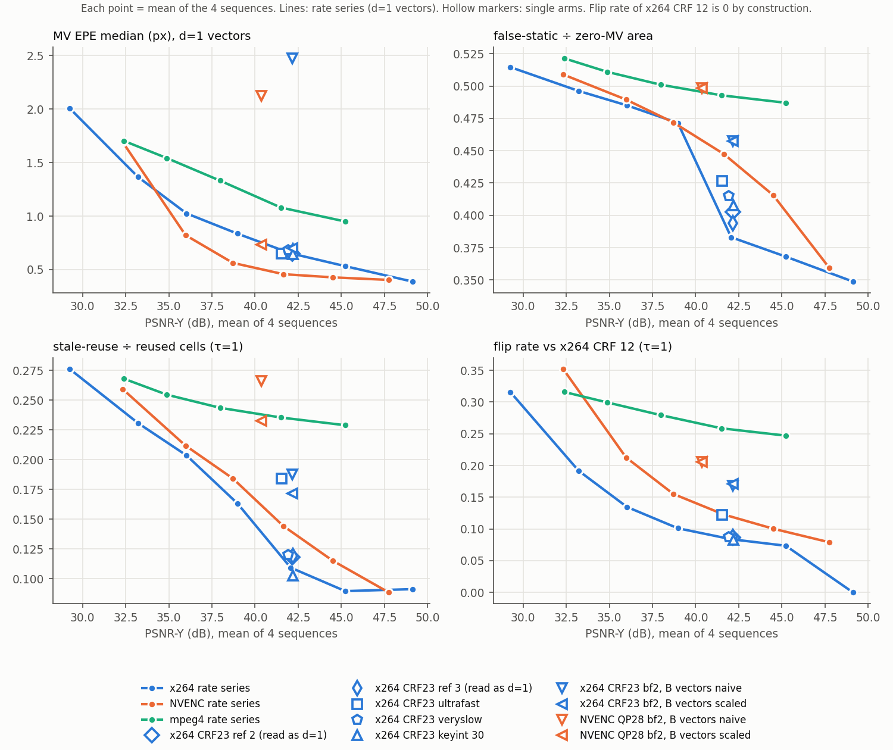
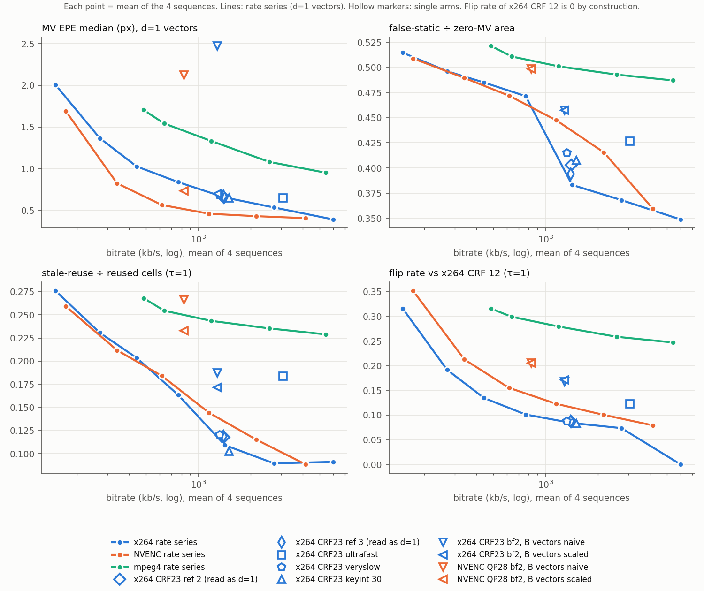

# Paper 3 pilot: codec MVs vs Sintel GT (exploratory)

Exploratory pilot. No claims; the numbers are reported as they came out, with no tuning or reruns.

- Sequences (final pass), with pixel static share: alley_1 (0.0015), ambush_5 (0.0059), ambush_7 (0.7936), bandage_2 (0.5553)
- Git b0c66fdee5 on `sonu/p3`; PyAV 17.1.0, FFmpeg 8.1.1, x264 - core 165 (the SEI carries no revision), NVIDIA NVIDIA GeForce RTX 4050 Laptop GPU, 610.74
- Start 2026-09-29T18:38:05+05:30; total pilot runtime **5.1 min**; failures: **0**
- GT: `lib/gt_grid.py` (forward splat onto frame t's 4×4 grid); blocks and cells with gt_cover < 0.5 are excluded. All rates are area-weighted. The per-sequence gate and headline groups are defined in `run_pilot.py`'s docstring.
- Tables show τ = 1 px for the gate metrics. `results.csv` has τ ∈ {0.5, 1, 2} and every vector group.

## Reading guide

- **Headline group:** P-frame vectors with d = 1 (the whole of every bf 0 arm). For ref 2/3 the group is "d1(assumed)", because d is unknown there and read as 1.
- **Gate:** reuse if |MV| < τ. Flip rate is measured against x264 CRF 12, on the same display frame and cell.
- **Mean-of-4 caveat.** For ratio metrics (precision, false-static ÷ zero-MV, stale ÷ reused), the mean of four blends two regimes:
  - ambush_7 and bandage_2 have large static areas (pixel static share 0.79 / 0.56). Reuse precision there is 0.80–0.99.
  - alley_1 and ambush_5 are almost entirely moving (static share 0.0015 / 0.0059). Reuse precision there is 0.004–0.06, because there is almost nothing static to reuse.

  So the per-sequence columns are the ones to read, and a mean near 0.5 describes none of the four.

## What moved the gate (exploratory; τ = 1 unless noted)

**Which factor moves it most.** The quantiser. Along x264 CRF 12 → 45 (mean of 4):
- flip rate goes 0 → 0.316
- stale ÷ reused goes 0.091 → 0.276
- median EPE goes 0.39 → 2.01 px

Stale ÷ reused per sequence, CRF 12 → 45:

| sequence | CRF 12 | CRF 45 |
|---|---|---|
| alley_1 | 0.008 | 0.121 |
| ambush_5 | 0.351 | 0.868 |
| ambush_7 | 0.002 | 0.051 |
| bandage_2 | 0.004 | 0.064 |

The NVENC QP 18 → 45 series moves about as much: flip 0.079 → 0.352, stale 0.089 → 0.259. mpeg4 moves less across its whole q range (flip 0.247 → 0.316, stale 0.229 → 0.268), but it starts high.

**Encoder.** Compared near matched PSNR (x264 CRF 23 at 42.1 dB, NVENC QP 28 at 41.6 dB, mpeg4 q 4 at 41.5 dB, all mean of 4):

| | x264 CRF 23 | NVENC QP 28 | mpeg4 q 4 |
|---|---|---|---|
| flip rate | 0.084 | 0.123 | 0.259 |
| stale ÷ reused | 0.109 | 0.144 | 0.235 |
| median EPE | 0.65 | 0.46 | 1.08 |

NVENC has the lower EPE but the higher stale rate. That's a single matched point, not a curve.

**Other x264 settings at CRF 23:**
- **preset:** ultrafast raises stale to 0.184 (alley_1 0.169 vs 0.012 at medium) and flip to 0.122, at 2–3× the bitrate. Veryslow is within about 0.01 of medium (stale 0.120 vs 0.109, flip 0.088 vs 0.084).
- **ref 2/3 (read as d=1):** negligible change. Median EPE +0.02 px, stale +0.01, flip +0.003.
- **keyint 30:** negligible change (stale −0.006, flip −0.002).

The pilot can't see how many ref 2/3 blocks actually used t−2. The small change is consistent with x264 mostly choosing t−1 on this content, unlike the synthetic shift in validation A.

**Steady or inverted-U.** Using the GT metrics (flip rate is 0 at CRF 12 by construction):
- **Mean of 4, x264 CRF series:** EPE, EPE > 3 px, and false-static ÷ zero-MV rise steadily; precision falls steadily. Stale ÷ reused is flat from CRF 12 to 18 (0.091, 0.090), then rises. Recall is U-shaped (0.56 → 0.54 → 0.67).
- **Per sequence, it is not uniformly steady:**
  - **ambush_7 EPE is inverted-U** under x264: 0.53 → 0.90 at CRF 28 → 0.25 at CRF 45. At high CRF the static background turns into exact-zero vectors (zero-MV share 0.13 → 0.64), and zero is its true motion. Its recall is U-shaped (0.42 → 0.81) for the same reason. At low CRF, x264 codes small non-zero vectors on a background that is 79% static.
  - **Under NVENC, ambush_7 EPE falls steadily** (0.42 → 0.23).
  - **alley_1 false-static ÷ zero-MV peaks at CRF 38** (0.95), then drops to 0.905.
  - **Stale ÷ reused and precision are the steadiest metrics.** Under x264, stale is monotone in 3 of 4 sequences; ambush_5 dips 0.351 → 0.341 at CRF 18. Precision falls steadily in every sequence and encoder except alley_1 under x264 and NVENC, where it first edges up (for example 0.015 → 0.018) at values that are near zero anyway.
- The per-sequence shape table is below.

**B-frames and ref>1 vs QP (ANVIL).** ref>1 barely moves anything (above). B-frames move the gate about as much as a large QP step:
- **x264 CRF 23:** bf2's B vectors vs the bf 0 d=1 vectors: stale 0.187 vs 0.109, flip 0.168 vs 0.084. That's about the gap between CRF 23 and CRF 33 on stale (0.204), and between CRF 33 and 38 on flip (0.135 / 0.192).
- **NVENC QP 28:** bf2's B vectors vs bf 0: stale 0.266 vs 0.144, flip 0.205 vs 0.123. That's at the level of QP 38–45 on stale (0.212–0.259) and about QP 38 on flip (0.213).

The naive vs scaled split separates two things:
- **EPE gap: mostly reference distance.**
  - x264 B vectors: naive 2.47 → scaled 0.70 (mean of 4). Per sequence, alley_1 2.38 → 0.18, ambush_7 0.26 → 0.24.
  - x264 P-frames with d = 2–3: naive 3.52 → scaled 0.79.
  - The exception is ambush_5: scaled B EPE is 2.26, vs 1.35 for bf 0. That's where the steady-motion assumption behind scaling is least likely to hold.
- **Gate gap: mostly not reference distance.**
  - For B vectors, scaling moves stale only 0.187 → 0.171 (x264) and 0.266 → 0.233 (NVENC). Flip doesn't move at all (0.168 → 0.171; 0.205 → 0.206).
  - So the B-frame gate shift looks like it comes from the B vectors themselves.
  - Those vectors are coded coarser: mean B-frame QP is 27.3 vs 23.9 for P (x264), and 36 vs 28 for NVENC. The B-frame comparison is therefore confounded with QP.
  - For P-frames at d = 2–3, the gate gap *is* mostly reference distance: stale naive 0.234 → scaled 0.119, vs 0.109 at bf 0.

## Failures, odd things, runtime

- **Failures:** none. All 100 encode × sequence runs succeeded. Runtimes:
  - step 0 (static scan over 1041 flow files): not separately timed
  - pilot: **306 s**, of which 12 s was loading GT and images once
  - summary: seconds
  - Per run: about 3.3 s. ref 2/3 and B-frame arms took about 1 s, because compare.py's `gt_src` runs only for known-d=1 P vectors. Veryslow took 3.7 s (only 50 frames).
- **x264 adaptive B placement** (`b_adapt=1`, not disabled by the spec) gives different frame patterns per sequence. For example, ambush_5 is `…BPBPPBPBPBPPPBPBPPPPPPBP`, and bandage_2 has many P-P runs.
  - In x264's bf2 arm, the "d1" P-frames are therefore the high-motion frames: in ambush_5, 8 frames with GT 7–28 px. Hence precision 0, and stale ÷ reused = 1.0 (2196 of 2197 reused cells). That's a selection effect, not a measurement error.
- **NVENC bf2 ends in `…BPP`,** so its d1 group is one frame per sequence. On ambush_5 that frame (49) has GT motion of about 55 px while NVENC's vectors are about 0 (EPE 55 px). compare.py's source-position GT agrees (53 px), so this is not an artifact of the frame-t grid.
- **Different QP scales:**
  - NVENC constqp puts I-frames at QP 22 and B-frames at 36 when QP is 28.
  - mpeg4's exported QP is 2×q (the MPEG-2 qscale convention), e.g. q 4 → 8.0.
  - The "mean P QP" column shows these as the decoder exports them.
- **ambush_5 is the hardest sequence.**
  - 13.6% of its in-frame cells are excluded (gt_cover < 0.5), vs about 2% elsewhere.
  - MV coverage is 64.5% at CRF 12 (many intra blocks).
  - EPE > 3 px covers 29–75% of its area.
- **Low-QP noise-chasing on ambush_7:** at CRF 12 only 13% of valid area has zero MV, on a sequence where 79% of pixels are static, so reuse recall is 0.42.
- **Scaled vectors can beat bf 0 d=1 on EPE:** alley_1 B scaled 0.18 and P d>1 scaled 0.08, vs 0.23 at bf 0. One possible reason is that dividing a quarter-pel vector by d gives finer effective precision. These are also different frames.
- **ref 2/3 are only 1–2% smaller** than ref 1 at CRF 23. Ultrafast is 2–3× the bitrate of medium.
- **mpeg4's flip rate is high even at q 2** (0.25). It uses a different block structure (16×16/8×8, half-pel) from the x264 reference.
- **x264 version:** the build reports "x264 - core 165" with no revision string.

## Plots

## Factor effect: range (max − min) across each factor's arms, mean of the 4 sequences

| factor | EPE med | false-static/zero | stale/reused@1 | prec@1 | recall@1 | flip@1 |
|---|---|---|---|---|---|---|
| CRF (x264 medium, ref 1, bf 0) | 1.6168 | 0.1659 | 0.1864 | 0.0580 | 0.1305 | 0.3156 |
| NVENC QP (constqp, p4, refs 1, bf 0) | 1.2864 | 0.1496 | 0.1707 | 0.0568 | 0.2159 | 0.2727 |
| mpeg4 q (qmin=qmax=q, bf 0) | 0.7539 | 0.0344 | 0.0391 | 0.0278 | 0.0849 | 0.0688 |
| ref (x264 CRF 23 medium, bf 0; ref 2/3 read as d=1) | 0.0202 | 0.0198 | 0.0099 | 0.0011 | 0.0061 | 0.0035 |
| preset (x264 CRF 23, ref 1, bf 0) | 0.0351 | 0.0436 | 0.0746 | 0.0104 | 0.0128 | 0.0385 |
| keyint (x264 CRF 23 medium) | 0.0075 | 0.0244 | 0.0067 | 0.0012 | 0.0055 | 0.0015 |
| encoder (closest mean PSNR to x264 CRF 23) | 0.6225 | 0.1098 | 0.1260 | 0.0332 | 0.2707 | 0.1748 |
| bframes: B naive vs bf0 d1 (x264 and NVENC arms pooled; see narrative for per-encoder) | 2.0164 | 0.1153 | 0.1570 | 0.0239 | 0.2349 | 0.1214 |
| bframes: B scaled vs bf0 d1 (x264 and NVENC arms pooled) | 0.2745 | 0.1153 | 0.1235 | 0.0274 | 0.2771 | 0.1218 |

## Shape along the rate series (mean of 4, headline d=1 vectors, arms ordered low → high QP)

| series | EPE median | EPE>3 % | false-static/zero | stale/reused@1 | precision@1 | recall@1 |
|---|---|---|---|---|---|---|
| x264 CRF | monotone ↑ (0.388, 0.532, 0.652, 0.836, 1.03, 1.37, 2.01) | monotone ↑ (12.7, 15.3, 17, 19.5, 22.3, 26, 31.1) | monotone ↑ (0.349, 0.368, 0.383, 0.471, 0.485, 0.496, 0.515) | U (min at arm 2) (0.0912, 0.0896, 0.109, 0.163, 0.204, 0.231, 0.276) | monotone ↓ (0.496, 0.495, 0.492, 0.485, 0.476, 0.467, 0.438) | U (min at arm 5) (0.563, 0.562, 0.56, 0.557, 0.539, 0.556, 0.67) |
| NVENC QP | monotone ↑ (0.404, 0.428, 0.457, 0.563, 0.822, 1.69) | U (min at arm 3) (14.9, 14.6, 13.6, 15.1, 17.8, 24.6) | monotone ↑ (0.359, 0.416, 0.447, 0.472, 0.49, 0.509) | monotone ↑ (0.0885, 0.115, 0.144, 0.184, 0.212, 0.259) | monotone ↓ (0.497, 0.489, 0.483, 0.475, 0.463, 0.44) | non-monotone: +++−+ (0.597, 0.691, 0.712, 0.739, 0.735, 0.813) |
| mpeg4 q | monotone ↑ (0.95, 1.08, 1.33, 1.54, 1.7) | monotone ↑ (18.5, 19.5, 21.2, 23.7, 25.8) | monotone ↑ (0.487, 0.493, 0.501, 0.511, 0.521) | monotone ↑ (0.229, 0.235, 0.244, 0.254, 0.268) | monotone ↓ (0.462, 0.459, 0.452, 0.443, 0.434) | inverted-U (peak at arm 2) (0.821, 0.831, 0.828, 0.825, 0.746) |

Per sequence (mean-of-4 mixes static-rich and fully-moving sequences, so the shape can differ):

| series | sequence | EPE median | false-static/zero | stale/reused@1 | precision@1 | recall@1 |
|---|---|---|---|---|---|---|
| x264 CRF | alley_1 | monotone ↑ (0.205, 0.216, 0.233, 0.262, 0.308, 0.406, 0.891) | inverted-U (peak at arm 6) (0.551, 0.602, 0.634, 0.916, 0.939, 0.953, 0.905) | monotone ↑ (0.00773, 0.00965, 0.0116, 0.0393, 0.0822, 0.106, 0.121) | inverted-U (peak at arm 3) (0.0153, 0.016, 0.0181, 0.0163, 0.0087, 0.00516, 0.00429) | non-monotone: ++−−−+ (0.651, 0.679, 0.703, 0.693, 0.502, 0.391, 0.597) |
| x264 CRF | ambush_5 | monotone ↑ (0.699, 1.03, 1.35, 2, 2.89, 4.29, 6.13) | non-monotone: ++++−+ (0.838, 0.862, 0.887, 0.948, 0.956, 0.953, 0.971) | U (min at arm 2) (0.351, 0.341, 0.417, 0.597, 0.701, 0.768, 0.868) | monotone ↓ (0.0553, 0.0494, 0.0429, 0.0282, 0.0198, 0.0123, 0.00731) | U (min at arm 4) (0.256, 0.227, 0.218, 0.215, 0.292, 0.404, 0.533) |
| x264 CRF | ambush_7 | inverted-U (peak at arm 4) (0.53, 0.753, 0.878, 0.903, 0.625, 0.288, 0.252) | U (min at arm 2) (0.003, 0.00297, 0.00324, 0.00544, 0.0128, 0.0156, 0.057) | monotone ↑ (0.00218, 0.00224, 0.00257, 0.00425, 0.00967, 0.0137, 0.0506) | monotone ↓ (0.994, 0.994, 0.994, 0.991, 0.985, 0.98, 0.939) | U (min at arm 3) (0.424, 0.423, 0.411, 0.431, 0.518, 0.649, 0.805) |
| x264 CRF | bandage_2 | monotone ↑ (0.119, 0.134, 0.147, 0.184, 0.278, 0.476, 0.75) | monotone ↑ (0.00265, 0.00489, 0.00805, 0.0169, 0.032, 0.0627, 0.126) | monotone ↑ (0.00424, 0.0052, 0.00632, 0.0124, 0.0208, 0.0349, 0.0644) | monotone ↓ (0.921, 0.919, 0.914, 0.906, 0.891, 0.87, 0.803) | monotone ↓ (0.923, 0.918, 0.908, 0.89, 0.845, 0.779, 0.745) |
| NVENC QP | alley_1 | non-monotone: +−+++ (0.217, 0.227, 0.224, 0.228, 0.289, 1.08) | inverted-U (peak at arm 5) (0.603, 0.772, 0.862, 0.914, 0.921, 0.887) | non-monotone: +++−+ (0.0105, 0.0264, 0.0514, 0.106, 0.0886, 0.107) | inverted-U (peak at arm 2) (0.0147, 0.0159, 0.0121, 0.00905, 0.00439, 0.00266) | non-monotone: +−−−+ (0.596, 0.64, 0.582, 0.581, 0.494, 0.658) |
| NVENC QP | ambush_5 | monotone ↑ (0.865, 1.08, 1.22, 1.64, 2.62, 5.28) | monotone ↑ (0.824, 0.862, 0.886, 0.915, 0.94, 0.964) | monotone ↑ (0.334, 0.416, 0.5, 0.591, 0.691, 0.806) | monotone ↓ (0.06, 0.0431, 0.0319, 0.023, 0.0155, 0.00895) | non-monotone: +++−+ (0.424, 0.665, 0.731, 0.758, 0.754, 0.793) |
| NVENC QP | ambush_7 | monotone ↓ (0.416, 0.279, 0.259, 0.246, 0.234, 0.227) | monotone ↑ (0.00309, 0.00557, 0.00892, 0.0176, 0.0408, 0.0816) | monotone ↑ (0.00253, 0.004, 0.00588, 0.0133, 0.0321, 0.0695) | monotone ↓ (0.994, 0.992, 0.988, 0.979, 0.957, 0.916) | monotone ↑ (0.447, 0.537, 0.615, 0.692, 0.767, 0.865) |
| NVENC QP | bandage_2 | monotone ↑ (0.118, 0.125, 0.13, 0.139, 0.151, 0.182) | monotone ↑ (0.00747, 0.0228, 0.0326, 0.0416, 0.0567, 0.102) | monotone ↑ (0.00631, 0.0139, 0.0199, 0.0267, 0.0348, 0.0546) | monotone ↓ (0.919, 0.907, 0.899, 0.889, 0.877, 0.832) | U (min at arm 2) (0.923, 0.921, 0.922, 0.923, 0.925, 0.937) |
| mpeg4 q | alley_1 | monotone ↑ (0.531, 0.663, 0.821, 1.01, 1.15) | non-monotone: ++−+ (0.887, 0.896, 0.899, 0.898, 0.899) | non-monotone: +−+− (0.0946, 0.102, 0.0977, 0.0993, 0.0987) | monotone ↓ (0.0048, 0.00447, 0.00391, 0.00358, 0.00343) | monotone ↑ (0.713, 0.756, 0.765, 0.793, 0.828) |
| mpeg4 q | ambush_5 | monotone ↑ (2.84, 3.22, 4.04, 4.67, 5.13) | monotone ↑ (0.948, 0.951, 0.955, 0.958, 0.967) | monotone ↑ (0.748, 0.759, 0.778, 0.792, 0.825) | monotone ↓ (0.0137, 0.0132, 0.012, 0.0113, 0.00781) | inverted-U (peak at arm 2) (0.823, 0.83, 0.823, 0.818, 0.546) |
| mpeg4 q | ambush_7 | inverted-U (peak at arm 4) (0.247, 0.251, 0.253, 0.256, 0.254) | monotone ↑ (0.0315, 0.0346, 0.0505, 0.0732, 0.0864) | monotone ↑ (0.026, 0.0292, 0.0421, 0.0623, 0.0739) | monotone ↓ (0.964, 0.961, 0.946, 0.925, 0.912) | monotone ↓ (0.809, 0.798, 0.788, 0.758, 0.73) |
| mpeg4 q | bandage_2 | monotone ↑ (0.175, 0.184, 0.206, 0.23, 0.278) | monotone ↑ (0.0817, 0.0895, 0.1, 0.115, 0.133) | monotone ↑ (0.0473, 0.0507, 0.056, 0.0643, 0.0744) | monotone ↓ (0.865, 0.857, 0.845, 0.833, 0.813) | monotone ↓ (0.94, 0.939, 0.937, 0.929, 0.879) |

## Gate across τ: x264 CRF series, d=1, mean of 4

| CRF | τ | flip | reused cells | precision | recall | stale/reused | stale/valid |
|---|---|---|---|---|---|---|---|
| 12 | 0.5 | 0.0000 | 1030207 | 0.538 | 0.425 | 0.1066 | 0.00190 |
| 12 | 1 | 0.0000 | 1319565 | 0.496 | 0.563 | 0.0912 | 0.00332 |
| 12 | 2 | 0.0000 | 2585361 | 0.449 | 0.716 | 0.0782 | 0.00966 |
| 18 | 0.5 | 0.0569 | 1013748 | 0.536 | 0.409 | 0.1119 | 0.00194 |
| 18 | 1 | 0.0735 | 1316353 | 0.495 | 0.562 | 0.0896 | 0.00340 |
| 18 | 2 | 0.0664 | 2614846 | 0.448 | 0.711 | 0.0814 | 0.01048 |
| 23 | 0.5 | 0.0658 | 990772 | 0.539 | 0.422 | 0.1449 | 0.00290 |
| 23 | 1 | 0.0839 | 1294639 | 0.492 | 0.560 | 0.1093 | 0.00440 |
| 23 | 2 | 0.0757 | 2607551 | 0.446 | 0.704 | 0.0937 | 0.01234 |
| 28 | 0.5 | 0.0841 | 1020471 | 0.509 | 0.382 | 0.2350 | 0.00760 |
| 28 | 1 | 0.1011 | 1335080 | 0.485 | 0.557 | 0.1633 | 0.00949 |
| 28 | 2 | 0.0929 | 2595788 | 0.443 | 0.690 | 0.1266 | 0.01834 |
| 33 | 0.5 | 0.1220 | 1174005 | 0.490 | 0.382 | 0.2615 | 0.01895 |
| 33 | 1 | 0.1346 | 1490944 | 0.476 | 0.539 | 0.2035 | 0.02103 |
| 33 | 2 | 0.1207 | 2664827 | 0.438 | 0.699 | 0.1652 | 0.03211 |
| 38 | 0.5 | 0.1847 | 1433133 | 0.479 | 0.449 | 0.2699 | 0.04411 |
| 38 | 1 | 0.1918 | 1763459 | 0.467 | 0.556 | 0.2307 | 0.04686 |
| 38 | 2 | 0.1698 | 2813387 | 0.435 | 0.749 | 0.2068 | 0.05904 |
| 45 | 0.5 | 0.3062 | 2134306 | 0.446 | 0.559 | 0.2916 | 0.11377 |
| 45 | 1 | 0.3156 | 2417551 | 0.438 | 0.670 | 0.2759 | 0.11751 |
| 45 | 2 | 0.2788 | 3205527 | 0.419 | 0.763 | 0.2638 | 0.13216 |

## Tables per factor (τ = 1; each sequence's value and the mean of the 4)

### CRF (x264 medium, ref 1, bf 0)

| arm | metric | alley_1 | ambush_5 | ambush_7 | bandage_2 | mean of 4 |
|---|---|---|---|---|---|---|
| CRF 12 | PSNR-Y dB | 48.16 | 49.55 | 50.36 | 48.44 | **49.12** |
| CRF 12 | bitrate kb/s | 5739 | 6686 | 4652 | 6954 | **6008** |
| CRF 12 | mean P QP | 13.8 | 13.4 | 12.2 | 13.1 | **13.1** |
| CRF 12 | EPE median px | 0.205 | 0.699 | 0.530 | 0.119 | **0.388** |
| CRF 12 | EPE>3px % area | 2.30 | 28.92 | 15.03 | 4.44 | **12.67** |
| CRF 12 | MV coverage % | 96.63 | 64.51 | 76.85 | 95.77 | **83.44** |
| CRF 12 | zero-MV share | 0.0013 | 0.0082 | 0.1307 | 0.4145 | **0.1387** |
| CRF 12 | false-static / zero-MV | 0.551 | 0.838 | 0.003 | 0.003 | **0.349** |
| CRF 12 | false-static / valid | 0.0007 | 0.0069 | 0.0004 | 0.0011 | **0.0023** |
| CRF 12 | flip rate @1 | 0.0000 | 0.0000 | 0.0000 | 0.0000 | **0.0000** |
| CRF 12 | reuse precision @1 | 0.015 | 0.055 | 0.994 | 0.921 | **0.496** |
| CRF 12 | reuse recall @1 | 0.651 | 0.256 | 0.424 | 0.923 | **0.563** |
| CRF 12 | stale / reused @1 | 0.0077 | 0.3507 | 0.0022 | 0.0042 | **0.0912** |
| CRF 12 | stale / valid @1 | 0.00056 | 0.00962 | 0.00074 | 0.00234 | **0.00332** |
| CRF 18 | PSNR-Y dB | 44.35 | 45.86 | 46.75 | 43.96 | **45.23** |
| CRF 18 | bitrate kb/s | 2458 | 3077 | 2094 | 3324 | **2738** |
| CRF 18 | mean P QP | 19.8 | 19.5 | 18.2 | 19.5 | **19.3** |
| CRF 18 | EPE median px | 0.216 | 1.027 | 0.753 | 0.134 | **0.532** |
| CRF 18 | EPE>3px % area | 2.68 | 33.10 | 20.32 | 5.14 | **15.31** |
| CRF 18 | MV coverage % | 98.26 | 75.05 | 86.71 | 97.14 | **89.29** |
| CRF 18 | zero-MV share | 0.0013 | 0.0087 | 0.1462 | 0.4168 | **0.1432** |
| CRF 18 | false-static / zero-MV | 0.602 | 0.862 | 0.003 | 0.005 | **0.368** |
| CRF 18 | false-static / valid | 0.0008 | 0.0075 | 0.0004 | 0.0020 | **0.0027** |
| CRF 18 | flip rate @1 | 0.0797 | 0.0305 | 0.1384 | 0.0455 | **0.0735** |
| CRF 18 | reuse precision @1 | 0.016 | 0.049 | 0.994 | 0.919 | **0.495** |
| CRF 18 | reuse recall @1 | 0.679 | 0.227 | 0.423 | 0.918 | **0.562** |
| CRF 18 | stale / reused @1 | 0.0096 | 0.3412 | 0.0022 | 0.0052 | **0.0896** |
| CRF 18 | stale / valid @1 | 0.00069 | 0.00927 | 0.00076 | 0.00287 | **0.00340** |
| CRF 23 | PSNR-Y dB | 41.18 | 42.90 | 43.80 | 40.37 | **42.06** |
| CRF 23 | bitrate kb/s | 1247 | 1615 | 1095 | 1738 | **1424** |
| CRF 23 | mean P QP | 24.8 | 24.6 | 23.3 | 24.8 | **24.4** |
| CRF 23 | EPE median px | 0.233 | 1.352 | 0.878 | 0.147 | **0.652** |
| CRF 23 | EPE>3px % area | 3.06 | 36.38 | 22.73 | 5.69 | **16.97** |
| CRF 23 | MV coverage % | 98.71 | 78.90 | 89.53 | 97.58 | **91.18** |
| CRF 23 | zero-MV share | 0.0017 | 0.0139 | 0.1667 | 0.4294 | **0.1530** |
| CRF 23 | false-static / zero-MV | 0.634 | 0.887 | 0.003 | 0.008 | **0.383** |
| CRF 23 | false-static / valid | 0.0011 | 0.0123 | 0.0005 | 0.0035 | **0.0044** |
| CRF 23 | flip rate @1 | 0.0850 | 0.0353 | 0.1581 | 0.0571 | **0.0839** |
| CRF 23 | reuse precision @1 | 0.018 | 0.043 | 0.994 | 0.914 | **0.492** |
| CRF 23 | reuse recall @1 | 0.703 | 0.218 | 0.411 | 0.908 | **0.560** |
| CRF 23 | stale / reused @1 | 0.0116 | 0.4167 | 0.0026 | 0.0063 | **0.1093** |
| CRF 23 | stale / valid @1 | 0.00077 | 0.01255 | 0.00084 | 0.00346 | **0.00440** |
| CRF 28 | PSNR-Y dB | 38.02 | 40.07 | 40.84 | 36.95 | **38.97** |
| CRF 28 | bitrate kb/s | 675 | 905 | 580 | 913 | **768** |
| CRF 28 | mean P QP | 30.0 | 29.8 | 28.7 | 30.4 | **29.7** |
| CRF 28 | EPE median px | 0.262 | 1.997 | 0.903 | 0.184 | **0.836** |
| CRF 28 | EPE>3px % area | 4.09 | 41.82 | 25.73 | 6.41 | **19.51** |
| CRF 28 | MV coverage % | 98.80 | 82.25 | 90.70 | 97.83 | **92.39** |
| CRF 28 | zero-MV share | 0.0058 | 0.0294 | 0.2121 | 0.4264 | **0.1684** |
| CRF 28 | false-static / zero-MV | 0.916 | 0.948 | 0.005 | 0.017 | **0.471** |
| CRF 28 | false-static / valid | 0.0053 | 0.0279 | 0.0012 | 0.0072 | **0.0104** |
| CRF 28 | flip rate @1 | 0.0967 | 0.0496 | 0.1800 | 0.0782 | **0.1011** |
| CRF 28 | reuse precision @1 | 0.016 | 0.028 | 0.991 | 0.906 | **0.485** |
| CRF 28 | reuse recall @1 | 0.693 | 0.215 | 0.431 | 0.890 | **0.557** |
| CRF 28 | stale / reused @1 | 0.0393 | 0.5973 | 0.0042 | 0.0124 | **0.1633** |
| CRF 28 | stale / valid @1 | 0.00284 | 0.02693 | 0.00146 | 0.00672 | **0.00949** |
| CRF 33 | PSNR-Y dB | 35.01 | 37.38 | 37.93 | 33.79 | **36.03** |
| CRF 33 | bitrate kb/s | 390 | 547 | 326 | 504 | **442** |
| CRF 33 | mean P QP | 35.3 | 35.0 | 33.8 | 35.8 | **35.0** |
| CRF 33 | EPE median px | 0.308 | 2.889 | 0.625 | 0.278 | **1.025** |
| CRF 33 | EPE>3px % area | 6.17 | 49.15 | 26.36 | 7.46 | **22.28** |
| CRF 33 | MV coverage % | 98.90 | 84.29 | 90.83 | 98.13 | **93.04** |
| CRF 33 | zero-MV share | 0.0210 | 0.0732 | 0.3245 | 0.3998 | **0.2046** |
| CRF 33 | false-static / zero-MV | 0.939 | 0.956 | 0.013 | 0.032 | **0.485** |
| CRF 33 | false-static / valid | 0.0197 | 0.0700 | 0.0042 | 0.0128 | **0.0267** |
| CRF 33 | flip rate @1 | 0.1228 | 0.0873 | 0.2170 | 0.1114 | **0.1346** |
| CRF 33 | reuse precision @1 | 0.009 | 0.020 | 0.985 | 0.891 | **0.476** |
| CRF 33 | reuse recall @1 | 0.502 | 0.292 | 0.518 | 0.845 | **0.539** |
| CRF 33 | stale / reused @1 | 0.0822 | 0.7014 | 0.0097 | 0.0208 | **0.2035** |
| CRF 33 | stale / valid @1 | 0.00803 | 0.06119 | 0.00403 | 0.01088 | **0.02103** |
| CRF 38 | PSNR-Y dB | 32.23 | 34.68 | 35.04 | 30.92 | **33.22** |
| CRF 38 | bitrate kb/s | 239 | 343 | 198 | 303 | **271** |
| CRF 38 | mean P QP | 40.7 | 39.9 | 38.5 | 41.1 | **40.1** |
| CRF 38 | EPE median px | 0.406 | 4.290 | 0.288 | 0.476 | **1.365** |
| CRF 38 | EPE>3px % area | 9.92 | 60.62 | 23.70 | 9.60 | **25.96** |
| CRF 38 | MV coverage % | 98.90 | 84.56 | 90.13 | 98.23 | **92.96** |
| CRF 38 | zero-MV share | 0.0432 | 0.1814 | 0.4549 | 0.3603 | **0.2600** |
| CRF 38 | false-static / zero-MV | 0.953 | 0.953 | 0.016 | 0.063 | **0.496** |
| CRF 38 | false-static / valid | 0.0412 | 0.1730 | 0.0071 | 0.0226 | **0.0610** |
| CRF 38 | flip rate @1 | 0.1515 | 0.1828 | 0.2707 | 0.1619 | **0.1918** |
| CRF 38 | reuse precision @1 | 0.005 | 0.012 | 0.980 | 0.870 | **0.467** |
| CRF 38 | reuse recall @1 | 0.391 | 0.404 | 0.649 | 0.779 | **0.556** |
| CRF 38 | stale / reused @1 | 0.1065 | 0.7675 | 0.0137 | 0.0349 | **0.2307** |
| CRF 38 | stale / valid @1 | 0.01364 | 0.14937 | 0.00718 | 0.01725 | **0.04686** |
| CRF 45 | PSNR-Y dB | 28.49 | 30.72 | 30.43 | 27.41 | **29.26** |
| CRF 45 | bitrate kb/s | 140 | 187 | 109 | 165 | **150** |
| CRF 45 | mean P QP | 47.4 | 46.7 | 45.1 | 47.5 | **46.7** |
| CRF 45 | EPE median px | 0.891 | 6.127 | 0.252 | 0.750 | **2.005** |
| CRF 45 | EPE>3px % area | 17.84 | 75.21 | 16.86 | 14.39 | **31.08** |
| CRF 45 | MV coverage % | 98.67 | 84.47 | 90.03 | 98.10 | **92.82** |
| CRF 45 | zero-MV share | 0.1337 | 0.4186 | 0.6401 | 0.4278 | **0.4050** |
| CRF 45 | false-static / zero-MV | 0.905 | 0.971 | 0.057 | 0.126 | **0.515** |
| CRF 45 | false-static / valid | 0.1210 | 0.4065 | 0.0365 | 0.0538 | **0.1544** |
| CRF 45 | flip rate @1 | 0.2541 | 0.4033 | 0.3834 | 0.2215 | **0.3156** |
| CRF 45 | reuse precision @1 | 0.004 | 0.007 | 0.939 | 0.803 | **0.438** |
| CRF 45 | reuse recall @1 | 0.597 | 0.533 | 0.805 | 0.745 | **0.670** |
| CRF 45 | stale / reused @1 | 0.1213 | 0.8675 | 0.0506 | 0.0644 | **0.2759** |
| CRF 45 | stale / valid @1 | 0.02857 | 0.37421 | 0.03436 | 0.03292 | **0.11751** |

### NVENC QP (constqp, p4, refs 1, bf 0)

| arm | metric | alley_1 | ambush_5 | ambush_7 | bandage_2 | mean of 4 |
|---|---|---|---|---|---|---|
| QP 18 | PSNR-Y dB | 46.89 | 48.09 | 48.89 | 47.13 | **47.75** |
| QP 18 | bitrate kb/s | 3874 | 4566 | 2860 | 5360 | **4165** |
| QP 18 | mean P QP | 18.0 | 18.0 | 18.0 | 18.0 | **18.0** |
| QP 18 | EPE median px | 0.217 | 0.865 | 0.416 | 0.118 | **0.404** |
| QP 18 | EPE>3px % area | 3.23 | 31.66 | 19.15 | 5.53 | **14.90** |
| QP 18 | MV coverage % | 97.69 | 70.96 | 78.56 | 96.33 | **85.88** |
| QP 18 | zero-MV share | 0.0025 | 0.0298 | 0.2035 | 0.4327 | **0.1671** |
| QP 18 | false-static / zero-MV | 0.603 | 0.824 | 0.003 | 0.007 | **0.359** |
| QP 18 | false-static / valid | 0.0015 | 0.0246 | 0.0006 | 0.0032 | **0.0075** |
| QP 18 | flip rate @1 | 0.0787 | 0.0358 | 0.1538 | 0.0479 | **0.0791** |
| QP 18 | reuse precision @1 | 0.015 | 0.060 | 0.994 | 0.919 | **0.497** |
| QP 18 | reuse recall @1 | 0.596 | 0.424 | 0.447 | 0.923 | **0.597** |
| QP 18 | stale / reused @1 | 0.0105 | 0.3345 | 0.0025 | 0.0063 | **0.0885** |
| QP 18 | stale / valid @1 | 0.00072 | 0.01398 | 0.00090 | 0.00349 | **0.00477** |
| QP 23 | PSNR-Y dB | 43.34 | 45.10 | 45.91 | 43.65 | **44.50** |
| QP 23 | bitrate kb/s | 1906 | 2337 | 1464 | 2958 | **2166** |
| QP 23 | mean P QP | 23.0 | 23.0 | 23.0 | 23.0 | **23.0** |
| QP 23 | EPE median px | 0.227 | 1.080 | 0.279 | 0.125 | **0.428** |
| QP 23 | EPE>3px % area | 3.77 | 31.17 | 17.41 | 5.91 | **14.56** |
| QP 23 | MV coverage % | 97.71 | 72.71 | 78.76 | 96.75 | **86.48** |
| QP 23 | zero-MV share | 0.0071 | 0.0832 | 0.3208 | 0.4556 | **0.2167** |
| QP 23 | false-static / zero-MV | 0.772 | 0.862 | 0.006 | 0.023 | **0.416** |
| QP 23 | false-static / valid | 0.0055 | 0.0717 | 0.0018 | 0.0104 | **0.0223** |
| QP 23 | flip rate @1 | 0.0841 | 0.0697 | 0.1907 | 0.0571 | **0.1004** |
| QP 23 | reuse precision @1 | 0.016 | 0.043 | 0.992 | 0.907 | **0.489** |
| QP 23 | reuse recall @1 | 0.640 | 0.665 | 0.537 | 0.921 | **0.691** |
| QP 23 | stale / reused @1 | 0.0264 | 0.4162 | 0.0040 | 0.0139 | **0.1151** |
| QP 23 | stale / valid @1 | 0.00179 | 0.03804 | 0.00172 | 0.00779 | **0.01234** |
| QP 28 | PSNR-Y dB | 40.27 | 42.56 | 43.28 | 40.45 | **41.64** |
| QP 28 | bitrate kb/s | 1001 | 1249 | 771 | 1597 | **1155** |
| QP 28 | mean P QP | 28.0 | 28.0 | 28.0 | 28.0 | **28.0** |
| QP 28 | EPE median px | 0.224 | 1.217 | 0.259 | 0.130 | **0.457** |
| QP 28 | EPE>3px % area | 4.30 | 31.11 | 12.96 | 6.18 | **13.64** |
| QP 28 | MV coverage % | 96.87 | 70.21 | 77.01 | 96.40 | **85.12** |
| QP 28 | zero-MV share | 0.0195 | 0.1283 | 0.4016 | 0.4753 | **0.2562** |
| QP 28 | false-static / zero-MV | 0.862 | 0.886 | 0.009 | 0.033 | **0.447** |
| QP 28 | false-static / valid | 0.0168 | 0.1137 | 0.0036 | 0.0155 | **0.0374** |
| QP 28 | flip rate @1 | 0.0998 | 0.1040 | 0.2218 | 0.0653 | **0.1227** |
| QP 28 | reuse precision @1 | 0.012 | 0.032 | 0.988 | 0.899 | **0.483** |
| QP 28 | reuse recall @1 | 0.582 | 0.731 | 0.615 | 0.922 | **0.712** |
| QP 28 | stale / reused @1 | 0.0514 | 0.4998 | 0.0059 | 0.0199 | **0.1442** |
| QP 28 | stale / valid @1 | 0.00418 | 0.06776 | 0.00290 | 0.01126 | **0.02153** |
| QP 33 | PSNR-Y dB | 37.21 | 39.99 | 40.51 | 37.13 | **38.71** |
| QP 33 | bitrate kb/s | 541 | 698 | 399 | 827 | **616** |
| QP 33 | mean P QP | 33.0 | 33.0 | 33.0 | 33.0 | **33.0** |
| QP 33 | EPE median px | 0.228 | 1.640 | 0.246 | 0.139 | **0.563** |
| QP 33 | EPE>3px % area | 5.84 | 36.76 | 11.21 | 6.68 | **15.12** |
| QP 33 | MV coverage % | 96.51 | 71.02 | 78.66 | 96.29 | **85.62** |
| QP 33 | zero-MV share | 0.0432 | 0.1874 | 0.4844 | 0.4979 | **0.3032** |
| QP 33 | false-static / zero-MV | 0.914 | 0.915 | 0.018 | 0.042 | **0.472** |
| QP 33 | false-static / valid | 0.0395 | 0.1714 | 0.0085 | 0.0207 | **0.0600** |
| QP 33 | flip rate @1 | 0.1235 | 0.1566 | 0.2648 | 0.0757 | **0.1552** |
| QP 33 | reuse precision @1 | 0.009 | 0.023 | 0.979 | 0.889 | **0.475** |
| QP 33 | reuse recall @1 | 0.581 | 0.758 | 0.692 | 0.923 | **0.739** |
| QP 33 | stale / reused @1 | 0.1055 | 0.5911 | 0.0133 | 0.0267 | **0.1842** |
| QP 33 | stale / valid @1 | 0.01147 | 0.11543 | 0.00748 | 0.01531 | **0.03742** |
| QP 38 | PSNR-Y dB | 34.39 | 37.55 | 37.97 | 33.97 | **35.97** |
| QP 38 | bitrate kb/s | 304 | 403 | 222 | 433 | **341** |
| QP 38 | mean P QP | 38.0 | 38.0 | 38.0 | 38.0 | **38.0** |
| QP 38 | EPE median px | 0.289 | 2.616 | 0.234 | 0.151 | **0.822** |
| QP 38 | EPE>3px % area | 6.95 | 47.06 | 9.99 | 7.15 | **17.79** |
| QP 38 | MV coverage % | 96.16 | 73.09 | 81.01 | 95.96 | **86.55** |
| QP 38 | zero-MV share | 0.1096 | 0.2826 | 0.5839 | 0.5244 | **0.3751** |
| QP 38 | false-static / zero-MV | 0.921 | 0.940 | 0.041 | 0.057 | **0.490** |
| QP 38 | false-static / valid | 0.1009 | 0.2657 | 0.0238 | 0.0297 | **0.1050** |
| QP 38 | flip rate @1 | 0.1963 | 0.2432 | 0.3213 | 0.0899 | **0.2127** |
| QP 38 | reuse precision @1 | 0.004 | 0.016 | 0.957 | 0.877 | **0.463** |
| QP 38 | reuse recall @1 | 0.494 | 0.754 | 0.767 | 0.925 | **0.735** |
| QP 38 | stale / reused @1 | 0.0886 | 0.6915 | 0.0321 | 0.0348 | **0.2117** |
| QP 38 | stale / valid @1 | 0.01690 | 0.19906 | 0.02039 | 0.02026 | **0.06416** |
| QP 45 | PSNR-Y dB | 30.93 | 34.04 | 34.24 | 30.11 | **32.33** |
| QP 45 | bitrate kb/s | 171 | 207 | 118 | 193 | **172** |
| QP 45 | mean P QP | 45.0 | 45.0 | 45.0 | 45.0 | **45.0** |
| QP 45 | EPE median px | 1.076 | 5.276 | 0.227 | 0.182 | **1.690** |
| QP 45 | EPE>3px % area | 11.42 | 68.42 | 10.04 | 8.57 | **24.61** |
| QP 45 | MV coverage % | 95.31 | 79.06 | 86.77 | 95.87 | **89.25** |
| QP 45 | zero-MV share | 0.3621 | 0.5211 | 0.7219 | 0.5861 | **0.5478** |
| QP 45 | false-static / zero-MV | 0.887 | 0.964 | 0.082 | 0.102 | **0.509** |
| QP 45 | false-static / valid | 0.3213 | 0.5025 | 0.0589 | 0.0600 | **0.2357** |
| QP 45 | flip rate @1 | 0.3997 | 0.4639 | 0.4169 | 0.1265 | **0.3517** |
| QP 45 | reuse precision @1 | 0.003 | 0.009 | 0.916 | 0.832 | **0.440** |
| QP 45 | reuse recall @1 | 0.658 | 0.793 | 0.865 | 0.937 | **0.813** |
| QP 45 | stale / reused @1 | 0.1069 | 0.8056 | 0.0695 | 0.0546 | **0.2591** |
| QP 45 | stale / valid @1 | 0.04472 | 0.42266 | 0.05199 | 0.03388 | **0.13831** |

### mpeg4 q (qmin=qmax=q, bf 0)

| arm | metric | alley_1 | ambush_5 | ambush_7 | bandage_2 | mean of 4 |
|---|---|---|---|---|---|---|
| q 2 | PSNR-Y dB | 44.30 | 45.64 | 46.36 | 44.61 | **45.23** |
| q 2 | bitrate kb/s | 5484 | 5573 | 3648 | 7045 | **5438** |
| q 2 | mean P QP | 4.0 | 4.0 | 4.0 | 4.0 | **4.0** |
| q 2 | EPE median px | 0.531 | 2.844 | 0.247 | 0.175 | **0.950** |
| q 2 | EPE>3px % area | 5.66 | 49.15 | 12.65 | 6.72 | **18.54** |
| q 2 | MV coverage % | 99.47 | 84.71 | 92.76 | 99.31 | **94.06** |
| q 2 | zero-MV share | 0.2203 | 0.3505 | 0.6376 | 0.5641 | **0.4431** |
| q 2 | false-static / zero-MV | 0.887 | 0.948 | 0.031 | 0.082 | **0.487** |
| q 2 | false-static / valid | 0.1953 | 0.3324 | 0.0201 | 0.0461 | **0.1485** |
| q 2 | flip rate @1 | 0.2519 | 0.3086 | 0.3327 | 0.0949 | **0.2470** |
| q 2 | reuse precision @1 | 0.005 | 0.014 | 0.964 | 0.865 | **0.462** |
| q 2 | reuse recall @1 | 0.713 | 0.823 | 0.809 | 0.940 | **0.821** |
| q 2 | stale / reused @1 | 0.0946 | 0.7476 | 0.0260 | 0.0473 | **0.2289** |
| q 2 | stale / valid @1 | 0.02379 | 0.26573 | 0.01728 | 0.02835 | **0.08378** |
| q 4 | PSNR-Y dB | 40.64 | 42.20 | 42.64 | 40.52 | **41.50** |
| q 4 | bitrate kb/s | 2431 | 2716 | 1794 | 3333 | **2568** |
| q 4 | mean P QP | 8.0 | 8.0 | 8.0 | 8.0 | **8.0** |
| q 4 | EPE median px | 0.663 | 3.222 | 0.251 | 0.184 | **1.080** |
| q 4 | EPE>3px % area | 6.35 | 51.39 | 13.24 | 6.97 | **19.49** |
| q 4 | MV coverage % | 99.39 | 84.11 | 91.76 | 99.14 | **93.60** |
| q 4 | zero-MV share | 0.2450 | 0.3672 | 0.6249 | 0.5627 | **0.4500** |
| q 4 | false-static / zero-MV | 0.896 | 0.951 | 0.035 | 0.089 | **0.493** |
| q 4 | false-static / valid | 0.2196 | 0.3493 | 0.0216 | 0.0504 | **0.1602** |
| q 4 | flip rate @1 | 0.2817 | 0.3246 | 0.3287 | 0.0994 | **0.2586** |
| q 4 | reuse precision @1 | 0.004 | 0.013 | 0.961 | 0.857 | **0.459** |
| q 4 | reuse recall @1 | 0.756 | 0.830 | 0.798 | 0.939 | **0.831** |
| q 4 | stale / reused @1 | 0.1022 | 0.7592 | 0.0292 | 0.0507 | **0.2353** |
| q 4 | stale / valid @1 | 0.02925 | 0.28329 | 0.01924 | 0.03060 | **0.09059** |
| q 8 | PSNR-Y dB | 37.05 | 39.06 | 39.16 | 36.61 | **37.97** |
| q 8 | bitrate kb/s | 1061 | 1379 | 864 | 1448 | **1188** |
| q 8 | mean P QP | 16.0 | 16.0 | 16.0 | 16.0 | **16.0** |
| q 8 | EPE median px | 0.821 | 4.044 | 0.253 | 0.206 | **1.331** |
| q 8 | EPE>3px % area | 6.91 | 56.54 | 14.13 | 7.34 | **21.23** |
| q 8 | MV coverage % | 99.14 | 82.66 | 90.10 | 98.79 | **92.67** |
| q 8 | zero-MV share | 0.2825 | 0.3980 | 0.6238 | 0.5610 | **0.4663** |
| q 8 | false-static / zero-MV | 0.899 | 0.955 | 0.051 | 0.100 | **0.501** |
| q 8 | false-static / valid | 0.2539 | 0.3800 | 0.0315 | 0.0563 | **0.1804** |
| q 8 | flip rate @1 | 0.3196 | 0.3536 | 0.3361 | 0.1085 | **0.2794** |
| q 8 | reuse precision @1 | 0.004 | 0.012 | 0.946 | 0.845 | **0.452** |
| q 8 | reuse recall @1 | 0.765 | 0.823 | 0.788 | 0.937 | **0.828** |
| q 8 | stale / reused @1 | 0.0977 | 0.7783 | 0.0421 | 0.0560 | **0.2435** |
| q 8 | stale / valid @1 | 0.03242 | 0.31526 | 0.02781 | 0.03419 | **0.10242** |
| q 16 | PSNR-Y dB | 33.87 | 36.34 | 36.21 | 33.15 | **34.89** |
| q 16 | bitrate kb/s | 544 | 844 | 506 | 650 | **636** |
| q 16 | mean P QP | 32.0 | 32.0 | 32.0 | 32.0 | **32.0** |
| q 16 | EPE median px | 1.012 | 4.668 | 0.256 | 0.230 | **1.541** |
| q 16 | EPE>3px % area | 8.34 | 62.15 | 16.24 | 8.12 | **23.71** |
| q 16 | MV coverage % | 98.50 | 80.01 | 86.81 | 98.06 | **90.84** |
| q 16 | zero-MV share | 0.3274 | 0.4226 | 0.6127 | 0.5663 | **0.4822** |
| q 16 | false-static / zero-MV | 0.898 | 0.958 | 0.073 | 0.115 | **0.511** |
| q 16 | false-static / valid | 0.2940 | 0.4047 | 0.0449 | 0.0650 | **0.2021** |
| q 16 | flip rate @1 | 0.3590 | 0.3781 | 0.3376 | 0.1224 | **0.2993** |
| q 16 | reuse precision @1 | 0.004 | 0.011 | 0.925 | 0.833 | **0.443** |
| q 16 | reuse recall @1 | 0.793 | 0.818 | 0.758 | 0.929 | **0.825** |
| q 16 | stale / reused @1 | 0.0993 | 0.7920 | 0.0623 | 0.0643 | **0.2545** |
| q 16 | stale / valid @1 | 0.03728 | 0.34095 | 0.04053 | 0.03955 | **0.11458** |
| q 31 | PSNR-Y dB | 31.41 | 34.10 | 33.69 | 30.33 | **32.38** |
| q 31 | bitrate kb/s | 400 | 693 | 430 | 415 | **484** |
| q 31 | mean P QP | 62.0 | 62.0 | 62.0 | 62.0 | **62.0** |
| q 31 | EPE median px | 1.151 | 5.131 | 0.254 | 0.278 | **1.703** |
| q 31 | EPE>3px % area | 10.06 | 67.19 | 16.78 | 9.31 | **25.83** |
| q 31 | MV coverage % | 96.40 | 73.95 | 82.67 | 94.39 | **86.85** |
| q 31 | zero-MV share | 0.3687 | 0.4058 | 0.6006 | 0.5519 | **0.4817** |
| q 31 | false-static / zero-MV | 0.899 | 0.967 | 0.086 | 0.133 | **0.521** |
| q 31 | false-static / valid | 0.3315 | 0.3926 | 0.0519 | 0.0732 | **0.2123** |
| q 31 | flip rate @1 | 0.3908 | 0.3696 | 0.3437 | 0.1593 | **0.3159** |
| q 31 | reuse precision @1 | 0.003 | 0.008 | 0.912 | 0.813 | **0.434** |
| q 31 | reuse recall @1 | 0.828 | 0.546 | 0.730 | 0.879 | **0.746** |
| q 31 | stale / reused @1 | 0.0987 | 0.8250 | 0.0739 | 0.0744 | **0.2680** |
| q 31 | stale / valid @1 | 0.04030 | 0.34125 | 0.04693 | 0.04433 | **0.11820** |

### ref (x264 CRF 23 medium, bf 0; ref 2/3 read as d=1)

| arm | metric | alley_1 | ambush_5 | ambush_7 | bandage_2 | mean of 4 |
|---|---|---|---|---|---|---|
| ref 1 | PSNR-Y dB | 41.18 | 42.90 | 43.80 | 40.37 | **42.06** |
| ref 1 | bitrate kb/s | 1247 | 1615 | 1095 | 1738 | **1424** |
| ref 1 | mean P QP | 24.8 | 24.6 | 23.3 | 24.8 | **24.4** |
| ref 1 | EPE median px | 0.233 | 1.352 | 0.878 | 0.147 | **0.652** |
| ref 1 | EPE>3px % area | 3.06 | 36.38 | 22.73 | 5.69 | **16.97** |
| ref 1 | MV coverage % | 98.71 | 78.90 | 89.53 | 97.58 | **91.18** |
| ref 1 | zero-MV share | 0.0017 | 0.0139 | 0.1667 | 0.4294 | **0.1530** |
| ref 1 | false-static / zero-MV | 0.634 | 0.887 | 0.003 | 0.008 | **0.383** |
| ref 1 | false-static / valid | 0.0011 | 0.0123 | 0.0005 | 0.0035 | **0.0044** |
| ref 1 | flip rate @1 | 0.0850 | 0.0353 | 0.1581 | 0.0571 | **0.0839** |
| ref 1 | reuse precision @1 | 0.018 | 0.043 | 0.994 | 0.914 | **0.492** |
| ref 1 | reuse recall @1 | 0.703 | 0.218 | 0.411 | 0.908 | **0.560** |
| ref 1 | stale / reused @1 | 0.0116 | 0.4167 | 0.0026 | 0.0063 | **0.1093** |
| ref 1 | stale / valid @1 | 0.00077 | 0.01255 | 0.00084 | 0.00346 | **0.00440** |
| ref 2 [d assumed 1] | PSNR-Y dB | 41.37 | 42.94 | 43.89 | 40.41 | **42.15** |
| ref 2 [d assumed 1] | bitrate kb/s | 1223 | 1587 | 1078 | 1723 | **1403** |
| ref 2 [d assumed 1] | mean P QP | 24.8 | 24.6 | 23.3 | 24.9 | **24.4** |
| ref 2 [d assumed 1] | EPE median px | 0.269 | 1.365 | 0.820 | 0.151 | **0.651** |
| ref 2 [d assumed 1] | EPE>3px % area | 3.41 | 37.43 | 22.65 | 5.89 | **17.35** |
| ref 2 [d assumed 1] | MV coverage % | 98.74 | 79.83 | 90.17 | 97.62 | **91.59** |
| ref 2 [d assumed 1] | zero-MV share | 0.0016 | 0.0151 | 0.1694 | 0.4259 | **0.1530** |
| ref 2 [d assumed 1] | false-static / zero-MV | 0.706 | 0.895 | 0.002 | 0.008 | **0.403** |
| ref 2 [d assumed 1] | false-static / valid | 0.0011 | 0.0135 | 0.0004 | 0.0034 | **0.0046** |
| ref 2 [d assumed 1] | flip rate @1 | 0.0837 | 0.0373 | 0.1646 | 0.0611 | **0.0867** |
| ref 2 [d assumed 1] | reuse precision @1 | 0.020 | 0.040 | 0.994 | 0.919 | **0.493** |
| ref 2 [d assumed 1] | reuse recall @1 | 0.654 | 0.214 | 0.440 | 0.907 | **0.554** |
| ref 2 [d assumed 1] | stale / reused @1 | 0.0142 | 0.4481 | 0.0022 | 0.0080 | **0.1181** |
| ref 2 [d assumed 1] | stale / valid @1 | 0.00080 | 0.01417 | 0.00078 | 0.00438 | **0.00503** |
| ref 3 [d assumed 1] | PSNR-Y dB | 41.42 | 42.94 | 43.92 | 40.42 | **42.18** |
| ref 3 [d assumed 1] | bitrate kb/s | 1223 | 1588 | 1069 | 1724 | **1401** |
| ref 3 [d assumed 1] | mean P QP | 24.8 | 24.6 | 23.3 | 24.9 | **24.4** |
| ref 3 [d assumed 1] | EPE median px | 0.283 | 1.446 | 0.806 | 0.151 | **0.672** |
| ref 3 [d assumed 1] | EPE>3px % area | 4.21 | 38.48 | 22.85 | 6.10 | **17.91** |
| ref 3 [d assumed 1] | MV coverage % | 98.83 | 80.46 | 90.27 | 97.76 | **91.83** |
| ref 3 [d assumed 1] | zero-MV share | 0.0019 | 0.0151 | 0.1728 | 0.4293 | **0.1548** |
| ref 3 [d assumed 1] | false-static / zero-MV | 0.650 | 0.911 | 0.004 | 0.010 | **0.394** |
| ref 3 [d assumed 1] | false-static / valid | 0.0012 | 0.0137 | 0.0007 | 0.0044 | **0.0050** |
| ref 3 [d assumed 1] | flip rate @1 | 0.0817 | 0.0374 | 0.1678 | 0.0624 | **0.0873** |
| ref 3 [d assumed 1] | reuse precision @1 | 0.022 | 0.038 | 0.993 | 0.920 | **0.493** |
| ref 3 [d assumed 1] | reuse recall @1 | 0.664 | 0.208 | 0.442 | 0.908 | **0.556** |
| ref 3 [d assumed 1] | stale / reused @1 | 0.0160 | 0.4493 | 0.0029 | 0.0085 | **0.1192** |
| ref 3 [d assumed 1] | stale / valid @1 | 0.00084 | 0.01459 | 0.00101 | 0.00462 | **0.00526** |

### preset (x264 CRF 23, ref 1, bf 0)

| arm | metric | alley_1 | ambush_5 | ambush_7 | bandage_2 | mean of 4 |
|---|---|---|---|---|---|---|
| ultrafast | PSNR-Y dB | 39.89 | 41.68 | 43.78 | 40.77 | **41.53** |
| ultrafast | bitrate kb/s | 3395 | 2622 | 2260 | 4013 | **3072** |
| ultrafast | mean P QP | 23.9 | 24.4 | 22.6 | 23.8 | **23.7** |
| ultrafast | EPE median px | 0.580 | 1.469 | 0.304 | 0.241 | **0.648** |
| ultrafast | EPE>3px % area | 4.80 | 37.23 | 20.09 | 6.71 | **17.21** |
| ultrafast | MV coverage % | 97.85 | 77.48 | 84.95 | 97.67 | **89.49** |
| ultrafast | zero-MV share | 0.0206 | 0.0968 | 0.4086 | 0.4989 | **0.2562** |
| ultrafast | false-static / zero-MV | 0.758 | 0.905 | 0.007 | 0.036 | **0.427** |
| ultrafast | false-static / valid | 0.0157 | 0.0876 | 0.0027 | 0.0181 | **0.0310** |
| ultrafast | flip rate @1 | 0.0815 | 0.0848 | 0.2137 | 0.1092 | **0.1223** |
| ultrafast | reuse precision @1 | 0.038 | 0.025 | 0.992 | 0.943 | **0.499** |
| ultrafast | reuse recall @1 | 0.459 | 0.414 | 0.511 | 0.853 | **0.559** |
| ultrafast | stale / reused @1 | 0.1692 | 0.5413 | 0.0045 | 0.0205 | **0.1839** |
| ultrafast | stale / valid @1 | 0.00349 | 0.05238 | 0.00184 | 0.01024 | **0.01699** |
| medium | PSNR-Y dB | 41.18 | 42.90 | 43.80 | 40.37 | **42.06** |
| medium | bitrate kb/s | 1247 | 1615 | 1095 | 1738 | **1424** |
| medium | mean P QP | 24.8 | 24.6 | 23.3 | 24.8 | **24.4** |
| medium | EPE median px | 0.233 | 1.352 | 0.878 | 0.147 | **0.652** |
| medium | EPE>3px % area | 3.06 | 36.38 | 22.73 | 5.69 | **16.97** |
| medium | MV coverage % | 98.71 | 78.90 | 89.53 | 97.58 | **91.18** |
| medium | zero-MV share | 0.0017 | 0.0139 | 0.1667 | 0.4294 | **0.1530** |
| medium | false-static / zero-MV | 0.634 | 0.887 | 0.003 | 0.008 | **0.383** |
| medium | false-static / valid | 0.0011 | 0.0123 | 0.0005 | 0.0035 | **0.0044** |
| medium | flip rate @1 | 0.0850 | 0.0353 | 0.1581 | 0.0571 | **0.0839** |
| medium | reuse precision @1 | 0.018 | 0.043 | 0.994 | 0.914 | **0.492** |
| medium | reuse recall @1 | 0.703 | 0.218 | 0.411 | 0.908 | **0.560** |
| medium | stale / reused @1 | 0.0116 | 0.4167 | 0.0026 | 0.0063 | **0.1093** |
| medium | stale / valid @1 | 0.00077 | 0.01255 | 0.00084 | 0.00346 | **0.00440** |
| veryslow | PSNR-Y dB | 40.99 | 42.73 | 43.60 | 40.31 | **41.90** |
| veryslow | bitrate kb/s | 1152 | 1527 | 1012 | 1631 | **1331** |
| veryslow | mean P QP | 26.7 | 26.7 | 25.3 | 27.0 | **26.4** |
| veryslow | EPE median px | 0.261 | 1.494 | 0.822 | 0.156 | **0.683** |
| veryslow | EPE>3px % area | 3.46 | 38.85 | 25.24 | 5.97 | **18.38** |
| veryslow | MV coverage % | 98.80 | 80.96 | 90.46 | 97.76 | **91.99** |
| veryslow | zero-MV share | 0.0036 | 0.0150 | 0.1858 | 0.4286 | **0.1583** |
| veryslow | false-static / zero-MV | 0.712 | 0.935 | 0.004 | 0.011 | **0.415** |
| veryslow | false-static / valid | 0.0026 | 0.0140 | 0.0007 | 0.0045 | **0.0055** |
| veryslow | flip rate @1 | 0.0913 | 0.0365 | 0.1616 | 0.0611 | **0.0876** |
| veryslow | reuse precision @1 | 0.015 | 0.036 | 0.993 | 0.912 | **0.489** |
| veryslow | reuse recall @1 | 0.659 | 0.191 | 0.432 | 0.907 | **0.547** |
| veryslow | stale / reused @1 | 0.0152 | 0.4544 | 0.0030 | 0.0084 | **0.1203** |
| veryslow | stale / valid @1 | 0.00110 | 0.01429 | 0.00105 | 0.00460 | **0.00526** |

### keyint (x264 CRF 23 medium)

| arm | metric | alley_1 | ambush_5 | ambush_7 | bandage_2 | mean of 4 |
|---|---|---|---|---|---|---|
| keyint 250 | PSNR-Y dB | 41.18 | 42.90 | 43.80 | 40.37 | **42.06** |
| keyint 250 | bitrate kb/s | 1247 | 1615 | 1095 | 1738 | **1424** |
| keyint 250 | mean P QP | 24.8 | 24.6 | 23.3 | 24.8 | **24.4** |
| keyint 250 | EPE median px | 0.233 | 1.352 | 0.878 | 0.147 | **0.652** |
| keyint 250 | EPE>3px % area | 3.06 | 36.38 | 22.73 | 5.69 | **16.97** |
| keyint 250 | MV coverage % | 98.71 | 78.90 | 89.53 | 97.58 | **91.18** |
| keyint 250 | zero-MV share | 0.0017 | 0.0139 | 0.1667 | 0.4294 | **0.1530** |
| keyint 250 | false-static / zero-MV | 0.634 | 0.887 | 0.003 | 0.008 | **0.383** |
| keyint 250 | false-static / valid | 0.0011 | 0.0123 | 0.0005 | 0.0035 | **0.0044** |
| keyint 250 | flip rate @1 | 0.0850 | 0.0353 | 0.1581 | 0.0571 | **0.0839** |
| keyint 250 | reuse precision @1 | 0.018 | 0.043 | 0.994 | 0.914 | **0.492** |
| keyint 250 | reuse recall @1 | 0.703 | 0.218 | 0.411 | 0.908 | **0.560** |
| keyint 250 | stale / reused @1 | 0.0116 | 0.4167 | 0.0026 | 0.0063 | **0.1093** |
| keyint 250 | stale / valid @1 | 0.00077 | 0.01255 | 0.00084 | 0.00346 | **0.00440** |
| keyint 30 | PSNR-Y dB | 41.39 | 42.97 | 43.91 | 40.50 | **42.19** |
| keyint 30 | bitrate kb/s | 1355 | 1652 | 1152 | 1871 | **1508** |
| keyint 30 | mean P QP | 24.9 | 24.6 | 23.3 | 24.9 | **24.4** |
| keyint 30 | EPE median px | 0.230 | 1.343 | 0.862 | 0.145 | **0.645** |
| keyint 30 | EPE>3px % area | 3.18 | 36.32 | 22.79 | 5.61 | **16.98** |
| keyint 30 | MV coverage % | 98.71 | 79.04 | 89.72 | 97.61 | **91.27** |
| keyint 30 | zero-MV share | 0.0016 | 0.0130 | 0.1677 | 0.4309 | **0.1533** |
| keyint 30 | false-static / zero-MV | 0.742 | 0.877 | 0.003 | 0.008 | **0.408** |
| keyint 30 | false-static / valid | 0.0012 | 0.0114 | 0.0005 | 0.0033 | **0.0041** |
| keyint 30 | flip rate @1 | 0.0828 | 0.0348 | 0.1546 | 0.0573 | **0.0824** |
| keyint 30 | reuse precision @1 | 0.019 | 0.045 | 0.994 | 0.915 | **0.493** |
| keyint 30 | reuse recall @1 | 0.717 | 0.218 | 0.418 | 0.909 | **0.565** |
| keyint 30 | stale / reused @1 | 0.0137 | 0.3870 | 0.0026 | 0.0073 | **0.1026** |
| keyint 30 | stale / valid @1 | 0.00089 | 0.01135 | 0.00086 | 0.00398 | **0.00427** |

### encoder (closest mean PSNR to x264 CRF 23)

| arm | metric | alley_1 | ambush_5 | ambush_7 | bandage_2 | mean of 4 |
|---|---|---|---|---|---|---|
| x264 CRF 23 | PSNR-Y dB | 41.18 | 42.90 | 43.80 | 40.37 | **42.06** |
| x264 CRF 23 | bitrate kb/s | 1247 | 1615 | 1095 | 1738 | **1424** |
| x264 CRF 23 | mean P QP | 24.8 | 24.6 | 23.3 | 24.8 | **24.4** |
| x264 CRF 23 | EPE median px | 0.233 | 1.352 | 0.878 | 0.147 | **0.652** |
| x264 CRF 23 | EPE>3px % area | 3.06 | 36.38 | 22.73 | 5.69 | **16.97** |
| x264 CRF 23 | MV coverage % | 98.71 | 78.90 | 89.53 | 97.58 | **91.18** |
| x264 CRF 23 | zero-MV share | 0.0017 | 0.0139 | 0.1667 | 0.4294 | **0.1530** |
| x264 CRF 23 | false-static / zero-MV | 0.634 | 0.887 | 0.003 | 0.008 | **0.383** |
| x264 CRF 23 | false-static / valid | 0.0011 | 0.0123 | 0.0005 | 0.0035 | **0.0044** |
| x264 CRF 23 | flip rate @1 | 0.0850 | 0.0353 | 0.1581 | 0.0571 | **0.0839** |
| x264 CRF 23 | reuse precision @1 | 0.018 | 0.043 | 0.994 | 0.914 | **0.492** |
| x264 CRF 23 | reuse recall @1 | 0.703 | 0.218 | 0.411 | 0.908 | **0.560** |
| x264 CRF 23 | stale / reused @1 | 0.0116 | 0.4167 | 0.0026 | 0.0063 | **0.1093** |
| x264 CRF 23 | stale / valid @1 | 0.00077 | 0.01255 | 0.00084 | 0.00346 | **0.00440** |
| NVENC qp28 | PSNR-Y dB | 40.27 | 42.56 | 43.28 | 40.45 | **41.64** |
| NVENC qp28 | bitrate kb/s | 1001 | 1249 | 771 | 1597 | **1155** |
| NVENC qp28 | mean P QP | 28.0 | 28.0 | 28.0 | 28.0 | **28.0** |
| NVENC qp28 | EPE median px | 0.224 | 1.217 | 0.259 | 0.130 | **0.457** |
| NVENC qp28 | EPE>3px % area | 4.30 | 31.11 | 12.96 | 6.18 | **13.64** |
| NVENC qp28 | MV coverage % | 96.87 | 70.21 | 77.01 | 96.40 | **85.12** |
| NVENC qp28 | zero-MV share | 0.0195 | 0.1283 | 0.4016 | 0.4753 | **0.2562** |
| NVENC qp28 | false-static / zero-MV | 0.862 | 0.886 | 0.009 | 0.033 | **0.447** |
| NVENC qp28 | false-static / valid | 0.0168 | 0.1137 | 0.0036 | 0.0155 | **0.0374** |
| NVENC qp28 | flip rate @1 | 0.0998 | 0.1040 | 0.2218 | 0.0653 | **0.1227** |
| NVENC qp28 | reuse precision @1 | 0.012 | 0.032 | 0.988 | 0.899 | **0.483** |
| NVENC qp28 | reuse recall @1 | 0.582 | 0.731 | 0.615 | 0.922 | **0.712** |
| NVENC qp28 | stale / reused @1 | 0.0514 | 0.4998 | 0.0059 | 0.0199 | **0.1442** |
| NVENC qp28 | stale / valid @1 | 0.00418 | 0.06776 | 0.00290 | 0.01126 | **0.02153** |
| mpeg4 q4 | PSNR-Y dB | 40.64 | 42.20 | 42.64 | 40.52 | **41.50** |
| mpeg4 q4 | bitrate kb/s | 2431 | 2716 | 1794 | 3333 | **2568** |
| mpeg4 q4 | mean P QP | 8.0 | 8.0 | 8.0 | 8.0 | **8.0** |
| mpeg4 q4 | EPE median px | 0.663 | 3.222 | 0.251 | 0.184 | **1.080** |
| mpeg4 q4 | EPE>3px % area | 6.35 | 51.39 | 13.24 | 6.97 | **19.49** |
| mpeg4 q4 | MV coverage % | 99.39 | 84.11 | 91.76 | 99.14 | **93.60** |
| mpeg4 q4 | zero-MV share | 0.2450 | 0.3672 | 0.6249 | 0.5627 | **0.4500** |
| mpeg4 q4 | false-static / zero-MV | 0.896 | 0.951 | 0.035 | 0.089 | **0.493** |
| mpeg4 q4 | false-static / valid | 0.2196 | 0.3493 | 0.0216 | 0.0504 | **0.1602** |
| mpeg4 q4 | flip rate @1 | 0.2817 | 0.3246 | 0.3287 | 0.0994 | **0.2586** |
| mpeg4 q4 | reuse precision @1 | 0.004 | 0.013 | 0.961 | 0.857 | **0.459** |
| mpeg4 q4 | reuse recall @1 | 0.756 | 0.830 | 0.798 | 0.939 | **0.831** |
| mpeg4 q4 | stale / reused @1 | 0.1022 | 0.7592 | 0.0292 | 0.0507 | **0.2353** |
| mpeg4 q4 | stale / valid @1 | 0.02925 | 0.28329 | 0.01924 | 0.03060 | **0.09059** |

### bframes (x264 CRF 23 medium b-pyramid none; NVENC QP 28 b_ref_mode disabled; ref 1)

With ref 1 and bf 2, P-frames point back to the previous I/P (d = 2–3), and B vectors have d = 1–2 (future vectors point forward). Naive = raw vector vs 1-step GT. Scaled = vector ÷ d, with the sign flipped for future references.

| arm | metric | alley_1 | ambush_5 | ambush_7 | bandage_2 | mean of 4 |
|---|---|---|---|---|---|---|
| x264 CRF 23 bf 0 — P d=1 | PSNR-Y dB | 41.18 | 42.90 | 43.80 | 40.37 | **42.06** |
| x264 CRF 23 bf 0 — P d=1 | bitrate kb/s | 1247 | 1615 | 1095 | 1738 | **1424** |
| x264 CRF 23 bf 0 — P d=1 | mean P QP | 24.8 | 24.6 | 23.3 | 24.8 | **24.4** |
| x264 CRF 23 bf 0 — P d=1 | EPE median px | 0.233 | 1.352 | 0.878 | 0.147 | **0.652** |
| x264 CRF 23 bf 0 — P d=1 | EPE>3px % area | 3.06 | 36.38 | 22.73 | 5.69 | **16.97** |
| x264 CRF 23 bf 0 — P d=1 | MV coverage % | 98.71 | 78.90 | 89.53 | 97.58 | **91.18** |
| x264 CRF 23 bf 0 — P d=1 | zero-MV share | 0.0017 | 0.0139 | 0.1667 | 0.4294 | **0.1530** |
| x264 CRF 23 bf 0 — P d=1 | false-static / zero-MV | 0.634 | 0.887 | 0.003 | 0.008 | **0.383** |
| x264 CRF 23 bf 0 — P d=1 | false-static / valid | 0.0011 | 0.0123 | 0.0005 | 0.0035 | **0.0044** |
| x264 CRF 23 bf 0 — P d=1 | flip rate @1 | 0.0850 | 0.0353 | 0.1581 | 0.0571 | **0.0839** |
| x264 CRF 23 bf 0 — P d=1 | reuse precision @1 | 0.018 | 0.043 | 0.994 | 0.914 | **0.492** |
| x264 CRF 23 bf 0 — P d=1 | reuse recall @1 | 0.703 | 0.218 | 0.411 | 0.908 | **0.560** |
| x264 CRF 23 bf 0 — P d=1 | stale / reused @1 | 0.0116 | 0.4167 | 0.0026 | 0.0063 | **0.1093** |
| x264 CRF 23 bf 0 — P d=1 | stale / valid @1 | 0.00077 | 0.01255 | 0.00084 | 0.00346 | **0.00440** |
| x264 CRF 23 bf 2 — P d>1 naive | PSNR-Y dB | 41.59 | 42.81 | 43.96 | 40.24 | **42.15** |
| x264 CRF 23 bf 2 — P d>1 naive | bitrate kb/s | 1058 | 1577 | 907 | 1599 | **1285** |
| x264 CRF 23 bf 2 — P d>1 naive | mean P QP | 23.6 | 24.4 | 23.1 | 24.3 | **23.9** |
| x264 CRF 23 bf 2 — P d>1 naive | EPE median px | 2.695 | 8.781 | 2.025 | 0.597 | **3.525** |
| x264 CRF 23 bf 2 — P d>1 naive | EPE>3px % area | 35.58 | 89.37 | 40.76 | 22.59 | **47.07** |
| x264 CRF 23 bf 2 — P d>1 naive | MV coverage % | 93.37 | 59.59 | 71.92 | 94.74 | **79.90** |
| x264 CRF 23 bf 2 — P d>1 naive | zero-MV share | 0.0002 | 0.0099 | 0.0499 | 0.3814 | **0.1104** |
| x264 CRF 23 bf 2 — P d>1 naive | false-static / zero-MV | 1.000 | 0.943 | 0.003 | 0.005 | **0.488** |
| x264 CRF 23 bf 2 — P d>1 naive | false-static / valid | 0.0002 | 0.0093 | 0.0002 | 0.0018 | **0.0029** |
| x264 CRF 23 bf 2 — P d>1 naive | flip rate @1 | 0.0815 | 0.0353 | 0.1915 | 0.1105 | **0.1047** |
| x264 CRF 23 bf 2 — P d>1 naive | reuse precision @1 | 0.018 | 0.015 | 0.997 | 0.980 | **0.503** |
| x264 CRF 23 bf 2 — P d>1 naive | reuse recall @1 | 0.005 | 0.049 | 0.277 | 0.848 | **0.294** |
| x264 CRF 23 bf 2 — P d>1 naive | stale / reused @1 | 0.3363 | 0.5950 | 0.0022 | 0.0036 | **0.2343** |
| x264 CRF 23 bf 2 — P d>1 naive | stale / valid @1 | 0.00025 | 0.00979 | 0.00052 | 0.00178 | **0.00308** |
| x264 CRF 23 bf 2 — P d>1 scaled | PSNR-Y dB | 41.59 | 42.81 | 43.96 | 40.24 | **42.15** |
| x264 CRF 23 bf 2 — P d>1 scaled | bitrate kb/s | 1058 | 1577 | 907 | 1599 | **1285** |
| x264 CRF 23 bf 2 — P d>1 scaled | mean P QP | 23.6 | 24.4 | 23.1 | 24.3 | **23.9** |
| x264 CRF 23 bf 2 — P d>1 scaled | EPE median px | 0.079 | 2.232 | 0.725 | 0.134 | **0.793** |
| x264 CRF 23 bf 2 — P d>1 scaled | EPE>3px % area | 3.89 | 43.86 | 19.98 | 3.95 | **17.92** |
| x264 CRF 23 bf 2 — P d>1 scaled | MV coverage % | 93.37 | 59.59 | 71.92 | 94.74 | **79.90** |
| x264 CRF 23 bf 2 — P d>1 scaled | zero-MV share | 0.0002 | 0.0099 | 0.0499 | 0.3814 | **0.1104** |
| x264 CRF 23 bf 2 — P d>1 scaled | false-static / zero-MV | 1.000 | 0.943 | 0.003 | 0.005 | **0.488** |
| x264 CRF 23 bf 2 — P d>1 scaled | false-static / valid | 0.0002 | 0.0093 | 0.0002 | 0.0018 | **0.0029** |
| x264 CRF 23 bf 2 — P d>1 scaled | flip rate @1 | 0.0856 | 0.0449 | 0.1774 | 0.0712 | **0.0948** |
| x264 CRF 23 bf 2 — P d>1 scaled | reuse precision @1 | 0.015 | 0.029 | 0.993 | 0.900 | **0.484** |
| x264 CRF 23 bf 2 — P d>1 scaled | reuse recall @1 | 0.425 | 0.206 | 0.463 | 0.923 | **0.504** |
| x264 CRF 23 bf 2 — P d>1 scaled | stale / reused @1 | 0.0143 | 0.4532 | 0.0034 | 0.0056 | **0.1191** |
| x264 CRF 23 bf 2 — P d>1 scaled | stale / valid @1 | 0.00117 | 0.01677 | 0.00131 | 0.00327 | **0.00563** |
| x264 CRF 23 bf 2 — B naive | PSNR-Y dB | 41.59 | 42.81 | 43.96 | 40.24 | **42.15** |
| x264 CRF 23 bf 2 — B naive | bitrate kb/s | 1058 | 1577 | 907 | 1599 | **1285** |
| x264 CRF 23 bf 2 — B naive | mean P QP | 23.6 | 24.4 | 23.1 | 24.3 | **23.9** |
| x264 CRF 23 bf 2 — B naive | EPE median px | 2.378 | 7.125 | 0.258 | 0.134 | **2.474** |
| x264 CRF 23 bf 2 — B naive | EPE>3px % area | 37.60 | 67.19 | 15.63 | 17.76 | **34.55** |
| x264 CRF 23 bf 2 — B naive | MV coverage % | 99.67 | 94.52 | 98.10 | 99.64 | **97.98** |
| x264 CRF 23 bf 2 — B naive | zero-MV share | 0.0290 | 0.0917 | 0.5326 | 0.5434 | **0.2992** |
| x264 CRF 23 bf 2 — B naive | false-static / zero-MV | 0.854 | 0.901 | 0.007 | 0.068 | **0.457** |
| x264 CRF 23 bf 2 — B naive | false-static / valid | 0.0248 | 0.0826 | 0.0039 | 0.0372 | **0.0371** |
| x264 CRF 23 bf 2 — B naive | flip rate @1 | 0.0983 | 0.1122 | 0.3508 | 0.1097 | **0.1678** |
| x264 CRF 23 bf 2 — B naive | reuse precision @1 | 0.009 | 0.034 | 0.986 | 0.844 | **0.468** |
| x264 CRF 23 bf 2 — B naive | reuse recall @1 | 0.521 | 0.507 | 0.807 | 0.950 | **0.697** |
| x264 CRF 23 bf 2 — B naive | stale / reused @1 | 0.1979 | 0.4999 | 0.0094 | 0.0425 | **0.1874** |
| x264 CRF 23 bf 2 — B naive | stale / valid @1 | 0.01273 | 0.05981 | 0.00637 | 0.02686 | **0.02644** |
| x264 CRF 23 bf 2 — B scaled | PSNR-Y dB | 41.59 | 42.81 | 43.96 | 40.24 | **42.15** |
| x264 CRF 23 bf 2 — B scaled | bitrate kb/s | 1058 | 1577 | 907 | 1599 | **1285** |
| x264 CRF 23 bf 2 — B scaled | mean P QP | 23.6 | 24.4 | 23.1 | 24.3 | **23.9** |
| x264 CRF 23 bf 2 — B scaled | EPE median px | 0.179 | 2.264 | 0.242 | 0.116 | **0.700** |
| x264 CRF 23 bf 2 — B scaled | EPE>3px % area | 5.05 | 44.13 | 11.89 | 5.96 | **16.76** |
| x264 CRF 23 bf 2 — B scaled | MV coverage % | 99.67 | 94.52 | 98.10 | 99.64 | **97.98** |
| x264 CRF 23 bf 2 — B scaled | zero-MV share | 0.0290 | 0.0917 | 0.5326 | 0.5434 | **0.2992** |
| x264 CRF 23 bf 2 — B scaled | false-static / zero-MV | 0.854 | 0.901 | 0.007 | 0.068 | **0.457** |
| x264 CRF 23 bf 2 — B scaled | false-static / valid | 0.0248 | 0.0826 | 0.0039 | 0.0372 | **0.0371** |
| x264 CRF 23 bf 2 — B scaled | flip rate @1 | 0.1079 | 0.1168 | 0.3516 | 0.1080 | **0.1711** |
| x264 CRF 23 bf 2 — B scaled | reuse precision @1 | 0.007 | 0.038 | 0.986 | 0.836 | **0.467** |
| x264 CRF 23 bf 2 — B scaled | reuse recall @1 | 0.562 | 0.606 | 0.828 | 0.953 | **0.737** |
| x264 CRF 23 bf 2 — B scaled | stale / reused @1 | 0.1452 | 0.4887 | 0.0094 | 0.0426 | **0.1715** |
| x264 CRF 23 bf 2 — B scaled | stale / valid @1 | 0.01331 | 0.06200 | 0.00657 | 0.02720 | **0.02727** |
| x264 CRF 23 bf 2 — P d=1 | PSNR-Y dB | – | 42.81 | 43.96 | 40.24 | **42.33** |
| x264 CRF 23 bf 2 — P d=1 | bitrate kb/s | – | 1577 | 907 | 1599 | **1361** |
| x264 CRF 23 bf 2 — P d=1 | mean P QP | – | 24.4 | 23.1 | 24.3 | **23.9** |
| x264 CRF 23 bf 2 — P d=1 | EPE median px | – | 1.653 | 0.785 | 0.179 | **0.872** |
| x264 CRF 23 bf 2 — P d=1 | EPE>3px % area | – | 43.42 | 20.25 | 9.77 | **24.48** |
| x264 CRF 23 bf 2 — P d=1 | MV coverage % | – | 60.05 | 93.99 | 96.32 | **83.45** |
| x264 CRF 23 bf 2 — P d=1 | zero-MV share | – | 0.0086 | 0.0951 | 0.4128 | **0.1722** |
| x264 CRF 23 bf 2 — P d=1 | false-static / zero-MV | – | 1.000 | 0.026 | 0.011 | **0.345** |
| x264 CRF 23 bf 2 — P d=1 | false-static / valid | – | 0.0086 | 0.0024 | 0.0045 | **0.0052** |
| x264 CRF 23 bf 2 — P d=1 | flip rate @1 | – | 0.0143 | 0.1339 | 0.0396 | **0.0626** |
| x264 CRF 23 bf 2 — P d=1 | reuse precision @1 | – | 0.000 | 0.971 | 0.969 | **0.647** |
| x264 CRF 23 bf 2 — P d=1 | reuse recall @1 | – | 0.000 | 0.298 | 0.894 | **0.397** |
| x264 CRF 23 bf 2 — P d=1 | stale / reused @1 | – | 0.9995 | 0.0173 | 0.0132 | **0.3433** |
| x264 CRF 23 bf 2 — P d=1 | stale / valid @1 | – | 0.01342 | 0.00274 | 0.00616 | **0.00744** |
| NVENC QP 28 bf 0 — P d=1 | PSNR-Y dB | 40.27 | 42.56 | 43.28 | 40.45 | **41.64** |
| NVENC QP 28 bf 0 — P d=1 | bitrate kb/s | 1001 | 1249 | 771 | 1597 | **1155** |
| NVENC QP 28 bf 0 — P d=1 | mean P QP | 28.0 | 28.0 | 28.0 | 28.0 | **28.0** |
| NVENC QP 28 bf 0 — P d=1 | EPE median px | 0.224 | 1.217 | 0.259 | 0.130 | **0.457** |
| NVENC QP 28 bf 0 — P d=1 | EPE>3px % area | 4.30 | 31.11 | 12.96 | 6.18 | **13.64** |
| NVENC QP 28 bf 0 — P d=1 | MV coverage % | 96.87 | 70.21 | 77.01 | 96.40 | **85.12** |
| NVENC QP 28 bf 0 — P d=1 | zero-MV share | 0.0195 | 0.1283 | 0.4016 | 0.4753 | **0.2562** |
| NVENC QP 28 bf 0 — P d=1 | false-static / zero-MV | 0.862 | 0.886 | 0.009 | 0.033 | **0.447** |
| NVENC QP 28 bf 0 — P d=1 | false-static / valid | 0.0168 | 0.1137 | 0.0036 | 0.0155 | **0.0374** |
| NVENC QP 28 bf 0 — P d=1 | flip rate @1 | 0.0998 | 0.1040 | 0.2218 | 0.0653 | **0.1227** |
| NVENC QP 28 bf 0 — P d=1 | reuse precision @1 | 0.012 | 0.032 | 0.988 | 0.899 | **0.483** |
| NVENC QP 28 bf 0 — P d=1 | reuse recall @1 | 0.582 | 0.731 | 0.615 | 0.922 | **0.712** |
| NVENC QP 28 bf 0 — P d=1 | stale / reused @1 | 0.0514 | 0.4998 | 0.0059 | 0.0199 | **0.1442** |
| NVENC QP 28 bf 0 — P d=1 | stale / valid @1 | 0.00418 | 0.06776 | 0.00290 | 0.01126 | **0.02153** |
| NVENC QP 28 bf 2 — P d>1 naive | PSNR-Y dB | 39.81 | 40.75 | 42.08 | 38.87 | **40.38** |
| NVENC QP 28 bf 2 — P d>1 naive | bitrate kb/s | 695 | 944 | 514 | 1152 | **826** |
| NVENC QP 28 bf 2 — P d>1 naive | mean P QP | 28.1 | 28.3 | 28.0 | 28.2 | **28.2** |
| NVENC QP 28 bf 2 — P d>1 naive | EPE median px | 2.726 | 9.630 | 0.379 | 0.405 | **3.285** |
| NVENC QP 28 bf 2 — P d>1 naive | EPE>3px % area | 35.86 | 85.81 | 31.64 | 31.82 | **46.28** |
| NVENC QP 28 bf 2 — P d>1 naive | MV coverage % | 90.99 | 45.71 | 60.23 | 87.98 | **71.23** |
| NVENC QP 28 bf 2 — P d>1 naive | zero-MV share | 0.0044 | 0.0682 | 0.2316 | 0.4207 | **0.1812** |
| NVENC QP 28 bf 2 — P d>1 naive | false-static / zero-MV | 0.774 | 0.845 | 0.006 | 0.024 | **0.412** |
| NVENC QP 28 bf 2 — P d>1 naive | false-static / valid | 0.0034 | 0.0576 | 0.0013 | 0.0100 | **0.0181** |
| NVENC QP 28 bf 2 — P d>1 naive | flip rate @1 | 0.0749 | 0.0624 | 0.2064 | 0.1074 | **0.1128** |
| NVENC QP 28 bf 2 — P d>1 naive | reuse precision @1 | 0.019 | 0.038 | 0.996 | 0.966 | **0.505** |
| NVENC QP 28 bf 2 — P d>1 naive | reuse recall @1 | 0.076 | 0.447 | 0.452 | 0.853 | **0.457** |
| NVENC QP 28 bf 2 — P d>1 naive | stale / reused @1 | 0.2534 | 0.4532 | 0.0029 | 0.0134 | **0.1807** |
| NVENC QP 28 bf 2 — P d>1 naive | stale / valid @1 | 0.00171 | 0.03131 | 0.00104 | 0.00645 | **0.01013** |
| NVENC QP 28 bf 2 — P d>1 scaled | PSNR-Y dB | 39.81 | 40.75 | 42.08 | 38.87 | **40.38** |
| NVENC QP 28 bf 2 — P d>1 scaled | bitrate kb/s | 695 | 944 | 514 | 1152 | **826** |
| NVENC QP 28 bf 2 — P d>1 scaled | mean P QP | 28.1 | 28.3 | 28.0 | 28.2 | **28.2** |
| NVENC QP 28 bf 2 — P d>1 scaled | EPE median px | 0.071 | 2.130 | 0.261 | 0.103 | **0.642** |
| NVENC QP 28 bf 2 — P d>1 scaled | EPE>3px % area | 4.32 | 42.26 | 10.90 | 5.27 | **15.68** |
| NVENC QP 28 bf 2 — P d>1 scaled | MV coverage % | 90.99 | 45.71 | 60.23 | 87.98 | **71.23** |
| NVENC QP 28 bf 2 — P d>1 scaled | zero-MV share | 0.0044 | 0.0682 | 0.2316 | 0.4207 | **0.1812** |
| NVENC QP 28 bf 2 — P d>1 scaled | false-static / zero-MV | 0.774 | 0.845 | 0.006 | 0.024 | **0.412** |
| NVENC QP 28 bf 2 — P d>1 scaled | false-static / valid | 0.0034 | 0.0576 | 0.0013 | 0.0100 | **0.0181** |
| NVENC QP 28 bf 2 — P d>1 scaled | flip rate @1 | 0.0897 | 0.0676 | 0.1926 | 0.0772 | **0.1068** |
| NVENC QP 28 bf 2 — P d>1 scaled | reuse precision @1 | 0.005 | 0.037 | 0.992 | 0.897 | **0.483** |
| NVENC QP 28 bf 2 — P d>1 scaled | reuse recall @1 | 0.263 | 0.490 | 0.506 | 0.915 | **0.544** |
| NVENC QP 28 bf 2 — P d>1 scaled | stale / reused @1 | 0.0331 | 0.4355 | 0.0050 | 0.0155 | **0.1223** |
| NVENC QP 28 bf 2 — P d>1 scaled | stale / valid @1 | 0.00267 | 0.03375 | 0.00202 | 0.00867 | **0.01178** |
| NVENC QP 28 bf 2 — B naive | PSNR-Y dB | 39.81 | 40.75 | 42.08 | 38.87 | **40.38** |
| NVENC QP 28 bf 2 — B naive | bitrate kb/s | 695 | 944 | 514 | 1152 | **826** |
| NVENC QP 28 bf 2 — B naive | mean P QP | 28.1 | 28.3 | 28.0 | 28.2 | **28.2** |
| NVENC QP 28 bf 2 — B naive | EPE median px | 2.154 | 5.918 | 0.257 | 0.158 | **2.122** |
| NVENC QP 28 bf 2 — B naive | EPE>3px % area | 35.44 | 67.73 | 13.97 | 20.15 | **34.32** |
| NVENC QP 28 bf 2 — B naive | MV coverage % | 99.45 | 81.98 | 94.15 | 98.76 | **93.58** |
| NVENC QP 28 bf 2 — B naive | zero-MV share | 0.0308 | 0.2555 | 0.5307 | 0.4802 | **0.3243** |
| NVENC QP 28 bf 2 — B naive | false-static / zero-MV | 0.944 | 0.941 | 0.031 | 0.077 | **0.498** |
| NVENC QP 28 bf 2 — B naive | false-static / valid | 0.0291 | 0.2403 | 0.0166 | 0.0371 | **0.0808** |
| NVENC QP 28 bf 2 — B naive | flip rate @1 | 0.0924 | 0.2393 | 0.3814 | 0.1080 | **0.2053** |
| NVENC QP 28 bf 2 — B naive | reuse precision @1 | 0.022 | 0.018 | 0.969 | 0.878 | **0.472** |
| NVENC QP 28 bf 2 — B naive | reuse recall @1 | 0.625 | 0.788 | 0.840 | 0.927 | **0.795** |
| NVENC QP 28 bf 2 — B naive | stale / reused @1 | 0.3104 | 0.6828 | 0.0202 | 0.0519 | **0.2663** |
| NVENC QP 28 bf 2 — B naive | stale / valid @1 | 0.01569 | 0.18130 | 0.01369 | 0.03007 | **0.06019** |
| NVENC QP 28 bf 2 — B scaled | PSNR-Y dB | 39.81 | 40.75 | 42.08 | 38.87 | **40.38** |
| NVENC QP 28 bf 2 — B scaled | bitrate kb/s | 695 | 944 | 514 | 1152 | **826** |
| NVENC QP 28 bf 2 — B scaled | mean P QP | 28.1 | 28.3 | 28.0 | 28.2 | **28.2** |
| NVENC QP 28 bf 2 — B scaled | EPE median px | 0.112 | 2.486 | 0.235 | 0.094 | **0.732** |
| NVENC QP 28 bf 2 — B scaled | EPE>3px % area | 3.91 | 46.14 | 7.76 | 6.18 | **16.00** |
| NVENC QP 28 bf 2 — B scaled | MV coverage % | 99.45 | 81.98 | 94.15 | 98.76 | **93.58** |
| NVENC QP 28 bf 2 — B scaled | zero-MV share | 0.0308 | 0.2555 | 0.5307 | 0.4802 | **0.3243** |
| NVENC QP 28 bf 2 — B scaled | false-static / zero-MV | 0.944 | 0.941 | 0.031 | 0.077 | **0.498** |
| NVENC QP 28 bf 2 — B scaled | false-static / valid | 0.0291 | 0.2403 | 0.0166 | 0.0371 | **0.0808** |
| NVENC QP 28 bf 2 — B scaled | flip rate @1 | 0.1033 | 0.2417 | 0.3786 | 0.0993 | **0.2057** |
| NVENC QP 28 bf 2 — B scaled | reuse precision @1 | 0.014 | 0.019 | 0.969 | 0.857 | **0.465** |
| NVENC QP 28 bf 2 — B scaled | reuse recall @1 | 0.707 | 0.843 | 0.855 | 0.943 | **0.837** |
| NVENC QP 28 bf 2 — B scaled | stale / reused @1 | 0.1832 | 0.6769 | 0.0202 | 0.0510 | **0.2328** |
| NVENC QP 28 bf 2 — B scaled | stale / valid @1 | 0.01604 | 0.18239 | 0.01395 | 0.03082 | **0.06080** |
| NVENC QP 28 bf 2 — P d=1 | PSNR-Y dB | 39.81 | 40.75 | 42.08 | 38.87 | **40.38** |
| NVENC QP 28 bf 2 — P d=1 | bitrate kb/s | 695 | 944 | 514 | 1152 | **826** |
| NVENC QP 28 bf 2 — P d=1 | mean P QP | 28.1 | 28.3 | 28.0 | 28.2 | **28.2** |
| NVENC QP 28 bf 2 — P d=1 | EPE median px | 0.296 | 55.433 | 0.226 | 0.271 | **14.056** |
| NVENC QP 28 bf 2 — P d=1 | EPE>3px % area | 10.98 | 94.48 | 5.99 | 21.62 | **33.27** |
| NVENC QP 28 bf 2 — P d=1 | MV coverage % | 98.76 | 47.67 | 75.42 | 99.30 | **80.29** |
| NVENC QP 28 bf 2 — P d=1 | zero-MV share | 0.0488 | 0.2882 | 0.6452 | 0.5904 | **0.3932** |
| NVENC QP 28 bf 2 — P d=1 | false-static / zero-MV | 0.511 | 1.000 | 0.000 | 0.136 | **0.412** |
| NVENC QP 28 bf 2 — P d=1 | false-static / valid | 0.0250 | 0.2882 | 0.0000 | 0.0803 | **0.0984** |
| NVENC QP 28 bf 2 — P d=1 | flip rate @1 | 0.2739 | 0.2993 | 0.6402 | 0.2186 | **0.3580** |
| NVENC QP 28 bf 2 — P d=1 | reuse precision @1 | 0.000 | 0.000 | 1.000 | 0.800 | **0.450** |
| NVENC QP 28 bf 2 — P d=1 | reuse recall @1 | 0.250 | – | 0.652 | 0.865 | **0.589** |
| NVENC QP 28 bf 2 — P d=1 | stale / reused @1 | 0.0185 | 1.0000 | 0.0000 | 0.0560 | **0.2686** |
| NVENC QP 28 bf 2 — P d=1 | stale / valid @1 | 0.00576 | 0.29311 | 0.00000 | 0.04223 | **0.08527** |

## Gate counts (τ = 1, headline group, summed over the 4 sequences)

| encode | group | valid cells | reused | GT-static | TP | stale | zero-MV | false-static |
|---|---|---|---|---|---|---|---|---|
| x264_crf12 | d1 | 5197518 | 1319565 | 1805501 | 1132603 | 16242 | 740739 | 11068 |
| x264_crf18 | d1 | 5197518 | 1316353 | 1805501 | 1128363 | 16730 | 765065 | 13241 |
| x264_crf23 | d1 | 5197518 | 1294639 | 1805501 | 1107758 | 21608 | 816186 | 21410 |
| x264_crf28 | d1 | 5197518 | 1335080 | 1805501 | 1115551 | 46584 | 896537 | 51230 |
| x264_crf33 | d1 | 5197518 | 1490944 | 1805501 | 1175286 | 103046 | 1083101 | 131834 |
| x264_crf38 | d1 | 5197518 | 1763459 | 1805501 | 1265533 | 227515 | 1361865 | 299385 |
| x264_crf45 | d1 | 5197518 | 2417551 | 1805501 | 1406698 | 570515 | 2101146 | 763526 |
| x264_crf23_bf2 | B_naive | 2761027 | 975816 | 925636 | 789574 | 66441 | 770733 | 94490 |
| x264_crf23_bf2 | B_scaled | 2761027 | 1021259 | 925636 | 803597 | 68590 | 770733 | 94490 |
| x264_crf23_bf2 | dgt1_naive | 1811043 | 349480 | 644542 | 337308 | 5317 | 213886 | 4938 |
| x264_crf23_bf2 | dgt1_scaled | 1811043 | 509284 | 644542 | 426712 | 9747 | 213886 | 4938 |
| x264_crf23_bf2 | d1 | 625448 | 166926 | 235323 | 159666 | 4479 | 139840 | 3146 |
| x264_crf23_ref2 | d1(assumed) | 5197518 | 1310182 | 1805501 | 1138172 | 24724 | 816118 | 22514 |
| x264_crf23_ref3 | d1(assumed) | 5197518 | 1307536 | 1805501 | 1140771 | 25899 | 825658 | 24738 |
| x264_crf23_ultrafast | d1 | 5197518 | 1355302 | 1805501 | 1174594 | 82763 | 1355302 | 152436 |
| x264_crf23_keyint30 | d1 | 5092060 | 1277136 | 1777646 | 1097399 | 20672 | 801448 | 19727 |
| nvenc_qp18 | d1 | 5197518 | 1358290 | 1805501 | 1157942 | 23374 | 889415 | 36195 |
| nvenc_qp23 | d1 | 5197518 | 1522220 | 1805501 | 1254694 | 60096 | 1145939 | 108420 |
| nvenc_qp28 | d1 | 5197518 | 1684731 | 1805501 | 1337514 | 104639 | 1350083 | 182402 |
| nvenc_qp33 | d1 | 5197518 | 1891373 | 1805501 | 1420711 | 182289 | 1592642 | 294763 |
| nvenc_qp38 | d1 | 5197518 | 2223511 | 1805501 | 1500706 | 312286 | 1962545 | 520993 |
| nvenc_qp45 | d1 | 5197518 | 3011070 | 1805501 | 1613425 | 674265 | 2849975 | 1184080 |
| nvenc_qp28_bf2 | B_naive | 3395275 | 1347107 | 1167447 | 1021505 | 192322 | 1106539 | 258502 |
| nvenc_qp28_bf2 | B_scaled | 3395275 | 1414910 | 1167447 | 1040033 | 194351 | 1106539 | 258502 |
| nvenc_qp28_bf2 | dgt1_naive | 1698013 | 399272 | 590773 | 362854 | 16128 | 313197 | 28705 |
| nvenc_qp28_bf2 | dgt1_scaled | 1698013 | 487306 | 590773 | 396666 | 18888 | 313197 | 28705 |
| nvenc_qp28_bf2 | d1 | 104230 | 53838 | 47281 | 34940 | 7467 | 41784 | 8953 |
| mpeg4_q2 | d1 | 5197518 | 2447358 | 1805501 | 1557339 | 406976 | 2316178 | 743540 |
| mpeg4_q4 | d1 | 5197518 | 2512241 | 1805501 | 1544630 | 440699 | 2350293 | 803789 |
| mpeg4_q8 | d1 | 5197518 | 2624111 | 1805501 | 1533116 | 498970 | 2433191 | 907285 |
| mpeg4_q16 | d1 | 5197518 | 2703183 | 1805501 | 1495389 | 560010 | 2514656 | 1019777 |
| mpeg4_q31 | d1 | 5197518 | 2682048 | 1805501 | 1427314 | 579373 | 2514846 | 1076247 |
| x264_crf23_veryslow | d1 | 5197518 | 1328223 | 1805501 | 1128936 | 25918 | 844386 | 27104 |

## Encodes: exact options, frame types, size

| encode × sequence | status | options | types (I/P/B) | file bytes | kb/s | PSNR-Y | run s |
|---|---|---|---|---|---|---|---|
| x264_crf12 × alley_1 | ok | `{"crf": "12", "preset": "medium", "x264-params": "bframes=0:keyint=250:min-keyint=250:scenecut=0:ref=1"}` | 1/49/0 | 1496009 | 5739 | 48.16 | 3.9 |
| x264_crf12 × ambush_5 | ok | `{"crf": "12", "preset": "medium", "x264-params": "bframes=0:keyint=250:min-keyint=250:scenecut=0:ref=1"}` | 1/49/0 | 1742518 | 6686 | 49.55 | 3.5 |
| x264_crf12 × ambush_7 | ok | `{"crf": "12", "preset": "medium", "x264-params": "bframes=0:keyint=250:min-keyint=250:scenecut=0:ref=1"}` | 1/49/0 | 1212817 | 4652 | 50.36 | 3.4 |
| x264_crf12 × bandage_2 | ok | `{"crf": "12", "preset": "medium", "x264-params": "bframes=0:keyint=250:min-keyint=250:scenecut=0:ref=1"}` | 1/49/0 | 1812360 | 6954 | 48.44 | 3.4 |
| x264_crf18 × alley_1 | ok | `{"crf": "18", "preset": "medium", "x264-params": "bframes=0:keyint=250:min-keyint=250:scenecut=0:ref=1"}` | 1/49/0 | 641429 | 2458 | 44.35 | 3.3 |
| x264_crf18 × ambush_5 | ok | `{"crf": "18", "preset": "medium", "x264-params": "bframes=0:keyint=250:min-keyint=250:scenecut=0:ref=1"}` | 1/49/0 | 802562 | 3077 | 45.86 | 3.3 |
| x264_crf18 × ambush_7 | ok | `{"crf": "18", "preset": "medium", "x264-params": "bframes=0:keyint=250:min-keyint=250:scenecut=0:ref=1"}` | 1/49/0 | 546598 | 2094 | 46.75 | 3.2 |
| x264_crf18 × bandage_2 | ok | `{"crf": "18", "preset": "medium", "x264-params": "bframes=0:keyint=250:min-keyint=250:scenecut=0:ref=1"}` | 1/49/0 | 866864 | 3324 | 43.96 | 3.4 |
| x264_crf23 × alley_1 | ok | `{"crf": "23", "preset": "medium", "x264-params": "bframes=0:keyint=250:min-keyint=250:scenecut=0:ref=1"}` | 1/49/0 | 326044 | 1247 | 41.18 | 3.3 |
| x264_crf23 × ambush_5 | ok | `{"crf": "23", "preset": "medium", "x264-params": "bframes=0:keyint=250:min-keyint=250:scenecut=0:ref=1"}` | 1/49/0 | 421970 | 1615 | 42.90 | 3.3 |
| x264_crf23 × ambush_7 | ok | `{"crf": "23", "preset": "medium", "x264-params": "bframes=0:keyint=250:min-keyint=250:scenecut=0:ref=1"}` | 1/49/0 | 286477 | 1095 | 43.80 | 3.1 |
| x264_crf23 × bandage_2 | ok | `{"crf": "23", "preset": "medium", "x264-params": "bframes=0:keyint=250:min-keyint=250:scenecut=0:ref=1"}` | 1/49/0 | 453846 | 1738 | 40.37 | 3.4 |
| x264_crf28 × alley_1 | ok | `{"crf": "28", "preset": "medium", "x264-params": "bframes=0:keyint=250:min-keyint=250:scenecut=0:ref=1"}` | 1/49/0 | 177032 | 675 | 38.02 | 3.2 |
| x264_crf28 × ambush_5 | ok | `{"crf": "28", "preset": "medium", "x264-params": "bframes=0:keyint=250:min-keyint=250:scenecut=0:ref=1"}` | 1/49/0 | 236972 | 905 | 40.07 | 3.1 |
| x264_crf28 × ambush_7 | ok | `{"crf": "28", "preset": "medium", "x264-params": "bframes=0:keyint=250:min-keyint=250:scenecut=0:ref=1"}` | 1/49/0 | 152388 | 580 | 40.84 | 3.2 |
| x264_crf28 × bandage_2 | ok | `{"crf": "28", "preset": "medium", "x264-params": "bframes=0:keyint=250:min-keyint=250:scenecut=0:ref=1"}` | 1/49/0 | 239072 | 913 | 36.95 | 3.2 |
| x264_crf33 × alley_1 | ok | `{"crf": "33", "preset": "medium", "x264-params": "bframes=0:keyint=250:min-keyint=250:scenecut=0:ref=1"}` | 1/49/0 | 102992 | 390 | 35.01 | 3.2 |
| x264_crf33 × ambush_5 | ok | `{"crf": "33", "preset": "medium", "x264-params": "bframes=0:keyint=250:min-keyint=250:scenecut=0:ref=1"}` | 1/49/0 | 143907 | 547 | 37.38 | 3.1 |
| x264_crf33 × ambush_7 | ok | `{"crf": "33", "preset": "medium", "x264-params": "bframes=0:keyint=250:min-keyint=250:scenecut=0:ref=1"}` | 1/49/0 | 86357 | 326 | 37.93 | 3.0 |
| x264_crf33 × bandage_2 | ok | `{"crf": "33", "preset": "medium", "x264-params": "bframes=0:keyint=250:min-keyint=250:scenecut=0:ref=1"}` | 1/49/0 | 132493 | 504 | 33.79 | 3.1 |
| x264_crf38 × alley_1 | ok | `{"crf": "38", "preset": "medium", "x264-params": "bframes=0:keyint=250:min-keyint=250:scenecut=0:ref=1"}` | 1/49/0 | 63621 | 239 | 32.23 | 3.2 |
| x264_crf38 × ambush_5 | ok | `{"crf": "38", "preset": "medium", "x264-params": "bframes=0:keyint=250:min-keyint=250:scenecut=0:ref=1"}` | 1/49/0 | 90655 | 343 | 34.68 | 3.2 |
| x264_crf38 × ambush_7 | ok | `{"crf": "38", "preset": "medium", "x264-params": "bframes=0:keyint=250:min-keyint=250:scenecut=0:ref=1"}` | 1/49/0 | 52780 | 198 | 35.04 | 3.1 |
| x264_crf38 × bandage_2 | ok | `{"crf": "38", "preset": "medium", "x264-params": "bframes=0:keyint=250:min-keyint=250:scenecut=0:ref=1"}` | 1/49/0 | 80314 | 303 | 30.92 | 3.2 |
| x264_crf45 × alley_1 | ok | `{"crf": "45", "preset": "medium", "x264-params": "bframes=0:keyint=250:min-keyint=250:scenecut=0:ref=1"}` | 1/49/0 | 37673 | 140 | 28.49 | 3.2 |
| x264_crf45 × ambush_5 | ok | `{"crf": "45", "preset": "medium", "x264-params": "bframes=0:keyint=250:min-keyint=250:scenecut=0:ref=1"}` | 1/49/0 | 50163 | 187 | 30.72 | 3.2 |
| x264_crf45 × ambush_7 | ok | `{"crf": "45", "preset": "medium", "x264-params": "bframes=0:keyint=250:min-keyint=250:scenecut=0:ref=1"}` | 1/49/0 | 29850 | 109 | 30.43 | 3.2 |
| x264_crf45 × bandage_2 | ok | `{"crf": "45", "preset": "medium", "x264-params": "bframes=0:keyint=250:min-keyint=250:scenecut=0:ref=1"}` | 1/49/0 | 44396 | 165 | 27.41 | 3.2 |
| x264_crf23_bf2 × alley_1 | ok | `{"crf": "23", "preset": "medium", "x264-params": "bframes=2:keyint=250:min-keyint=250:scenecut=0:ref=1:b-pyramid=none"}` | 1/17/32 | 277213 | 1058 | 41.59 | 1.0 |
| x264_crf23_bf2 × ambush_5 | ok | `{"crf": "23", "preset": "medium", "x264-params": "bframes=2:keyint=250:min-keyint=250:scenecut=0:ref=1:b-pyramid=none"}` | 1/25/24 | 412425 | 1577 | 42.81 | 1.4 |
| x264_crf23_bf2 × ambush_7 | ok | `{"crf": "23", "preset": "medium", "x264-params": "bframes=2:keyint=250:min-keyint=250:scenecut=0:ref=1:b-pyramid=none"}` | 1/22/27 | 237933 | 907 | 43.96 | 1.3 |
| x264_crf23_bf2 × bandage_2 | ok | `{"crf": "23", "preset": "medium", "x264-params": "bframes=2:keyint=250:min-keyint=250:scenecut=0:ref=1:b-pyramid=none"}` | 1/29/20 | 418083 | 1599 | 40.24 | 1.8 |
| x264_crf23_ref2 × alley_1 | ok | `{"crf": "23", "preset": "medium", "x264-params": "bframes=0:keyint=250:min-keyint=250:scenecut=0:ref=2"}` | 1/49/0 | 319858 | 1223 | 41.37 | 1.1 |
| x264_crf23_ref2 × ambush_5 | ok | `{"crf": "23", "preset": "medium", "x264-params": "bframes=0:keyint=250:min-keyint=250:scenecut=0:ref=2"}` | 1/49/0 | 414533 | 1587 | 42.94 | 1.0 |
| x264_crf23_ref2 × ambush_7 | ok | `{"crf": "23", "preset": "medium", "x264-params": "bframes=0:keyint=250:min-keyint=250:scenecut=0:ref=2"}` | 1/49/0 | 282084 | 1078 | 43.89 | 0.9 |
| x264_crf23_ref2 × bandage_2 | ok | `{"crf": "23", "preset": "medium", "x264-params": "bframes=0:keyint=250:min-keyint=250:scenecut=0:ref=2"}` | 1/49/0 | 450070 | 1723 | 40.41 | 1.0 |
| x264_crf23_ref3 × alley_1 | ok | `{"crf": "23", "preset": "medium", "x264-params": "bframes=0:keyint=250:min-keyint=250:scenecut=0:ref=3"}` | 1/49/0 | 319936 | 1223 | 41.42 | 1.0 |
| x264_crf23_ref3 × ambush_5 | ok | `{"crf": "23", "preset": "medium", "x264-params": "bframes=0:keyint=250:min-keyint=250:scenecut=0:ref=3"}` | 1/49/0 | 414875 | 1588 | 42.94 | 1.1 |
| x264_crf23_ref3 × ambush_7 | ok | `{"crf": "23", "preset": "medium", "x264-params": "bframes=0:keyint=250:min-keyint=250:scenecut=0:ref=3"}` | 1/49/0 | 279682 | 1069 | 43.92 | 1.0 |
| x264_crf23_ref3 × bandage_2 | ok | `{"crf": "23", "preset": "medium", "x264-params": "bframes=0:keyint=250:min-keyint=250:scenecut=0:ref=3"}` | 1/49/0 | 450241 | 1724 | 40.42 | 1.1 |
| x264_crf23_ultrafast × alley_1 | ok | `{"crf": "23", "preset": "ultrafast", "x264-params": "bframes=0:keyint=250:min-keyint=250:scenecut=0:ref=1"}` | 1/49/0 | 885503 | 3395 | 39.89 | 3.2 |
| x264_crf23_ultrafast × ambush_5 | ok | `{"crf": "23", "preset": "ultrafast", "x264-params": "bframes=0:keyint=250:min-keyint=250:scenecut=0:ref=1"}` | 1/49/0 | 684110 | 2622 | 41.68 | 2.9 |
| x264_crf23_ultrafast × ambush_7 | ok | `{"crf": "23", "preset": "ultrafast", "x264-params": "bframes=0:keyint=250:min-keyint=250:scenecut=0:ref=1"}` | 1/49/0 | 589918 | 2260 | 43.78 | 2.9 |
| x264_crf23_ultrafast × bandage_2 | ok | `{"crf": "23", "preset": "ultrafast", "x264-params": "bframes=0:keyint=250:min-keyint=250:scenecut=0:ref=1"}` | 1/49/0 | 1046279 | 4013 | 40.77 | 3.0 |
| x264_crf23_keyint30 × alley_1 | ok | `{"crf": "23", "preset": "medium", "x264-params": "bframes=0:keyint=30:min-keyint=30:scenecut=0:ref=1"}` | 2/48/0 | 354268 | 1355 | 41.39 | 3.1 |
| x264_crf23_keyint30 × ambush_5 | ok | `{"crf": "23", "preset": "medium", "x264-params": "bframes=0:keyint=30:min-keyint=30:scenecut=0:ref=1"}` | 2/48/0 | 431467 | 1652 | 42.97 | 3.0 |
| x264_crf23_keyint30 × ambush_7 | ok | `{"crf": "23", "preset": "medium", "x264-params": "bframes=0:keyint=30:min-keyint=30:scenecut=0:ref=1"}` | 2/48/0 | 301436 | 1152 | 43.91 | 3.1 |
| x264_crf23_keyint30 × bandage_2 | ok | `{"crf": "23", "preset": "medium", "x264-params": "bframes=0:keyint=30:min-keyint=30:scenecut=0:ref=1"}` | 2/48/0 | 488710 | 1871 | 40.50 | 3.2 |
| nvenc_qp18 × alley_1 | ok | `{"rc": "constqp", "qp": "18", "bf": "0", "g": "250", "preset": "p4", "refs": "1"}` | 1/49/0 | 1009948 | 3874 | 46.89 | 3.4 |
| nvenc_qp18 × ambush_5 | ok | `{"rc": "constqp", "qp": "18", "bf": "0", "g": "250", "preset": "p4", "refs": "1"}` | 1/49/0 | 1190174 | 4566 | 48.09 | 3.3 |
| nvenc_qp18 × ambush_7 | ok | `{"rc": "constqp", "qp": "18", "bf": "0", "g": "250", "preset": "p4", "refs": "1"}` | 1/49/0 | 745947 | 2860 | 48.89 | 3.3 |
| nvenc_qp18 × bandage_2 | ok | `{"rc": "constqp", "qp": "18", "bf": "0", "g": "250", "preset": "p4", "refs": "1"}` | 1/49/0 | 1396982 | 5360 | 47.13 | 3.3 |
| nvenc_qp23 × alley_1 | ok | `{"rc": "constqp", "qp": "23", "bf": "0", "g": "250", "preset": "p4", "refs": "1"}` | 1/49/0 | 497357 | 1906 | 43.34 | 3.3 |
| nvenc_qp23 × ambush_5 | ok | `{"rc": "constqp", "qp": "23", "bf": "0", "g": "250", "preset": "p4", "refs": "1"}` | 1/49/0 | 609555 | 2337 | 45.10 | 3.3 |
| nvenc_qp23 × ambush_7 | ok | `{"rc": "constqp", "qp": "23", "bf": "0", "g": "250", "preset": "p4", "refs": "1"}` | 1/49/0 | 382342 | 1464 | 45.91 | 3.1 |
| nvenc_qp23 × bandage_2 | ok | `{"rc": "constqp", "qp": "23", "bf": "0", "g": "250", "preset": "p4", "refs": "1"}` | 1/49/0 | 771246 | 2958 | 43.65 | 3.3 |
| nvenc_qp28 × alley_1 | ok | `{"rc": "constqp", "qp": "28", "bf": "0", "g": "250", "preset": "p4", "refs": "1"}` | 1/49/0 | 261656 | 1001 | 40.27 | 3.2 |
| nvenc_qp28 × ambush_5 | ok | `{"rc": "constqp", "qp": "28", "bf": "0", "g": "250", "preset": "p4", "refs": "1"}` | 1/49/0 | 326427 | 1249 | 42.56 | 3.1 |
| nvenc_qp28 × ambush_7 | ok | `{"rc": "constqp", "qp": "28", "bf": "0", "g": "250", "preset": "p4", "refs": "1"}` | 1/49/0 | 201809 | 771 | 43.28 | 3.2 |
| nvenc_qp28 × bandage_2 | ok | `{"rc": "constqp", "qp": "28", "bf": "0", "g": "250", "preset": "p4", "refs": "1"}` | 1/49/0 | 416921 | 1597 | 40.45 | 3.4 |
| nvenc_qp33 × alley_1 | ok | `{"rc": "constqp", "qp": "33", "bf": "0", "g": "250", "preset": "p4", "refs": "1"}` | 1/49/0 | 141989 | 541 | 37.21 | 3.4 |
| nvenc_qp33 × ambush_5 | ok | `{"rc": "constqp", "qp": "33", "bf": "0", "g": "250", "preset": "p4", "refs": "1"}` | 1/49/0 | 182744 | 698 | 39.99 | 3.9 |
| nvenc_qp33 × ambush_7 | ok | `{"rc": "constqp", "qp": "33", "bf": "0", "g": "250", "preset": "p4", "refs": "1"}` | 1/49/0 | 104861 | 399 | 40.51 | 3.3 |
| nvenc_qp33 × bandage_2 | ok | `{"rc": "constqp", "qp": "33", "bf": "0", "g": "250", "preset": "p4", "refs": "1"}` | 1/49/0 | 216375 | 827 | 37.13 | 3.7 |
| nvenc_qp38 × alley_1 | ok | `{"rc": "constqp", "qp": "38", "bf": "0", "g": "250", "preset": "p4", "refs": "1"}` | 1/49/0 | 80345 | 304 | 34.39 | 4.0 |
| nvenc_qp38 × ambush_5 | ok | `{"rc": "constqp", "qp": "38", "bf": "0", "g": "250", "preset": "p4", "refs": "1"}` | 1/49/0 | 106045 | 403 | 37.55 | 3.7 |
| nvenc_qp38 × ambush_7 | ok | `{"rc": "constqp", "qp": "38", "bf": "0", "g": "250", "preset": "p4", "refs": "1"}` | 1/49/0 | 58825 | 222 | 37.97 | 3.7 |
| nvenc_qp38 × bandage_2 | ok | `{"rc": "constqp", "qp": "38", "bf": "0", "g": "250", "preset": "p4", "refs": "1"}` | 1/49/0 | 113928 | 433 | 33.97 | 3.6 |
| nvenc_qp45 × alley_1 | ok | `{"rc": "constqp", "qp": "45", "bf": "0", "g": "250", "preset": "p4", "refs": "1"}` | 1/49/0 | 45568 | 171 | 30.93 | 3.5 |
| nvenc_qp45 × ambush_5 | ok | `{"rc": "constqp", "qp": "45", "bf": "0", "g": "250", "preset": "p4", "refs": "1"}` | 1/49/0 | 54905 | 207 | 34.04 | 3.3 |
| nvenc_qp45 × ambush_7 | ok | `{"rc": "constqp", "qp": "45", "bf": "0", "g": "250", "preset": "p4", "refs": "1"}` | 1/49/0 | 31902 | 118 | 34.24 | 3.4 |
| nvenc_qp45 × bandage_2 | ok | `{"rc": "constqp", "qp": "45", "bf": "0", "g": "250", "preset": "p4", "refs": "1"}` | 1/49/0 | 51431 | 193 | 30.11 | 3.3 |
| nvenc_qp28_bf2 × alley_1 | ok | `{"rc": "constqp", "qp": "28", "bf": "2", "g": "250", "preset": "p4", "refs": "1", "b_ref_mode": "disabled"}` | 1/17/32 | 182353 | 695 | 39.81 | 1.3 |
| nvenc_qp28_bf2 × ambush_5 | ok | `{"rc": "constqp", "qp": "28", "bf": "2", "g": "250", "preset": "p4", "refs": "1", "b_ref_mode": "disabled"}` | 1/17/32 | 247295 | 944 | 40.75 | 1.1 |
| nvenc_qp28_bf2 × ambush_7 | ok | `{"rc": "constqp", "qp": "28", "bf": "2", "g": "250", "preset": "p4", "refs": "1", "b_ref_mode": "disabled"}` | 1/17/32 | 135316 | 514 | 42.08 | 1.2 |
| nvenc_qp28_bf2 × bandage_2 | ok | `{"rc": "constqp", "qp": "28", "bf": "2", "g": "250", "preset": "p4", "refs": "1", "b_ref_mode": "disabled"}` | 1/17/32 | 301232 | 1152 | 38.87 | 1.3 |
| mpeg4_q2 × alley_1 | ok | `{"qmin": "2", "qmax": "2", "bf": "0", "g": "250"}` | 1/49/0 | 1429165 | 5484 | 44.30 | 3.0 |
| mpeg4_q2 × ambush_5 | ok | `{"qmin": "2", "qmax": "2", "bf": "0", "g": "250"}` | 1/49/0 | 1452280 | 5573 | 45.64 | 3.0 |
| mpeg4_q2 × ambush_7 | ok | `{"qmin": "2", "qmax": "2", "bf": "0", "g": "250"}` | 1/49/0 | 951154 | 3648 | 46.36 | 3.1 |
| mpeg4_q2 × bandage_2 | ok | `{"qmin": "2", "qmax": "2", "bf": "0", "g": "250"}` | 1/49/0 | 1835845 | 7045 | 44.61 | 3.0 |
| mpeg4_q4 × alley_1 | ok | `{"qmin": "4", "qmax": "4", "bf": "0", "g": "250"}` | 1/49/0 | 634253 | 2431 | 40.64 | 3.0 |
| mpeg4_q4 × ambush_5 | ok | `{"qmin": "4", "qmax": "4", "bf": "0", "g": "250"}` | 1/49/0 | 708328 | 2716 | 42.20 | 3.0 |
| mpeg4_q4 × ambush_7 | ok | `{"qmin": "4", "qmax": "4", "bf": "0", "g": "250"}` | 1/49/0 | 468229 | 1794 | 42.64 | 3.0 |
| mpeg4_q4 × bandage_2 | ok | `{"qmin": "4", "qmax": "4", "bf": "0", "g": "250"}` | 1/49/0 | 868930 | 3333 | 40.52 | 3.0 |
| mpeg4_q8 × alley_1 | ok | `{"qmin": "8", "qmax": "8", "bf": "0", "g": "250"}` | 1/49/0 | 277317 | 1061 | 37.05 | 3.1 |
| mpeg4_q8 × ambush_5 | ok | `{"qmin": "8", "qmax": "8", "bf": "0", "g": "250"}` | 1/49/0 | 360160 | 1379 | 39.06 | 3.2 |
| mpeg4_q8 × ambush_7 | ok | `{"qmin": "8", "qmax": "8", "bf": "0", "g": "250"}` | 1/49/0 | 225987 | 864 | 39.16 | 3.3 |
| mpeg4_q8 × bandage_2 | ok | `{"qmin": "8", "qmax": "8", "bf": "0", "g": "250"}` | 1/49/0 | 378166 | 1448 | 36.61 | 3.2 |
| mpeg4_q16 × alley_1 | ok | `{"qmin": "16", "qmax": "16", "bf": "0", "g": "250"}` | 1/49/0 | 142853 | 544 | 33.87 | 3.1 |
| mpeg4_q16 × ambush_5 | ok | `{"qmin": "16", "qmax": "16", "bf": "0", "g": "250"}` | 1/49/0 | 220945 | 844 | 36.34 | 2.9 |
| mpeg4_q16 × ambush_7 | ok | `{"qmin": "16", "qmax": "16", "bf": "0", "g": "250"}` | 1/49/0 | 132905 | 506 | 36.21 | 3.0 |
| mpeg4_q16 × bandage_2 | ok | `{"qmin": "16", "qmax": "16", "bf": "0", "g": "250"}` | 1/49/0 | 170362 | 650 | 33.15 | 3.0 |
| mpeg4_q31 × alley_1 | ok | `{"qmin": "31", "qmax": "31", "bf": "0", "g": "250"}` | 1/49/0 | 105298 | 400 | 31.41 | 3.1 |
| mpeg4_q31 × ambush_5 | ok | `{"qmin": "31", "qmax": "31", "bf": "0", "g": "250"}` | 1/49/0 | 181595 | 693 | 34.10 | 3.2 |
| mpeg4_q31 × ambush_7 | ok | `{"qmin": "31", "qmax": "31", "bf": "0", "g": "250"}` | 1/49/0 | 113085 | 430 | 33.69 | 3.1 |
| mpeg4_q31 × bandage_2 | ok | `{"qmin": "31", "qmax": "31", "bf": "0", "g": "250"}` | 1/49/0 | 109027 | 415 | 30.33 | 3.0 |
| x264_crf23_veryslow × alley_1 | ok | `{"crf": "23", "preset": "veryslow", "x264-params": "bframes=0:keyint=250:min-keyint=250:scenecut=0:ref=1"}` | 1/49/0 | 301252 | 1152 | 40.99 | 3.7 |
| x264_crf23_veryslow × ambush_5 | ok | `{"crf": "23", "preset": "veryslow", "x264-params": "bframes=0:keyint=250:min-keyint=250:scenecut=0:ref=1"}` | 1/49/0 | 399021 | 1527 | 42.73 | 3.8 |
| x264_crf23_veryslow × ambush_7 | ok | `{"crf": "23", "preset": "veryslow", "x264-params": "bframes=0:keyint=250:min-keyint=250:scenecut=0:ref=1"}` | 1/49/0 | 264956 | 1012 | 43.60 | 3.7 |
| x264_crf23_veryslow × bandage_2 | ok | `{"crf": "23", "preset": "veryslow", "x264-params": "bframes=0:keyint=250:min-keyint=250:scenecut=0:ref=1"}` | 1/49/0 | 426082 | 1631 | 40.31 | 3.6 |
