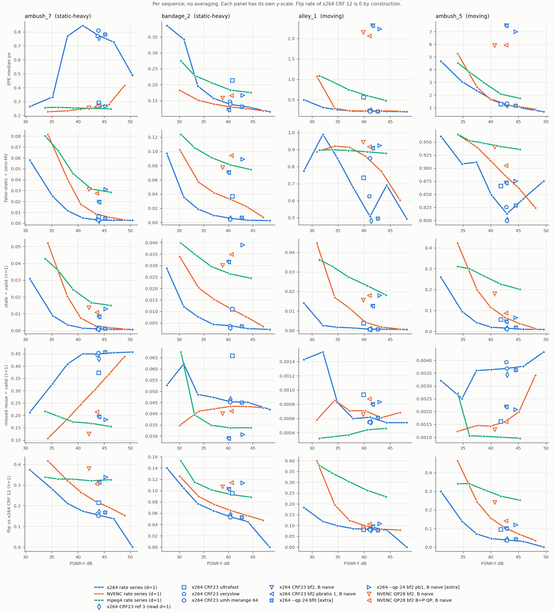
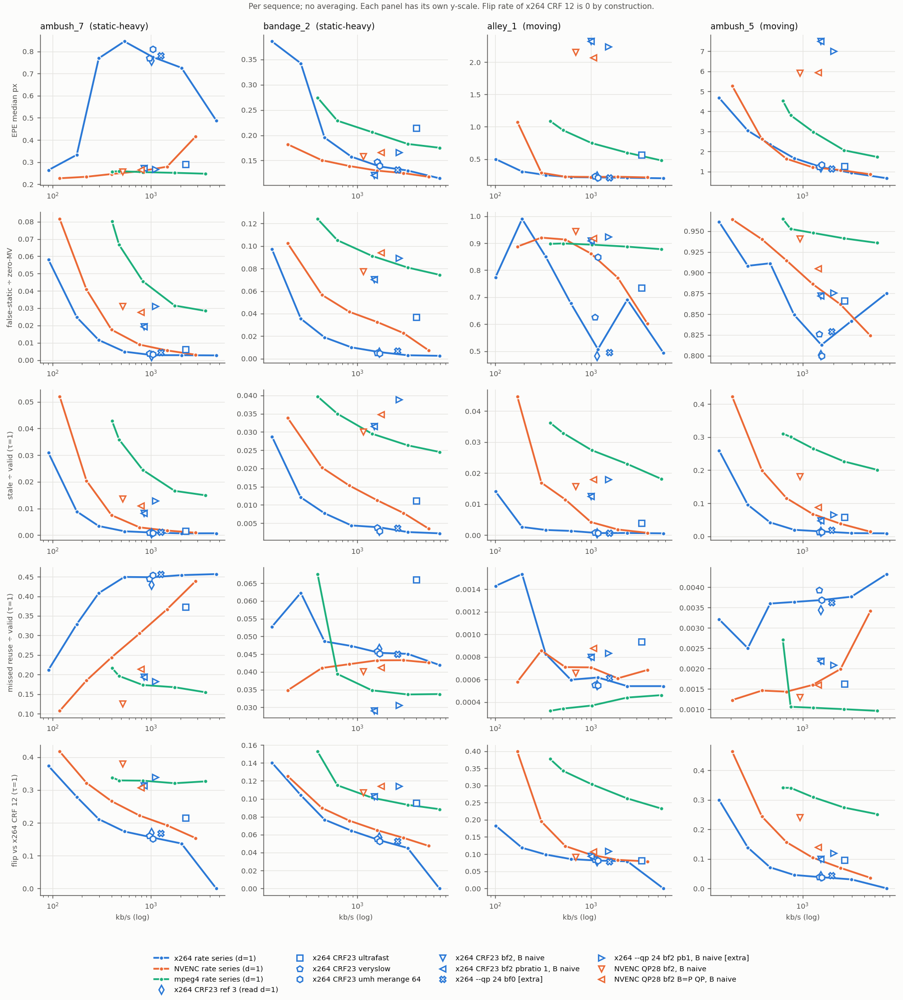

# Paper 3 pilot v2: codec MVs vs Sintel GT (exploratory)

Exploratory pilot. No claims; the numbers are reported as they came out, with no tuning or reruns. This supersedes v1 (`p3/pilot/`, where x264 ran 7 slices per frame and mpeg4 ran 16 packets per frame).

- Sequences (final pass), with pixel static share: static-heavy ambush_7 (0.794), bandage_2 (0.555); moving alley_1 (0.0015), ambush_5 (0.0059)
- Git b7392cb845 on `sonu/p3`, plus **uncommitted additive knobs in `p3/lib/encode.py`** (the diff is in manifest.json). PyAV 17.1.0, FFmpeg 8.1.1, x264 - core 165, NVIDIA NVIDIA GeForce RTX 4050 Laptop GPU, 610.74
- Start 2026-09-29T19:04:32+0530; pilot runtime **8.5 min**; failures: **0**
- Vector groups with fewer than 5 frames are in results.csv and blocks/ but not in these tables. The gate headlines are stale ÷ valid and missed reuse ÷ valid; stale ÷ reused is secondary. Tables use τ = 1; results.csv has τ ∈ {0.5, 1, 2}.

## Reading guide

- Every number is for one sequence. Columns are static-heavy (S: ambush_7, bandage_2), then moving (M: alley_1, ambush_5).
- **Headline gate metrics (τ = 1 px):**
  - stale ÷ valid: reused cells whose GT motion is > 2 px
  - missed reuse ÷ valid: GT-static cells (|GT| < 0.5 px) that the gate recomputes

  Missed reuse only carries information on the static-heavy pair. On alley_1 and ambush_5 there is almost nothing static to miss (≤ 0.005 of valid area in every arm).
- Flip rate is given two ways: vs x264 CRF 12, and vs the encoder's own best setting (NVENC QP 18, mpeg4 q 2).

## What moved the gate (exploratory; τ = 1)

**Quantiser moves stale reuse most.** Stale ÷ valid, lowest to highest QP:

| sequence | x264 CRF 12 → 45 | NVENC QP 18 → 45 | mpeg4 q 2 → 31 |
|---|---|---|---|
| ambush_7 (S) | 0.0007 → 0.031 | 0.0009 → 0.052 | 0.015 → 0.043 |
| bandage_2 (S) | 0.0022 → 0.029 | 0.0035 → 0.034 | 0.025 → 0.040 |
| alley_1 (M) | 0.0006 → 0.014 | 0.0007 → 0.045 | 0.018 → 0.036 |
| ambush_5 (M) | 0.009 → 0.259 | 0.014 → 0.423 | 0.201 → 0.311 |

Missed reuse moves the other way and is large on ambush_7:
- x264 CRF 12 → 45: 0.457 → 0.212
- NVENC QP 18 → 45: 0.439 → 0.107
- bandage_2: 0.04–0.06 throughout

So higher QP trades missed reuse for stale reuse on the static-heavy sequences.

**Other factors, same metrics (x264 CRF 23 unless noted):**
- **ref 2/3 (read as d=1):** stale moves ≤ 0.0009, missed ≤ 0.018. Negligible.
- **keyint 30:** stale ≤ 0.0008. Negligible.
- **Search range** (me=umh, merange 16/32/64 vs medium's hex/16): stale ≤ 0.0023. Negligible (details below).
- **Preset:** ultrafast raises ambush_5 stale 0.015 → 0.058 and moves ambush_7 missed by 0.076. Veryslow is close to medium.
- **Encoder, compared on the PSNR row** (x264 CRF 23 / NVENC QP 28 / mpeg4 q 4):

  | | ambush_7 | bandage_2 | alley_1 | ambush_5 |
  |---|---|---|---|---|
  | stale ÷ valid | 0.0010 / 0.0029 / 0.017 | 0.0039 / 0.011 / 0.026 | 0.0006 / 0.0042 / 0.023 | 0.015 / 0.068 / 0.226 |
  | missed ÷ valid | 0.449 / 0.305 / 0.168 | – | – | – |

  x264 has the least stale reuse and the most missed reuse.
- **mpeg4's flip rate vs x264 CRF 12 is mostly an encoder difference.** At q 4 it is 0.09–0.32 vs x264, but only 0.02–0.09 vs mpeg4 q 2.

**Steady or inverted-U** (GT metrics, per sequence):
- **Stale ÷ valid rises steadily with QP** in all 4 sequences for NVENC and mpeg4. For x264 it's steady on bandage_2 and ambush_5, with tiny early dips on ambush_7 (0.00070 → 0.00067 at CRF 18) and alley_1 (at CRF 23).
- **Missed reuse on ambush_7 falls with QP:** steadily for NVENC; for x264 with small bumps.
- **bandage_2's missed reuse is a mild ∩ under x264:** 0.042 → 0.062 at CRF 38 → 0.053.
- **x264's EPE on ambush_7 is ∩:** 0.49 → 0.85 at CRF 28 → 0.26. NVENC and mpeg4 are flat or falling there.
- **Why ambush_7 behaves this way** (block level, GT-static blocks, x264 CRF 23):
  - 51% of the area gets |MV| ≥ 1 px (median 2.75, p90 16 px)
  - 26% gets a non-zero sub-pixel vector
  - 23% gets exactly zero
  - 13% of P-frame area has no vector at all

  At CRF 45, 77% is exactly zero. At NVENC QP 28 it is 67%. That is what drives both the missed reuse and the ∩ in EPE. I have not looked into why x264 puts multi-pixel vectors on static background at low and mid CRF.

**Search range (the ambush_5 question).**
- ambush_5's stale cells are mostly slow. At CRF 23 the speed bins are 2–8 / 8–16 / 16–32 / >32 px = 11094 / 2251 / 3030 / 1230, i.e. 63% at 2–8 px and 7% above 32 px.
- me=umh with merange 16/32/64 gives stale ÷ valid 0.0130 / 0.0130 / 0.0126, vs 0.0149 with hex/16.
- So the ambush_5 stale reuse isn't explained by motion beyond the search range.
- The "35%" in the brief is stale ÷ reused (v1 0.351, v2 0.329 at CRF 12). As a share of valid area it is 0.9%.

**B-frames vs QP (ANVIL), with QP matched.** stale ÷ valid, bf 0 d=1 → B naive (B scaled in brackets):

| | ambush_7 | bandage_2 | alley_1 | ambush_5 |
|---|---|---|---|---|
| x264 --qp 24, B QP = P QP = 24 [extra arm] | 0.0011 → 0.013 (0.013) | 0.0037 → 0.039 (0.040) | 0.0007 → 0.018 (0.019) | 0.020 → 0.066 (0.069) |
| NVENC QP 28, B QP = P QP = 28 | 0.0029 → 0.011 (0.011) | 0.011 → 0.035 (0.036) | 0.0042 → 0.018 (0.018) | 0.068 → 0.088 (0.089) |
| NVENC QP 28, default B QP 36 | 0.0029 → 0.014 | 0.011 → 0.030 | 0.0042 → 0.016 | 0.068 → 0.181 |
| x264 CRF 23, default (B QP +1.6 to +5.4) | 0.0010 → 0.0082 | 0.0039 → 0.032 | 0.0006 → 0.013 | 0.015 → 0.047 |

- **With QP matched, B-frame stale reuse is still 3–27× the bf 0 level in x264,** and 1.3–4.3× in NVENC. For x264 that is roughly CRF 38–45 territory: bandage_2 0.039 vs 0.029 at CRF 45; alley_1 0.018 vs 0.014.
- **Scaling by reference distance changes stale ÷ valid by ≤ 0.0032,** so the gate shift is not a reference-distance effect.
- **Matching the QP does matter for NVENC on ambush_5:** 0.181 → 0.088.
- **B-frames also cut missed reuse** (ambush_7 0.457 → 0.183 under x264 CQP 24). B-frames push the gate toward reuse.
- **EPE shows the opposite pattern.** The naive B-vs-bf0 gap is mostly reference distance: x264 CQP 24 B EPE median is 2.2 px naive vs 0.19 scaled on alley_1, and 7.0 vs 2.2 on ambush_5. Scaled B EPE is at or below bf 0, except on ambush_5 (2.2 vs 1.15).
- **Median EPE says the B vectors are fine, yet the gate gets more stale.** The stale cells are a tail that median EPE doesn't see.
- **P-frames at d = 3 in the B arms** are different: there, scaling does close most of the gate gap (x264 CQP 24 ambush_5 stale 0.012 naive → 0.022 scaled vs 0.020 at bf 0; missed 0.574 → 0.414 vs 0.457 on ambush_7).

## v1 → v2: what the slice fix changed (x264 table below)

- **CRF 12–23:** bitrate −1 to −6%, EPE median slightly lower (for example ambush_7 CRF 23: 0.88 → 0.78), flip within ±0.005. Stale ÷ valid changes are small in absolute terms.
- **CRF 45: larger.**
  - bitrate −16 to −28%
  - alley_1 stale 0.029 → 0.014, zero-MV 0.134 → 0.024
  - ambush_5 stale 0.374 → 0.259
  - bandage_2 flip 0.22 → 0.14, zero-MV 0.43 → 0.54

  Slicing mattered most at low bitrate.
- **mpeg4 also changed.** v1's mpeg4 ran 16 video packets per frame (see oddities). At q 2, ambush_5 EPE 2.84 → 1.73 and stale 0.266 → 0.201. Other mpeg4 changes are smaller (bitrate −1 to −8%).

## Failures, odd things, runtime

- **Failures:** none. 136/136 encode × sequence runs succeeded.
- **Runtime:** 507 s (8.5 min), plus 11 s to load GT. Single-threaded x264 roughly doubled per-run time at low CRF compared with v1.
- **Threading and slices:** every x264 SEI reads `threads=1 sliced_threads=0` with no `slices` field. The bitstream has 1 slice per frame for every x264 and NVENC encode, and 1 video packet per frame for mpeg4.
- **mpeg4 was sliced in v1 too.** At PyAV's default thread count, the mpegvideo encoder writes one resync-marked video packet per thread: 16 per frame on this machine (15 markers counted). v2 passes `threads=1` to mpeg4 as well. This extends the prompt's x264 fix to mpeg4 via the same additive knob.
- **x264 `pbratio=1.0` under CRF is a no-op.** The pb1 arm is byte-identical to the default-B arm on all four sequences. With mbtree=1 (CRF default), x264 ignores pbratio and its SEI omits `pb_ratio`. Decoded B QP stays 1.6–5.4 above P.
  - The extra constant-QP pair (`x264 --qp 24`, bf 0 and bf 2 with pbratio 1.0, not in the prompt) gives decoded I/P/B = 21/24/24 exactly. It's labelled [extra] everywhere.
- **NVENC B QP:** `b_qfactor=1, b_qoffset=0` gives decoded B = P = 28. The default is B 36.
- **The last frame of every b-adapt=0 / NVENC bf2 stream** is a P right after a P (`…BPP`), so each B arm has a 1-frame d=1 group. It's in results.csv and left out of the tables.
- **The final frame of NVENC bf2 streams mixes 28 and 36 QP.** That frame's QP map mixes the P and B QP (28 and 36); every other frame is uniform. This is why the default-B arm shows mean P QP 28.09–28.19.
- **x264 --qp 24 bf 0** costs 1.2–1.5× the bitrate of CRF 23, at +1.3–2.4 dB.
- **`p3/lib/encode.py` has uncommitted additive knobs:** threads, b_adapt, pbratio, me, merange, qp for libx264, b_qfactor/b_qoffset, and mpeg4 threads. With them unset, the default options are byte-for-byte the old ones. The diff is saved in manifest.json.

## Encoder checks: threading and slices (from the bitstream) and decoded QP

| encode | x264 SEI threads / sliced_threads (all 4 sequences) | slices per frame min–max | I/P/B QP ambush_7 | I/P/B QP bandage_2 | I/P/B QP alley_1 | I/P/B QP ambush_5 |
|---|---|---|---|---|---|---|
| x264_crf12 | 1/0 | 1–1 | 11.7/12.2/– | 11.5/13.1/– | 13.3/13.8/– | 13.0/13.4/– |
| x264_crf18 | 1/0 | 1–1 | 17.7/18.2/– | 17.5/19.4/– | 19.3/19.8/– | 19.0/19.5/– |
| x264_crf23 | 1/0 | 1–1 | 22.6/23.2/– | 22.5/24.9/– | 24.3/24.8/– | 24.1/24.5/– |
| x264_crf28 | 1/0 | 1–1 | 27.6/28.5/– | 27.5/30.7/– | 29.3/30.0/– | 29.1/29.8/– |
| x264_crf33 | 1/0 | 1–1 | 32.5/33.8/– | 32.5/36.3/– | 34.3/35.4/– | 33.9/34.9/– |
| x264_crf38 | 1/0 | 1–1 | 37.5/38.6/– | 37.6/41.5/– | 39.4/40.9/– | 38.9/39.9/– |
| x264_crf45 | 1/0 | 1–1 | 44.2/45.6/– | 44.4/48.2/– | 46.5/47.8/– | 45.6/46.4/– |
| x264_crf23_ref2 | 1/0 | 1–1 | 22.6/23.3/– | 22.5/25.0/– | 24.3/24.8/– | 24.1/24.5/– |
| x264_crf23_ref3 | 1/0 | 1–1 | 22.6/23.3/– | 22.5/25.0/– | 24.3/24.8/– | 24.1/24.5/– |
| x264_crf23_ultrafast | 1/0 | 1–1 | 20.0/22.4/– | 20.0/23.7/– | 20.0/23.9/– | 20.0/24.3/– |
| x264_crf23_keyint30 | 1/0 | 1–1 | 21.7/23.3/– | 21.4/25.0/– | 22.9/24.8/– | 22.9/24.6/– |
| x264_crf23_umh16 | 1/0 | 1–1 | 22.6/23.2/– | 22.5/24.8/– | 24.3/24.8/– | 24.1/24.6/– |
| x264_crf23_umh32 | 1/0 | 1–1 | 22.6/23.3/– | 22.5/24.8/– | 24.3/24.8/– | 24.1/24.6/– |
| x264_crf23_umh64 | 1/0 | 1–1 | 22.6/23.2/– | 22.5/24.8/– | 24.3/24.8/– | 24.1/24.6/– |
| x264_crf23_bf2 | 1/0 | 1–1 | 21.8/22.9/25.2 | 21.6/24.1/29.5 | 22.7/23.7/29.0 | 23.5/24.3/25.9 |
| x264_crf23_bf2_pb1 | 1/0 | 1–1 | 21.8/22.9/25.2 | 21.6/24.1/29.5 | 22.7/23.7/29.0 | 23.5/24.3/25.9 |
| x264_qp24 | 1/0 | 1–1 | 21.0/24.0/– | 21.0/24.0/– | 21.0/24.0/– | 21.0/24.0/– |
| x264_qp24_bf2_pb1 | 1/0 | 1–1 | 21.0/24.0/24.0 | 21.0/24.0/24.0 | 21.0/24.0/24.0 | 21.0/24.0/24.0 |
| nvenc_qp18 | None/None | 1–1 | 14.0/18.0/– | 14.0/18.0/– | 14.0/18.0/– | 14.0/18.0/– |
| nvenc_qp23 | None/None | 1–1 | 18.0/23.0/– | 18.0/23.0/– | 18.0/23.0/– | 18.0/23.0/– |
| nvenc_qp28 | None/None | 1–1 | 22.0/28.0/– | 22.0/28.0/– | 22.0/28.0/– | 22.0/28.0/– |
| nvenc_qp33 | None/None | 1–1 | 26.0/33.0/– | 26.0/33.0/– | 26.0/33.0/– | 26.0/33.0/– |
| nvenc_qp38 | None/None | 1–1 | 30.0/38.0/– | 30.0/38.0/– | 30.0/38.0/– | 30.0/38.0/– |
| nvenc_qp45 | None/None | 1–1 | 36.0/45.0/– | 36.0/45.0/– | 36.0/45.0/– | 36.0/45.0/– |
| nvenc_qp28_bf2 | None/None | 1–1 | 22.0/28.0/36.0 | 22.0/28.1/36.0 | 22.0/28.2/36.0 | 22.0/28.2/36.0 |
| nvenc_qp28_bf2_bqeq | None/None | 1–1 | 22.0/28.0/28.0 | 22.0/28.0/28.0 | 22.0/28.0/28.0 | 22.0/28.0/28.0 |
| mpeg4_q2 | None/None | 1–1 | 4.0/4.0/– | 4.0/4.0/– | 4.0/4.0/– | 4.0/4.0/– |
| mpeg4_q4 | None/None | 1–1 | 8.0/8.0/– | 8.0/8.0/– | 8.0/8.0/– | 8.0/8.0/– |
| mpeg4_q8 | None/None | 1–1 | 16.0/16.0/– | 16.0/16.0/– | 16.0/16.0/– | 16.0/16.0/– |
| mpeg4_q16 | None/None | 1–1 | 32.0/32.0/– | 32.0/32.0/– | 32.0/32.0/– | 32.0/32.0/– |
| mpeg4_q31 | None/None | 1–1 | 62.0/62.0/– | 62.0/62.0/– | 62.0/62.0/– | 62.0/62.0/– |
| x264_crf23_veryslow | 1/0 | 1–1 | 23.8/25.5/– | 23.9/27.2/– | 25.7/26.6/– | 25.5/26.6/– |

## v1 → v2 for the x264 arms (v1: 7 slices per frame, sliced threads; v2: 1 thread, 1 slice)

Each cell shows v1 → v2, τ = 1, headline group. The v1 bf2 arm used b-adapt=1, so it isn't comparable and is left out. In v2, v1's flip_rate corresponds to `flip_x264ref`.

| arm | metric | S: ambush_7 | S: bandage_2 | M: alley_1 | M: ambush_5 |
|---|---|---|---|---|---|
| x264_crf12 | kb/s | 4652 → 4628 | 6954 → 6906 | 5739 → 5683 | 6686 → 6594 |
| x264_crf12 | PSNR | 50.36 → 50.42 | 48.44 → 48.46 | 48.16 → 48.18 | 49.55 → 49.59 |
| x264_crf12 | EPE med | 0.530 → 0.489 | 0.119 → 0.115 | 0.205 → 0.203 | 0.699 → 0.670 |
| x264_crf12 | stale/valid | 0.00074 → 0.00070 | 0.00234 → 0.00220 | 0.00056 → 0.00055 | 0.00962 → 0.00913 |
| x264_crf12 | stale/reused | 0.0022 → 0.0021 | 0.0042 → 0.0040 | 0.0077 → 0.0077 | 0.3507 → 0.3294 |
| x264_crf12 | zero-MV | 0.131 → 0.133 | 0.415 → 0.415 | 0.001 → 0.001 | 0.008 → 0.008 |
| x264_crf12 | flip vs CRF12 | 0.0000 → 0.0000 | 0.0000 → 0.0000 | 0.0000 → 0.0000 | 0.0000 → 0.0000 |
| x264_crf18 | kb/s | 2094 → 2051 | 3324 → 3269 | 2458 → 2397 | 3077 → 2979 |
| x264_crf18 | PSNR | 46.75 → 46.84 | 43.96 → 43.98 | 44.35 → 44.35 | 45.86 → 45.92 |
| x264_crf18 | EPE med | 0.753 → 0.726 | 0.134 → 0.130 | 0.216 → 0.212 | 1.027 → 0.938 |
| x264_crf18 | stale/valid | 0.00076 → 0.00067 | 0.00287 → 0.00256 | 0.00069 → 0.00067 | 0.00927 → 0.00980 |
| x264_crf18 | stale/reused | 0.0022 → 0.0020 | 0.0052 → 0.0046 | 0.0096 → 0.0097 | 0.3412 → 0.3379 |
| x264_crf18 | zero-MV | 0.146 → 0.140 | 0.417 → 0.418 | 0.001 → 0.001 | 0.009 → 0.010 |
| x264_crf18 | flip vs CRF12 | 0.1384 → 0.1369 | 0.0455 → 0.0451 | 0.0797 → 0.0790 | 0.0305 → 0.0306 |
| x264_crf23 | kb/s | 1095 → 1049 | 1738 → 1688 | 1247 → 1183 | 1615 → 1524 |
| x264_crf23 | PSNR | 43.80 → 43.88 | 40.37 → 40.40 | 41.18 → 41.14 | 42.90 → 42.94 |
| x264_crf23 | EPE med | 0.878 → 0.775 | 0.147 → 0.138 | 0.233 → 0.216 | 1.352 → 1.225 |
| x264_crf23 | stale/valid | 0.00084 → 0.00096 | 0.00346 → 0.00385 | 0.00077 → 0.00065 | 0.01255 → 0.01490 |
| x264_crf23 | stale/reused | 0.0026 → 0.0028 | 0.0063 → 0.0070 | 0.0116 → 0.0105 | 0.4167 → 0.3964 |
| x264_crf23 | zero-MV | 0.167 → 0.164 | 0.429 → 0.436 | 0.002 → 0.001 | 0.014 → 0.018 |
| x264_crf23 | flip vs CRF12 | 0.1581 → 0.1550 | 0.0571 → 0.0537 | 0.0850 → 0.0811 | 0.0353 → 0.0379 |
| x264_crf28 | kb/s | 580 → 539 | 913 → 869 | 675 → 617 | 905 → 828 |
| x264_crf28 | PSNR | 40.84 → 40.90 | 36.95 → 36.97 | 38.02 → 37.92 | 40.07 → 40.12 |
| x264_crf28 | EPE med | 0.903 → 0.845 | 0.184 → 0.158 | 0.262 → 0.220 | 1.997 → 1.671 |
| x264_crf28 | stale/valid | 0.00146 → 0.00145 | 0.00672 → 0.00437 | 0.00284 → 0.00133 | 0.02693 → 0.01980 |
| x264_crf28 | stale/reused | 0.0042 → 0.0042 | 0.0124 → 0.0079 | 0.0393 → 0.0206 | 0.5973 → 0.5000 |
| x264_crf28 | zero-MV | 0.212 → 0.199 | 0.426 → 0.452 | 0.006 → 0.002 | 0.029 → 0.023 |
| x264_crf28 | flip vs CRF12 | 0.1800 → 0.1736 | 0.0782 → 0.0644 | 0.0967 → 0.0855 | 0.0496 → 0.0455 |
| x264_crf33 | kb/s | 326 → 295 | 504 → 461 | 390 → 338 | 547 → 484 |
| x264_crf33 | PSNR | 37.93 → 37.98 | 33.79 → 33.81 | 35.01 → 34.89 | 37.38 → 37.45 |
| x264_crf33 | EPE med | 0.625 → 0.769 | 0.278 → 0.195 | 0.308 → 0.253 | 2.889 → 2.352 |
| x264_crf33 | stale/valid | 0.00403 → 0.00341 | 0.01088 → 0.00771 | 0.00803 → 0.00164 | 0.06119 → 0.04210 |
| x264_crf33 | stale/reused | 0.0097 → 0.0087 | 0.0208 → 0.0139 | 0.0822 → 0.0215 | 0.7014 → 0.5955 |
| x264_crf33 | zero-MV | 0.325 → 0.271 | 0.400 → 0.456 | 0.021 → 0.003 | 0.073 → 0.054 |
| x264_crf33 | flip vs CRF12 | 0.2170 → 0.2114 | 0.1114 → 0.0768 | 0.1228 → 0.0988 | 0.0873 → 0.0712 |
| x264_crf38 | kb/s | 198 → 177 | 303 → 264 | 239 → 192 | 343 → 293 |
| x264_crf38 | PSNR | 35.04 → 35.15 | 30.92 → 30.94 | 32.23 → 32.11 | 34.68 → 34.83 |
| x264_crf38 | EPE med | 0.288 → 0.333 | 0.476 → 0.342 | 0.406 → 0.308 | 4.290 → 3.044 |
| x264_crf38 | stale/valid | 0.00718 → 0.00888 | 0.01725 → 0.01207 | 0.01364 → 0.00260 | 0.14937 → 0.09547 |
| x264_crf38 | stale/reused | 0.0137 → 0.0186 | 0.0349 → 0.0219 | 0.1065 → 0.0267 | 0.7675 → 0.6211 |
| x264_crf38 | zero-MV | 0.455 → 0.383 | 0.360 → 0.408 | 0.043 → 0.006 | 0.181 → 0.141 |
| x264_crf38 | flip vs CRF12 | 0.2707 → 0.2791 | 0.1619 → 0.1041 | 0.1515 → 0.1184 | 0.1828 → 0.1385 |
| x264_crf45 | kb/s | 109 → 91 | 165 → 134 | 140 → 101 | 187 → 154 |
| x264_crf45 | PSNR | 30.43 → 30.76 | 27.41 → 27.46 | 28.49 → 28.44 | 30.72 → 31.02 |
| x264_crf45 | EPE med | 0.252 → 0.264 | 0.750 → 0.386 | 0.891 → 0.500 | 6.127 → 4.675 |
| x264_crf45 | stale/valid | 0.03436 → 0.03091 | 0.03292 → 0.02875 | 0.02857 → 0.01406 | 0.37421 → 0.25940 |
| x264_crf45 | stale/reused | 0.0506 → 0.0498 | 0.0644 → 0.0479 | 0.1213 → 0.0879 | 0.8675 → 0.8095 |
| x264_crf45 | zero-MV | 0.640 → 0.580 | 0.428 → 0.544 | 0.134 → 0.024 | 0.419 → 0.298 |
| x264_crf45 | flip vs CRF12 | 0.3834 → 0.3738 | 0.2215 → 0.1403 | 0.2541 → 0.1832 | 0.4033 → 0.2996 |
| x264_crf23_ref2 | kb/s | 1078 → 1023 | 1723 → 1670 | 1223 → 1156 | 1587 → 1498 |
| x264_crf23_ref2 | PSNR | 43.89 → 43.95 | 40.41 → 40.43 | 41.37 → 41.30 | 42.94 → 42.98 |
| x264_crf23_ref2 | EPE med | 0.820 → 0.774 | 0.151 → 0.141 | 0.269 → 0.229 | 1.365 → 1.200 |
| x264_crf23_ref2 | stale/valid | 0.00078 → 0.00065 | 0.00438 → 0.00319 | 0.00080 → 0.00075 | 0.01417 → 0.01395 |
| x264_crf23_ref2 | stale/reused | 0.0022 → 0.0018 | 0.0080 → 0.0058 | 0.0142 → 0.0139 | 0.4481 → 0.3763 |
| x264_crf23_ref2 | zero-MV | 0.169 → 0.156 | 0.426 → 0.434 | 0.002 → 0.002 | 0.015 → 0.020 |
| x264_crf23_ref2 | flip vs CRF12 | 0.1646 → 0.1631 | 0.0611 → 0.0560 | 0.0837 → 0.0800 | 0.0373 → 0.0397 |
| x264_crf23_ref3 | kb/s | 1069 → 1010 | 1724 → 1666 | 1223 → 1154 | 1588 → 1502 |
| x264_crf23_ref3 | PSNR | 43.92 → 43.98 | 40.42 → 40.44 | 41.42 → 41.34 | 42.94 → 43.00 |
| x264_crf23_ref3 | EPE med | 0.806 → 0.758 | 0.151 → 0.143 | 0.283 → 0.237 | 1.446 → 1.210 |
| x264_crf23_ref3 | stale/valid | 0.00101 → 0.00076 | 0.00462 → 0.00292 | 0.00084 → 0.00067 | 0.01459 → 0.01462 |
| x264_crf23_ref3 | stale/reused | 0.0029 → 0.0021 | 0.0085 → 0.0054 | 0.0160 → 0.0132 | 0.4493 → 0.3573 |
| x264_crf23_ref3 | zero-MV | 0.173 → 0.154 | 0.429 → 0.434 | 0.002 → 0.001 | 0.015 → 0.021 |
| x264_crf23_ref3 | flip vs CRF12 | 0.1678 → 0.1695 | 0.0624 → 0.0574 | 0.0817 → 0.0793 | 0.0374 → 0.0415 |
| x264_crf23_ultrafast | kb/s | 2260 → 2256 | 4013 → 4009 | 3395 → 3353 | 2622 → 2566 |
| x264_crf23_ultrafast | PSNR | 43.78 → 43.95 | 40.77 → 40.83 | 39.89 → 39.90 | 41.68 → 41.80 |
| x264_crf23_ultrafast | EPE med | 0.304 → 0.290 | 0.241 → 0.214 | 0.580 → 0.568 | 1.469 → 1.276 |
| x264_crf23_ultrafast | stale/valid | 0.00184 → 0.00155 | 0.01024 → 0.01111 | 0.00349 → 0.00381 | 0.05238 → 0.05773 |
| x264_crf23_ultrafast | stale/reused | 0.0045 → 0.0037 | 0.0205 → 0.0216 | 0.1692 → 0.1903 | 0.5413 → 0.5016 |
| x264_crf23_ultrafast | zero-MV | 0.409 → 0.423 | 0.499 → 0.514 | 0.021 → 0.020 | 0.097 → 0.115 |
| x264_crf23_ultrafast | flip vs CRF12 | 0.2137 → 0.2155 | 0.1092 → 0.0956 | 0.0815 → 0.0805 | 0.0848 → 0.0959 |
| x264_crf23_keyint30 | kb/s | 1152 → 1102 | 1871 → 1819 | 1355 → 1289 | 1652 → 1559 |
| x264_crf23_keyint30 | PSNR | 43.91 → 43.98 | 40.50 → 40.50 | 41.39 → 41.35 | 42.97 → 43.01 |
| x264_crf23_keyint30 | EPE med | 0.862 → 0.780 | 0.145 → 0.137 | 0.230 → 0.214 | 1.343 → 1.230 |
| x264_crf23_keyint30 | stale/valid | 0.00086 → 0.00094 | 0.00398 → 0.00307 | 0.00089 → 0.00074 | 0.01135 → 0.01433 |
| x264_crf23_keyint30 | stale/reused | 0.0026 → 0.0027 | 0.0073 → 0.0055 | 0.0137 → 0.0120 | 0.3870 → 0.3809 |
| x264_crf23_keyint30 | zero-MV | 0.168 → 0.168 | 0.431 → 0.438 | 0.002 → 0.001 | 0.013 → 0.018 |
| x264_crf23_keyint30 | flip vs CRF12 | 0.1546 → 0.1547 | 0.0573 → 0.0535 | 0.0828 → 0.0810 | 0.0348 → 0.0385 |
| x264_crf23_veryslow | kb/s | 1012 → 966 | 1631 → 1589 | 1152 → 1104 | 1527 → 1453 |
| x264_crf23_veryslow | PSNR | 43.60 → 43.72 | 40.31 → 40.35 | 40.99 → 41.02 | 42.73 → 42.81 |
| x264_crf23_veryslow | EPE med | 0.822 → 0.770 | 0.156 → 0.147 | 0.261 → 0.236 | 1.494 → 1.246 |
| x264_crf23_veryslow | stale/valid | 0.00105 → 0.00094 | 0.00460 → 0.00373 | 0.00110 → 0.00076 | 0.01429 → 0.01319 |
| x264_crf23_veryslow | stale/reused | 0.0030 → 0.0027 | 0.0084 → 0.0068 | 0.0152 → 0.0118 | 0.4544 → 0.3683 |
| x264_crf23_veryslow | zero-MV | 0.186 → 0.171 | 0.429 → 0.433 | 0.004 → 0.002 | 0.015 → 0.015 |
| x264_crf23_veryslow | flip vs CRF12 | 0.1616 → 0.1609 | 0.0611 → 0.0554 | 0.0913 → 0.0841 | 0.0365 → 0.0382 |

## Plots

## Factor effect per sequence: range (max − min) across the factor's arms, τ = 1

Each cell shows stale/valid · missed/valid · flip vs CRF 12 · EPE median.

| factor | S: ambush_7 | S: bandage_2 | M: alley_1 | M: ambush_5 |
|---|---|---|---|---|
| CRF (x264 medium, ref 1, bf 0, 1 thread) | 0.0302 · 0.2449 · 0.3738 · 0.5815 | 0.0266 · 0.0203 · 0.1403 · 0.2709 | 0.0135 · 0.0010 · 0.1832 · 0.2970 | 0.2503 · 0.0018 · 0.2996 · 4.0054 |
| NVENC QP (constqp, p4, refs 1, bf 0) | 0.0511 · 0.3314 · 0.2641 · 0.1886 | 0.0304 · 0.0085 · 0.0780 · 0.0644 | 0.0440 · 0.0003 · 0.3206 · 0.8588 | 0.4087 · 0.0022 · 0.4280 · 4.4110 |
| mpeg4 q (qmin=qmax=q, bf 0, 1 thread) | 0.0278 · 0.0616 · 0.0177 · 0.0114 | 0.0152 · 0.0339 · 0.0644 · 0.0993 | 0.0181 · 0.0001 · 0.1446 · 0.6103 | 0.1095 · 0.0017 · 0.0894 · 2.7980 |
| ref (x264 CRF 23; ref 2/3 read as d=1) | 0.0003 · 0.0183 · 0.0145 · 0.0169 | 0.0009 · 0.0012 · 0.0037 · 0.0045 | 0.0001 · 0.0001 · 0.0017 · 0.0210 | 0.0009 · 0.0002 · 0.0036 · 0.0250 |
| preset (x264 CRF 23) | 0.0006 · 0.0759 · 0.0605 · 0.4842 | 0.0074 · 0.0206 · 0.0419 · 0.0757 | 0.0032 · 0.0004 · 0.0036 · 0.3515 | 0.0445 · 0.0023 · 0.0580 · 0.0510 |
| keyint (x264 CRF 23) | 0.0000 · 0.0021 · 0.0004 · 0.0057 | 0.0008 · 0.0006 · 0.0003 · 0.0008 | 0.0001 · 0.0000 · 0.0001 · 0.0024 | 0.0006 · 0.0001 · 0.0007 · 0.0042 |
| search range (x264 CRF 23 medium) | 0.0002 · 0.0071 · 0.0033 · 0.0377 | 0.0010 · 0.0005 · 0.0011 · 0.0012 | 0.0001 · 0.0001 · 0.0033 · 0.0032 | 0.0023 · 0.0004 · 0.0009 · 0.1129 |
| encoder (x264 CRF 23 / NVENC QP 28 / mpeg4 q 4 — compare PSNR row) | 0.0156 · 0.2809 · 0.1658 · 0.5231 | 0.0225 · 0.0117 · 0.0395 · 0.0529 | 0.0223 · 0.0003 · 0.1815 · 0.3829 | 0.2113 · 0.0027 · 0.2359 · 0.8450 |
| bframes x264 CRF 23: bf0 d1 vs bf2 B naive (default / pb1) | 0.0072 · 0.2541 · 0.1591 · 0.5035 | 0.0277 · 0.0163 · 0.0490 · 0.0173 | 0.0119 · 0.0002 · 0.0131 · 2.1030 | 0.0325 · 0.0015 · 0.0621 · 6.2602 |
| bframes x264 CRF 23: bf0 d1 vs bf2 B scaled | 0.0077 · 0.2733 · 0.1624 · 0.5202 | 0.0285 · 0.0200 · 0.0469 · 0.0354 | 0.0120 · 0.0001 · 0.0227 · 0.0298 | 0.0349 · 0.0021 · 0.0665 · 1.1715 |
| bframes NVENC QP 28: bf0 d1 vs bf2 B naive (default / B=P) | 0.0108 · 0.1796 · 0.1580 · 0.0091 | 0.0236 · 0.0031 · 0.0492 · 0.0364 | 0.0138 · 0.0002 · 0.0153 · 1.9303 | 0.1135 · 0.0003 · 0.1359 · 4.7208 |
| bframes NVENC QP 28: bf0 d1 vs bf2 B scaled | 0.0110 · 0.1914 · 0.1552 · 0.0235 | 0.0243 · 0.0121 · 0.0417 · 0.0354 | 0.0142 · 0.0002 · 0.0197 · 0.1122 | 0.1146 · 0.0006 · 0.1384 · 1.2692 |
| [extra] x264 --qp 24: bf0 d1 vs bf2 B naive (B QP = P QP) | 0.0118 · 0.2738 · 0.1709 · 0.5138 | 0.0353 · 0.0144 · 0.0612 · 0.0348 | 0.0172 · 0.0002 · 0.0304 · 2.0231 | 0.0463 · 0.0015 · 0.0761 · 5.8543 |

## Shape along the rate series (d=1, per sequence, arms low → high QP)

| series | metric | S: ambush_7 | S: bandage_2 | M: alley_1 | M: ambush_5 |
|---|---|---|---|---|---|
| x264 CRF | EPE median | ∩ (peak arm 4) (0.489, 0.726, 0.775, 0.845, 0.769, 0.333, 0.264) | ↑ (0.115, 0.13, 0.138, 0.158, 0.195, 0.342, 0.386) | ↑ (0.203, 0.212, 0.216, 0.22, 0.253, 0.308, 0.5) | ↑ (0.67, 0.938, 1.23, 1.67, 2.35, 3.04, 4.68) |
| x264 CRF | false-static/zero | ↑ (0.00268, 0.00281, 0.00283, 0.00487, 0.0116, 0.0247, 0.0581) | ↑ (0.00262, 0.0031, 0.0059, 0.0101, 0.019, 0.0355, 0.0971) | +−+++− (0.494, 0.691, 0.507, 0.677, 0.85, 0.99, 0.774) | −−++−+ (0.875, 0.842, 0.813, 0.849, 0.911, 0.908, 0.961) |
| x264 CRF | stale/valid@1 | ∪ (min arm 2) (0.000698, 0.000673, 0.000958, 0.00145, 0.00341, 0.00888, 0.0309) | ↑ (0.0022, 0.00256, 0.00385, 0.00437, 0.00771, 0.0121, 0.0288) | +−++++ (0.000554, 0.000668, 0.000645, 0.00133, 0.00164, 0.0026, 0.0141) | ↑ (0.00913, 0.0098, 0.0149, 0.0198, 0.0421, 0.0955, 0.259) |
| x264 CRF | missed/valid@1 | −−+−−− (0.457, 0.454, 0.449, 0.449, 0.408, 0.329, 0.212) | ∩ (peak arm 6) (0.042, 0.0451, 0.0454, 0.0473, 0.0486, 0.0623, 0.0527) | 0+−++− (0.000541, 0.000541, 0.000618, 0.000597, 0.000825, 0.00153, 0.00143) | ∪ (min arm 6) (0.00432, 0.00377, 0.00368, 0.00364, 0.0036, 0.0025, 0.00321) |
| x264 CRF | stale/reused@1 | ∪ (min arm 2) (0.00206, 0.00197, 0.00276, 0.00417, 0.00874, 0.0186, 0.0498) | ↑ (0.00398, 0.00465, 0.00696, 0.00791, 0.0139, 0.0219, 0.0479) | ↑ (0.00774, 0.00969, 0.0105, 0.0206, 0.0215, 0.0267, 0.0879) | ↑ (0.329, 0.338, 0.396, 0.5, 0.596, 0.621, 0.81) |
| NVENC QP | EPE median | ↓ (0.416, 0.279, 0.259, 0.246, 0.234, 0.227) | ↑ (0.118, 0.125, 0.13, 0.139, 0.151, 0.182) | +−+++ (0.217, 0.227, 0.224, 0.228, 0.289, 1.08) | ↑ (0.865, 1.08, 1.22, 1.64, 2.62, 5.28) |
| NVENC QP | false-static/zero | ↑ (0.00309, 0.00557, 0.00892, 0.0176, 0.0408, 0.0816) | ↑ (0.00747, 0.0228, 0.0326, 0.0416, 0.0567, 0.102) | ∩ (peak arm 5) (0.603, 0.772, 0.862, 0.914, 0.921, 0.887) | ↑ (0.824, 0.862, 0.886, 0.915, 0.94, 0.964) |
| NVENC QP | stale/valid@1 | ↑ (0.000901, 0.00172, 0.0029, 0.00748, 0.0204, 0.052) | ↑ (0.00349, 0.00779, 0.0113, 0.0153, 0.0203, 0.0339) | ↑ (0.000721, 0.00179, 0.00418, 0.0115, 0.0169, 0.0447) | ↑ (0.014, 0.038, 0.0678, 0.115, 0.199, 0.423) |
| NVENC QP | missed/valid@1 | ↓ (0.439, 0.367, 0.305, 0.244, 0.185, 0.107) | ∩ (peak arm 2) (0.0426, 0.0433, 0.0433, 0.0422, 0.0411, 0.0348) | −+++− (0.000684, 0.00061, 0.000707, 0.000709, 0.000856, 0.000579) | −−−+− (0.00341, 0.00199, 0.0016, 0.00143, 0.00146, 0.00122) |
| NVENC QP | stale/reused@1 | ↑ (0.00253, 0.004, 0.00588, 0.0133, 0.0321, 0.0695) | ↑ (0.00631, 0.0139, 0.0199, 0.0267, 0.0348, 0.0546) | +++−+ (0.0105, 0.0264, 0.0514, 0.106, 0.0886, 0.107) | ↑ (0.334, 0.416, 0.5, 0.591, 0.691, 0.806) |
| mpeg4 q | EPE median | ∩ (peak arm 4) (0.248, 0.252, 0.255, 0.259, 0.257) | ↑ (0.175, 0.183, 0.206, 0.229, 0.275) | ↑ (0.479, 0.599, 0.747, 0.946, 1.09) | ↑ (1.73, 2.06, 2.98, 3.81, 4.53) |
| mpeg4 q | false-static/zero | ↑ (0.0284, 0.0315, 0.0456, 0.0666, 0.0801) | ↑ (0.0744, 0.0809, 0.0912, 0.105, 0.124) | ∩ (peak arm 4) (0.878, 0.887, 0.895, 0.899, 0.898) | ↑ (0.936, 0.941, 0.948, 0.953, 0.965) |
| mpeg4 q | stale/valid@1 | ↑ (0.0149, 0.0166, 0.0244, 0.0358, 0.0428) | ↑ (0.0245, 0.0263, 0.0295, 0.035, 0.0397) | ↑ (0.0181, 0.023, 0.0274, 0.0329, 0.0362) | ↑ (0.201, 0.226, 0.265, 0.301, 0.311) |
| mpeg4 q | missed/valid@1 | ↑ (0.155, 0.168, 0.173, 0.196, 0.217) | ∪ (min arm 2) (0.0338, 0.0336, 0.0348, 0.0394, 0.0676) | ↓ (0.000461, 0.00044, 0.000369, 0.000342, 0.000322) | ↑ (0.000959, 0.001, 0.00104, 0.00106, 0.0027) |
| mpeg4 q | stale/reused@1 | ↑ (0.0226, 0.0256, 0.0374, 0.0559, 0.0681) | ↑ (0.0414, 0.0441, 0.049, 0.0577, 0.0676) | ↑ (0.0787, 0.0863, 0.0873, 0.0922, 0.0922) | ↑ (0.69, 0.715, 0.747, 0.772, 0.813) |

## Gate across τ: x264 CRF series, d=1 (stale/valid · missed/valid)

| CRF | τ | S: ambush_7 | S: bandage_2 | M: alley_1 | M: ambush_5 |
|---|---|---|---|---|---|
| 12 | 0.5 | 0.00044 · 0.52706 | 0.00109 · 0.06687 | 0.00015 · 0.00116 | 0.00570 · 0.00502 |
| 12 | 1 | 0.00070 · 0.45673 | 0.00220 · 0.04195 | 0.00055 · 0.00054 | 0.00913 · 0.00432 |
| 12 | 2 | 0.00250 · 0.34253 | 0.00900 · 0.02459 | 0.00490 · 0.00023 | 0.02204 · 0.00280 |
| 18 | 0.5 | 0.00043 · 0.53273 | 0.00106 · 0.07382 | 0.00020 · 0.00112 | 0.00638 · 0.00460 |
| 18 | 1 | 0.00067 · 0.45414 | 0.00256 · 0.04509 | 0.00067 · 0.00054 | 0.00980 · 0.00377 |
| 18 | 2 | 0.00288 · 0.32500 | 0.00983 · 0.02484 | 0.00571 · 0.00017 | 0.02417 · 0.00245 |
| 23 | 0.5 | 0.00059 · 0.53104 | 0.00215 · 0.07600 | 0.00024 · 0.00123 | 0.01018 · 0.00427 |
| 23 | 1 | 0.00096 · 0.44872 | 0.00385 · 0.04537 | 0.00065 · 0.00062 | 0.01490 · 0.00368 |
| 23 | 2 | 0.00359 · 0.32304 | 0.01202 · 0.02569 | 0.00656 · 0.00016 | 0.02950 · 0.00248 |
| 28 | 0.5 | 0.00102 · 0.52220 | 0.00261 · 0.08463 | 0.00053 · 0.00128 | 0.01516 · 0.00432 |
| 28 | 1 | 0.00145 · 0.44938 | 0.00437 · 0.04730 | 0.00133 · 0.00060 | 0.01980 · 0.00364 |
| 28 | 2 | 0.00563 · 0.32960 | 0.01393 · 0.02733 | 0.00831 · 0.00017 | 0.03592 · 0.00245 |
| 33 | 0.5 | 0.00280 · 0.47440 | 0.00593 · 0.09086 | 0.00072 · 0.00139 | 0.03743 · 0.00454 |
| 33 | 1 | 0.00341 · 0.40810 | 0.00771 · 0.04859 | 0.00164 · 0.00082 | 0.04210 · 0.00360 |
| 33 | 2 | 0.00823 · 0.32060 | 0.01789 · 0.02888 | 0.01235 · 0.00027 | 0.06132 · 0.00220 |
| 38 | 0.5 | 0.00816 · 0.38569 | 0.00962 · 0.13694 | 0.00118 · 0.00165 | 0.09136 · 0.00291 |
| 38 | 1 | 0.00888 · 0.32879 | 0.01207 · 0.06228 | 0.00260 · 0.00153 | 0.09547 · 0.00250 |
| 38 | 2 | 0.01384 · 0.27684 | 0.02479 · 0.03160 | 0.01806 · 0.00039 | 0.11852 · 0.00204 |
| 45 | 0.5 | 0.02878 · 0.24369 | 0.02461 · 0.07947 | 0.00533 · 0.00167 | 0.24762 · 0.00354 |
| 45 | 1 | 0.03091 · 0.21183 | 0.02875 · 0.05274 | 0.01406 · 0.00143 | 0.25940 · 0.00321 |
| 45 | 2 | 0.03476 · 0.19267 | 0.04689 · 0.02979 | 0.04935 · 0.00016 | 0.29047 · 0.00117 |

## Tables per factor (τ = 1)

### CRF (x264 medium, ref 1, bf 0, 1 thread)

| arm | metric | S: ambush_7 | S: bandage_2 | M: alley_1 | M: ambush_5 |
|---|---|---|---|---|---|
| CRF 12 | frames in group | 49 | 49 | 49 | 49 |
| CRF 12 | PSNR-Y dB | 50.42 | 48.46 | 48.18 | 49.59 |
| CRF 12 | bitrate kb/s | 4628 | 6906 | 5683 | 6594 |
| CRF 12 | decoded mean P QP | 12.2 | 13.1 | 13.8 | 13.4 |
| CRF 12 | EPE median px | 0.489 | 0.115 | 0.203 | 0.670 |
| CRF 12 | EPE>3px % area | 14.13 | 4.11 | 2.15 | 28.07 |
| CRF 12 | MV coverage % | 75.40 | 95.34 | 96.39 | 63.52 |
| CRF 12 | zero-MV share | 0.1329 | 0.4153 | 0.0011 | 0.0077 |
| CRF 12 | false-static / zero-MV | 0.003 | 0.003 | 0.494 | 0.875 |
| CRF 12 | **stale / valid @1** | 0.00070 | 0.00220 | 0.00055 | 0.00913 |
| CRF 12 | **missed reuse / valid @1** | 0.45673 | 0.04195 | 0.00054 | 0.00432 |
| CRF 12 | stale / reused @1 (secondary) | 0.0021 | 0.0040 | 0.0077 | 0.3294 |
| CRF 12 | flip vs x264 CRF 12 @1 | 0.0000 | 0.0000 | 0.0000 | 0.0000 |
| CRF 12 | flip vs own best @1 | 0.0000 | 0.0000 | 0.0000 | 0.0000 |
| CRF 18 | frames in group | 49 | 49 | 49 | 49 |
| CRF 18 | PSNR-Y dB | 46.84 | 43.98 | 44.35 | 45.92 |
| CRF 18 | bitrate kb/s | 2051 | 3269 | 2397 | 2979 |
| CRF 18 | decoded mean P QP | 18.2 | 19.4 | 19.8 | 19.5 |
| CRF 18 | EPE median px | 0.726 | 0.130 | 0.212 | 0.938 |
| CRF 18 | EPE>3px % area | 19.77 | 4.91 | 2.54 | 31.44 |
| CRF 18 | MV coverage % | 85.58 | 96.93 | 98.12 | 74.21 |
| CRF 18 | zero-MV share | 0.1399 | 0.4180 | 0.0010 | 0.0096 |
| CRF 18 | false-static / zero-MV | 0.003 | 0.003 | 0.691 | 0.842 |
| CRF 18 | **stale / valid @1** | 0.00067 | 0.00256 | 0.00067 | 0.00980 |
| CRF 18 | **missed reuse / valid @1** | 0.45414 | 0.04509 | 0.00054 | 0.00377 |
| CRF 18 | stale / reused @1 (secondary) | 0.0020 | 0.0046 | 0.0097 | 0.3379 |
| CRF 18 | flip vs x264 CRF 12 @1 | 0.1369 | 0.0451 | 0.0790 | 0.0306 |
| CRF 18 | flip vs own best @1 | 0.1369 | 0.0451 | 0.0790 | 0.0306 |
| CRF 23 | frames in group | 49 | 49 | 49 | 49 |
| CRF 23 | PSNR-Y dB | 43.88 | 40.40 | 41.14 | 42.94 |
| CRF 23 | bitrate kb/s | 1049 | 1688 | 1183 | 1524 |
| CRF 23 | decoded mean P QP | 23.2 | 24.9 | 24.8 | 24.5 |
| CRF 23 | EPE median px | 0.775 | 0.138 | 0.216 | 1.225 |
| CRF 23 | EPE>3px % area | 21.84 | 5.34 | 2.91 | 34.19 |
| CRF 23 | MV coverage % | 88.45 | 97.37 | 98.56 | 78.37 |
| CRF 23 | zero-MV share | 0.1638 | 0.4362 | 0.0013 | 0.0184 |
| CRF 23 | false-static / zero-MV | 0.003 | 0.006 | 0.507 | 0.813 |
| CRF 23 | **stale / valid @1** | 0.00096 | 0.00385 | 0.00065 | 0.01490 |
| CRF 23 | **missed reuse / valid @1** | 0.44872 | 0.04537 | 0.00062 | 0.00368 |
| CRF 23 | stale / reused @1 (secondary) | 0.0028 | 0.0070 | 0.0105 | 0.3964 |
| CRF 23 | flip vs x264 CRF 12 @1 | 0.1550 | 0.0537 | 0.0811 | 0.0379 |
| CRF 23 | flip vs own best @1 | 0.1550 | 0.0537 | 0.0811 | 0.0379 |
| CRF 28 | frames in group | 49 | 49 | 49 | 49 |
| CRF 28 | PSNR-Y dB | 40.90 | 36.97 | 37.92 | 40.12 |
| CRF 28 | bitrate kb/s | 539 | 869 | 617 | 828 |
| CRF 28 | decoded mean P QP | 28.5 | 30.7 | 30.0 | 29.8 |
| CRF 28 | EPE median px | 0.845 | 0.158 | 0.220 | 1.671 |
| CRF 28 | EPE>3px % area | 24.34 | 5.74 | 3.63 | 38.38 |
| CRF 28 | MV coverage % | 89.62 | 97.63 | 98.63 | 81.86 |
| CRF 28 | zero-MV share | 0.1991 | 0.4517 | 0.0020 | 0.0232 |
| CRF 28 | false-static / zero-MV | 0.005 | 0.010 | 0.677 | 0.849 |
| CRF 28 | **stale / valid @1** | 0.00145 | 0.00437 | 0.00133 | 0.01980 |
| CRF 28 | **missed reuse / valid @1** | 0.44938 | 0.04730 | 0.00060 | 0.00364 |
| CRF 28 | stale / reused @1 (secondary) | 0.0042 | 0.0079 | 0.0206 | 0.5000 |
| CRF 28 | flip vs x264 CRF 12 @1 | 0.1736 | 0.0644 | 0.0855 | 0.0455 |
| CRF 28 | flip vs own best @1 | 0.1736 | 0.0644 | 0.0855 | 0.0455 |
| CRF 33 | frames in group | 49 | 49 | 49 | 49 |
| CRF 33 | PSNR-Y dB | 37.98 | 33.81 | 34.89 | 37.45 |
| CRF 33 | bitrate kb/s | 295 | 461 | 338 | 484 |
| CRF 33 | decoded mean P QP | 33.8 | 36.3 | 35.4 | 34.9 |
| CRF 33 | EPE median px | 0.769 | 0.195 | 0.253 | 2.352 |
| CRF 33 | EPE>3px % area | 26.35 | 6.71 | 5.22 | 44.25 |
| CRF 33 | MV coverage % | 90.07 | 97.91 | 98.69 | 84.22 |
| CRF 33 | zero-MV share | 0.2706 | 0.4558 | 0.0029 | 0.0537 |
| CRF 33 | false-static / zero-MV | 0.012 | 0.019 | 0.850 | 0.911 |
| CRF 33 | **stale / valid @1** | 0.00341 | 0.00771 | 0.00164 | 0.04210 |
| CRF 33 | **missed reuse / valid @1** | 0.40810 | 0.04859 | 0.00082 | 0.00360 |
| CRF 33 | stale / reused @1 (secondary) | 0.0087 | 0.0139 | 0.0215 | 0.5955 |
| CRF 33 | flip vs x264 CRF 12 @1 | 0.2114 | 0.0768 | 0.0988 | 0.0712 |
| CRF 33 | flip vs own best @1 | 0.2114 | 0.0768 | 0.0988 | 0.0712 |
| CRF 38 | frames in group | 49 | 49 | 49 | 49 |
| CRF 38 | PSNR-Y dB | 35.15 | 30.94 | 32.11 | 34.83 |
| CRF 38 | bitrate kb/s | 177 | 264 | 192 | 293 |
| CRF 38 | decoded mean P QP | 38.6 | 41.5 | 40.9 | 39.9 |
| CRF 38 | EPE median px | 0.333 | 0.342 | 0.308 | 3.044 |
| CRF 38 | EPE>3px % area | 23.41 | 7.83 | 8.20 | 50.46 |
| CRF 38 | MV coverage % | 88.84 | 98.17 | 98.81 | 84.90 |
| CRF 38 | zero-MV share | 0.3831 | 0.4085 | 0.0059 | 0.1407 |
| CRF 38 | false-static / zero-MV | 0.025 | 0.036 | 0.990 | 0.908 |
| CRF 38 | **stale / valid @1** | 0.00888 | 0.01207 | 0.00260 | 0.09547 |
| CRF 38 | **missed reuse / valid @1** | 0.32879 | 0.06228 | 0.00153 | 0.00250 |
| CRF 38 | stale / reused @1 (secondary) | 0.0186 | 0.0219 | 0.0267 | 0.6211 |
| CRF 38 | flip vs x264 CRF 12 @1 | 0.2791 | 0.1041 | 0.1184 | 0.1385 |
| CRF 38 | flip vs own best @1 | 0.2791 | 0.1041 | 0.1184 | 0.1385 |
| CRF 45 | frames in group | 49 | 49 | 49 | 49 |
| CRF 45 | PSNR-Y dB | 30.76 | 27.46 | 28.44 | 31.02 |
| CRF 45 | bitrate kb/s | 91 | 134 | 101 | 154 |
| CRF 45 | decoded mean P QP | 45.6 | 48.2 | 47.8 | 46.4 |
| CRF 45 | EPE median px | 0.264 | 0.386 | 0.500 | 4.675 |
| CRF 45 | EPE>3px % area | 20.68 | 11.26 | 12.98 | 64.43 |
| CRF 45 | MV coverage % | 88.94 | 98.20 | 98.69 | 84.12 |
| CRF 45 | zero-MV share | 0.5800 | 0.5437 | 0.0240 | 0.2976 |
| CRF 45 | false-static / zero-MV | 0.058 | 0.097 | 0.774 | 0.961 |
| CRF 45 | **stale / valid @1** | 0.03091 | 0.02875 | 0.01406 | 0.25940 |
| CRF 45 | **missed reuse / valid @1** | 0.21183 | 0.05274 | 0.00143 | 0.00321 |
| CRF 45 | stale / reused @1 (secondary) | 0.0498 | 0.0479 | 0.0879 | 0.8095 |
| CRF 45 | flip vs x264 CRF 12 @1 | 0.3738 | 0.1403 | 0.1832 | 0.2996 |
| CRF 45 | flip vs own best @1 | 0.3738 | 0.1403 | 0.1832 | 0.2996 |

### NVENC QP (constqp, p4, refs 1, bf 0)

| arm | metric | S: ambush_7 | S: bandage_2 | M: alley_1 | M: ambush_5 |
|---|---|---|---|---|---|
| QP 18 | frames in group | 49 | 49 | 49 | 49 |
| QP 18 | PSNR-Y dB | 48.89 | 47.13 | 46.89 | 48.09 |
| QP 18 | bitrate kb/s | 2860 | 5360 | 3874 | 4566 |
| QP 18 | decoded mean P QP | 18.0 | 18.0 | 18.0 | 18.0 |
| QP 18 | EPE median px | 0.416 | 0.118 | 0.217 | 0.865 |
| QP 18 | EPE>3px % area | 19.15 | 5.53 | 3.23 | 31.66 |
| QP 18 | MV coverage % | 78.56 | 96.33 | 97.69 | 70.96 |
| QP 18 | zero-MV share | 0.2035 | 0.4327 | 0.0025 | 0.0298 |
| QP 18 | false-static / zero-MV | 0.003 | 0.007 | 0.603 | 0.824 |
| QP 18 | **stale / valid @1** | 0.00090 | 0.00349 | 0.00072 | 0.01398 |
| QP 18 | **missed reuse / valid @1** | 0.43871 | 0.04263 | 0.00068 | 0.00341 |
| QP 18 | stale / reused @1 (secondary) | 0.0025 | 0.0063 | 0.0105 | 0.3345 |
| QP 18 | flip vs x264 CRF 12 @1 | 0.1535 | 0.0475 | 0.0786 | 0.0356 |
| QP 18 | flip vs own best @1 | 0.0000 | 0.0000 | 0.0000 | 0.0000 |
| QP 23 | frames in group | 49 | 49 | 49 | 49 |
| QP 23 | PSNR-Y dB | 45.91 | 43.65 | 43.34 | 45.10 |
| QP 23 | bitrate kb/s | 1464 | 2958 | 1906 | 2337 |
| QP 23 | decoded mean P QP | 23.0 | 23.0 | 23.0 | 23.0 |
| QP 23 | EPE median px | 0.279 | 0.125 | 0.227 | 1.080 |
| QP 23 | EPE>3px % area | 17.41 | 5.91 | 3.77 | 31.17 |
| QP 23 | MV coverage % | 78.76 | 96.75 | 97.71 | 72.71 |
| QP 23 | zero-MV share | 0.3208 | 0.4556 | 0.0071 | 0.0832 |
| QP 23 | false-static / zero-MV | 0.006 | 0.023 | 0.772 | 0.862 |
| QP 23 | **stale / valid @1** | 0.00172 | 0.00779 | 0.00179 | 0.03804 |
| QP 23 | **missed reuse / valid @1** | 0.36688 | 0.04330 | 0.00061 | 0.00199 |
| QP 23 | stale / reused @1 (secondary) | 0.0040 | 0.0139 | 0.0264 | 0.4162 |
| QP 23 | flip vs x264 CRF 12 @1 | 0.1923 | 0.0565 | 0.0834 | 0.0695 |
| QP 23 | flip vs own best @1 | 0.1481 | 0.0485 | 0.0761 | 0.0586 |
| QP 28 | frames in group | 49 | 49 | 49 | 49 |
| QP 28 | PSNR-Y dB | 43.28 | 40.45 | 40.27 | 42.56 |
| QP 28 | bitrate kb/s | 771 | 1597 | 1001 | 1249 |
| QP 28 | decoded mean P QP | 28.0 | 28.0 | 28.0 | 28.0 |
| QP 28 | EPE median px | 0.259 | 0.130 | 0.224 | 1.217 |
| QP 28 | EPE>3px % area | 12.96 | 6.18 | 4.30 | 31.11 |
| QP 28 | MV coverage % | 77.01 | 96.40 | 96.87 | 70.21 |
| QP 28 | zero-MV share | 0.4016 | 0.4753 | 0.0195 | 0.1283 |
| QP 28 | false-static / zero-MV | 0.009 | 0.033 | 0.862 | 0.886 |
| QP 28 | **stale / valid @1** | 0.00290 | 0.01126 | 0.00418 | 0.06776 |
| QP 28 | **missed reuse / valid @1** | 0.30511 | 0.04326 | 0.00071 | 0.00160 |
| QP 28 | stale / reused @1 (secondary) | 0.0059 | 0.0199 | 0.0514 | 0.4998 |
| QP 28 | flip vs x264 CRF 12 @1 | 0.2221 | 0.0649 | 0.0981 | 0.1045 |
| QP 28 | flip vs own best @1 | 0.1811 | 0.0596 | 0.0931 | 0.0921 |
| QP 33 | frames in group | 49 | 49 | 49 | 49 |
| QP 33 | PSNR-Y dB | 40.51 | 37.13 | 37.21 | 39.99 |
| QP 33 | bitrate kb/s | 399 | 827 | 541 | 698 |
| QP 33 | decoded mean P QP | 33.0 | 33.0 | 33.0 | 33.0 |
| QP 33 | EPE median px | 0.246 | 0.139 | 0.228 | 1.640 |
| QP 33 | EPE>3px % area | 11.21 | 6.68 | 5.84 | 36.76 |
| QP 33 | MV coverage % | 78.66 | 96.29 | 96.51 | 71.02 |
| QP 33 | zero-MV share | 0.4844 | 0.4979 | 0.0432 | 0.1874 |
| QP 33 | false-static / zero-MV | 0.018 | 0.042 | 0.914 | 0.915 |
| QP 33 | **stale / valid @1** | 0.00748 | 0.01531 | 0.01147 | 0.11543 |
| QP 33 | **missed reuse / valid @1** | 0.24401 | 0.04218 | 0.00071 | 0.00143 |
| QP 33 | stale / reused @1 (secondary) | 0.0133 | 0.0267 | 0.1055 | 0.5911 |
| QP 33 | flip vs x264 CRF 12 @1 | 0.2662 | 0.0756 | 0.1235 | 0.1565 |
| QP 33 | flip vs own best @1 | 0.2310 | 0.0713 | 0.1189 | 0.1441 |
| QP 38 | frames in group | 49 | 49 | 49 | 49 |
| QP 38 | PSNR-Y dB | 37.97 | 33.97 | 34.39 | 37.55 |
| QP 38 | bitrate kb/s | 222 | 433 | 304 | 403 |
| QP 38 | decoded mean P QP | 38.0 | 38.0 | 38.0 | 38.0 |
| QP 38 | EPE median px | 0.234 | 0.151 | 0.289 | 2.616 |
| QP 38 | EPE>3px % area | 9.99 | 7.15 | 6.95 | 47.06 |
| QP 38 | MV coverage % | 81.01 | 95.96 | 96.16 | 73.09 |
| QP 38 | zero-MV share | 0.5839 | 0.5244 | 0.1096 | 0.2826 |
| QP 38 | false-static / zero-MV | 0.041 | 0.057 | 0.921 | 0.940 |
| QP 38 | **stale / valid @1** | 0.02039 | 0.02026 | 0.01690 | 0.19906 |
| QP 38 | **missed reuse / valid @1** | 0.18498 | 0.04110 | 0.00086 | 0.00146 |
| QP 38 | stale / reused @1 (secondary) | 0.0321 | 0.0348 | 0.0886 | 0.6915 |
| QP 38 | flip vs x264 CRF 12 @1 | 0.3219 | 0.0898 | 0.1952 | 0.2431 |
| QP 38 | flip vs own best @1 | 0.2923 | 0.0871 | 0.1914 | 0.2306 |
| QP 45 | frames in group | 49 | 49 | 49 | 49 |
| QP 45 | PSNR-Y dB | 34.24 | 30.11 | 30.93 | 34.04 |
| QP 45 | bitrate kb/s | 118 | 193 | 171 | 207 |
| QP 45 | decoded mean P QP | 45.0 | 45.0 | 45.0 | 45.0 |
| QP 45 | EPE median px | 0.227 | 0.182 | 1.076 | 5.276 |
| QP 45 | EPE>3px % area | 10.04 | 8.57 | 11.42 | 68.42 |
| QP 45 | MV coverage % | 86.77 | 95.87 | 95.31 | 79.06 |
| QP 45 | zero-MV share | 0.7219 | 0.5861 | 0.3621 | 0.5211 |
| QP 45 | false-static / zero-MV | 0.082 | 0.102 | 0.887 | 0.964 |
| QP 45 | **stale / valid @1** | 0.05199 | 0.03388 | 0.04472 | 0.42266 |
| QP 45 | **missed reuse / valid @1** | 0.10734 | 0.03480 | 0.00058 | 0.00122 |
| QP 45 | stale / reused @1 (secondary) | 0.0695 | 0.0546 | 0.1069 | 0.8056 |
| QP 45 | flip vs x264 CRF 12 @1 | 0.4175 | 0.1255 | 0.3992 | 0.4636 |
| QP 45 | flip vs own best @1 | 0.3935 | 0.1225 | 0.3990 | 0.4517 |

### mpeg4 q (qmin=qmax=q, bf 0, 1 thread)

| arm | metric | S: ambush_7 | S: bandage_2 | M: alley_1 | M: ambush_5 |
|---|---|---|---|---|---|
| q 2 | frames in group | 49 | 49 | 49 | 49 |
| q 2 | PSNR-Y dB | 46.24 | 44.60 | 44.23 | 45.30 |
| q 2 | bitrate kb/s | 3588 | 6964 | 5431 | 5295 |
| q 2 | decoded mean P QP | 4.0 | 4.0 | 4.0 | 4.0 |
| q 2 | EPE median px | 0.248 | 0.175 | 0.479 | 1.733 |
| q 2 | EPE>3px % area | 13.06 | 6.32 | 4.66 | 41.28 |
| q 2 | MV coverage % | 93.92 | 99.41 | 99.57 | 90.04 |
| q 2 | zero-MV share | 0.6335 | 0.5590 | 0.2003 | 0.2878 |
| q 2 | false-static / zero-MV | 0.028 | 0.074 | 0.878 | 0.936 |
| q 2 | **stale / valid @1** | 0.01494 | 0.02450 | 0.01810 | 0.20113 |
| q 2 | **missed reuse / valid @1** | 0.15489 | 0.03376 | 0.00046 | 0.00096 |
| q 2 | stale / reused @1 (secondary) | 0.0226 | 0.0414 | 0.0787 | 0.6903 |
| q 2 | flip vs x264 CRF 12 @1 | 0.3265 | 0.0884 | 0.2328 | 0.2515 |
| q 2 | flip vs own best @1 | 0.0000 | 0.0000 | 0.0000 | 0.0000 |
| q 4 | frames in group | 49 | 49 | 49 | 49 |
| q 4 | PSNR-Y dB | 42.53 | 40.49 | 40.59 | 41.85 |
| q 4 | bitrate kb/s | 1748 | 3275 | 2381 | 2538 |
| q 4 | decoded mean P QP | 8.0 | 8.0 | 8.0 | 8.0 |
| q 4 | EPE median px | 0.252 | 0.183 | 0.599 | 2.062 |
| q 4 | EPE>3px % area | 13.96 | 6.50 | 5.27 | 44.36 |
| q 4 | MV coverage % | 93.03 | 99.28 | 99.49 | 89.01 |
| q 4 | zero-MV share | 0.6191 | 0.5581 | 0.2272 | 0.3114 |
| q 4 | false-static / zero-MV | 0.032 | 0.081 | 0.887 | 0.941 |
| q 4 | **stale / valid @1** | 0.01660 | 0.02633 | 0.02296 | 0.22619 |
| q 4 | **missed reuse / valid @1** | 0.16778 | 0.03365 | 0.00044 | 0.00100 |
| q 4 | stale / reused @1 (secondary) | 0.0256 | 0.0441 | 0.0863 | 0.7153 |
| q 4 | flip vs x264 CRF 12 @1 | 0.3209 | 0.0933 | 0.2626 | 0.2737 |
| q 4 | flip vs own best @1 | 0.0416 | 0.0233 | 0.0899 | 0.0544 |
| q 8 | frames in group | 49 | 49 | 49 | 49 |
| q 8 | PSNR-Y dB | 39.07 | 36.59 | 37.03 | 38.77 |
| q 8 | bitrate kb/s | 831 | 1411 | 1019 | 1267 |
| q 8 | decoded mean P QP | 16.0 | 16.0 | 16.0 | 16.0 |
| q 8 | EPE median px | 0.255 | 0.206 | 0.747 | 2.983 |
| q 8 | EPE>3px % area | 14.59 | 6.88 | 5.87 | 49.90 |
| q 8 | MV coverage % | 91.36 | 98.90 | 99.28 | 87.40 |
| q 8 | zero-MV share | 0.6162 | 0.5542 | 0.2652 | 0.3488 |
| q 8 | false-static / zero-MV | 0.046 | 0.091 | 0.895 | 0.948 |
| q 8 | **stale / valid @1** | 0.02442 | 0.02952 | 0.02738 | 0.26526 |
| q 8 | **missed reuse / valid @1** | 0.17335 | 0.03481 | 0.00037 | 0.00104 |
| q 8 | stale / reused @1 (secondary) | 0.0374 | 0.0490 | 0.0873 | 0.7467 |
| q 8 | flip vs x264 CRF 12 @1 | 0.3287 | 0.1012 | 0.3037 | 0.3089 |
| q 8 | flip vs own best @1 | 0.0703 | 0.0404 | 0.1369 | 0.1025 |
| q 16 | frames in group | 49 | 49 | 49 | 49 |
| q 16 | PSNR-Y dB | 36.18 | 33.14 | 33.86 | 36.18 |
| q 16 | bitrate kb/s | 476 | 624 | 512 | 766 |
| q 16 | decoded mean P QP | 32.0 | 32.0 | 32.0 | 32.0 |
| q 16 | EPE median px | 0.259 | 0.229 | 0.946 | 3.807 |
| q 16 | EPE>3px % area | 16.79 | 7.58 | 7.07 | 56.19 |
| q 16 | MV coverage % | 88.73 | 98.23 | 98.68 | 84.78 |
| q 16 | zero-MV share | 0.6047 | 0.5585 | 0.3110 | 0.3822 |
| q 16 | false-static / zero-MV | 0.067 | 0.105 | 0.899 | 0.953 |
| q 16 | **stale / valid @1** | 0.03583 | 0.03501 | 0.03293 | 0.30053 |
| q 16 | **missed reuse / valid @1** | 0.19638 | 0.03944 | 0.00034 | 0.00106 |
| q 16 | stale / reused @1 (secondary) | 0.0559 | 0.0577 | 0.0922 | 0.7716 |
| q 16 | flip vs x264 CRF 12 @1 | 0.3294 | 0.1151 | 0.3428 | 0.3405 |
| q 16 | flip vs own best @1 | 0.1139 | 0.0623 | 0.1870 | 0.1518 |
| q 31 | frames in group | 49 | 49 | 49 | 49 |
| q 31 | PSNR-Y dB | 33.72 | 30.36 | 31.44 | 34.09 |
| q 31 | bitrate kb/s | 404 | 392 | 375 | 642 |
| q 31 | decoded mean P QP | 62.0 | 62.0 | 62.0 | 62.0 |
| q 31 | EPE median px | 0.257 | 0.275 | 1.089 | 4.531 |
| q 31 | EPE>3px % area | 16.68 | 8.70 | 8.55 | 61.87 |
| q 31 | MV coverage % | 84.22 | 94.64 | 96.59 | 78.60 |
| q 31 | zero-MV share | 0.5942 | 0.5453 | 0.3533 | 0.3759 |
| q 31 | false-static / zero-MV | 0.080 | 0.124 | 0.898 | 0.965 |
| q 31 | **stale / valid @1** | 0.04276 | 0.03973 | 0.03623 | 0.31067 |
| q 31 | **missed reuse / valid @1** | 0.21654 | 0.06758 | 0.00032 | 0.00270 |
| q 31 | stale / reused @1 (secondary) | 0.0681 | 0.0676 | 0.0922 | 0.8128 |
| q 31 | flip vs x264 CRF 12 @1 | 0.3385 | 0.1528 | 0.3774 | 0.3409 |
| q 31 | flip vs own best @1 | 0.1548 | 0.1138 | 0.2379 | 0.2065 |

### ref (x264 CRF 23; ref 2/3 read as d=1)

| arm | metric | S: ambush_7 | S: bandage_2 | M: alley_1 | M: ambush_5 |
|---|---|---|---|---|---|
| ref 1 | frames in group | 49 | 49 | 49 | 49 |
| ref 1 | PSNR-Y dB | 43.88 | 40.40 | 41.14 | 42.94 |
| ref 1 | bitrate kb/s | 1049 | 1688 | 1183 | 1524 |
| ref 1 | decoded mean P QP | 23.2 | 24.9 | 24.8 | 24.5 |
| ref 1 | EPE median px | 0.775 | 0.138 | 0.216 | 1.225 |
| ref 1 | EPE>3px % area | 21.84 | 5.34 | 2.91 | 34.19 |
| ref 1 | MV coverage % | 88.45 | 97.37 | 98.56 | 78.37 |
| ref 1 | zero-MV share | 0.1638 | 0.4362 | 0.0013 | 0.0184 |
| ref 1 | false-static / zero-MV | 0.003 | 0.006 | 0.507 | 0.813 |
| ref 1 | **stale / valid @1** | 0.00096 | 0.00385 | 0.00065 | 0.01490 |
| ref 1 | **missed reuse / valid @1** | 0.44872 | 0.04537 | 0.00062 | 0.00368 |
| ref 1 | stale / reused @1 (secondary) | 0.0028 | 0.0070 | 0.0105 | 0.3964 |
| ref 1 | flip vs x264 CRF 12 @1 | 0.1550 | 0.0537 | 0.0811 | 0.0379 |
| ref 1 | flip vs own best @1 | 0.1550 | 0.0537 | 0.0811 | 0.0379 |
| ref 2 [d assumed 1] | frames in group | 49 | 49 | 49 | 49 |
| ref 2 [d assumed 1] | PSNR-Y dB | 43.95 | 40.43 | 41.30 | 42.98 |
| ref 2 [d assumed 1] | bitrate kb/s | 1023 | 1670 | 1156 | 1498 |
| ref 2 [d assumed 1] | decoded mean P QP | 23.3 | 25.0 | 24.8 | 24.5 |
| ref 2 [d assumed 1] | EPE median px | 0.774 | 0.141 | 0.229 | 1.200 |
| ref 2 [d assumed 1] | EPE>3px % area | 21.18 | 5.45 | 3.13 | 34.87 |
| ref 2 [d assumed 1] | MV coverage % | 89.41 | 97.43 | 98.61 | 78.86 |
| ref 2 [d assumed 1] | zero-MV share | 0.1564 | 0.4338 | 0.0016 | 0.0201 |
| ref 2 [d assumed 1] | false-static / zero-MV | 0.002 | 0.005 | 0.411 | 0.792 |
| ref 2 [d assumed 1] | **stale / valid @1** | 0.00065 | 0.00319 | 0.00075 | 0.01395 |
| ref 2 [d assumed 1] | **missed reuse / valid @1** | 0.43763 | 0.04545 | 0.00061 | 0.00362 |
| ref 2 [d assumed 1] | stale / reused @1 (secondary) | 0.0018 | 0.0058 | 0.0139 | 0.3763 |
| ref 2 [d assumed 1] | flip vs x264 CRF 12 @1 | 0.1631 | 0.0560 | 0.0800 | 0.0397 |
| ref 2 [d assumed 1] | flip vs own best @1 | 0.1631 | 0.0560 | 0.0800 | 0.0397 |
| ref 3 [d assumed 1] | frames in group | 49 | 49 | 49 | 49 |
| ref 3 [d assumed 1] | PSNR-Y dB | 43.98 | 40.44 | 41.34 | 43.00 |
| ref 3 [d assumed 1] | bitrate kb/s | 1010 | 1666 | 1154 | 1502 |
| ref 3 [d assumed 1] | decoded mean P QP | 23.3 | 25.0 | 24.8 | 24.5 |
| ref 3 [d assumed 1] | EPE median px | 0.758 | 0.143 | 0.237 | 1.210 |
| ref 3 [d assumed 1] | EPE>3px % area | 21.12 | 5.53 | 3.74 | 34.94 |
| ref 3 [d assumed 1] | MV coverage % | 89.32 | 97.40 | 98.61 | 79.18 |
| ref 3 [d assumed 1] | zero-MV share | 0.1538 | 0.4344 | 0.0010 | 0.0208 |
| ref 3 [d assumed 1] | false-static / zero-MV | 0.002 | 0.006 | 0.483 | 0.801 |
| ref 3 [d assumed 1] | **stale / valid @1** | 0.00076 | 0.00292 | 0.00067 | 0.01462 |
| ref 3 [d assumed 1] | **missed reuse / valid @1** | 0.43043 | 0.04656 | 0.00055 | 0.00344 |
| ref 3 [d assumed 1] | stale / reused @1 (secondary) | 0.0021 | 0.0054 | 0.0132 | 0.3573 |
| ref 3 [d assumed 1] | flip vs x264 CRF 12 @1 | 0.1695 | 0.0574 | 0.0793 | 0.0415 |
| ref 3 [d assumed 1] | flip vs own best @1 | 0.1695 | 0.0574 | 0.0793 | 0.0415 |

### preset (x264 CRF 23)

| arm | metric | S: ambush_7 | S: bandage_2 | M: alley_1 | M: ambush_5 |
|---|---|---|---|---|---|
| ultrafast | frames in group | 49 | 49 | 49 | 49 |
| ultrafast | PSNR-Y dB | 43.95 | 40.83 | 39.90 | 41.80 |
| ultrafast | bitrate kb/s | 2256 | 4009 | 3353 | 2566 |
| ultrafast | decoded mean P QP | 22.4 | 23.7 | 23.9 | 24.3 |
| ultrafast | EPE median px | 0.290 | 0.214 | 0.568 | 1.276 |
| ultrafast | EPE>3px % area | 18.60 | 6.49 | 4.62 | 33.97 |
| ultrafast | MV coverage % | 84.11 | 97.71 | 97.77 | 77.35 |
| ultrafast | zero-MV share | 0.4235 | 0.5143 | 0.0200 | 0.1151 |
| ultrafast | false-static / zero-MV | 0.006 | 0.037 | 0.735 | 0.866 |
| ultrafast | **stale / valid @1** | 0.00155 | 0.01111 | 0.00381 | 0.05773 |
| ultrafast | **missed reuse / valid @1** | 0.37285 | 0.06600 | 0.00093 | 0.00162 |
| ultrafast | stale / reused @1 (secondary) | 0.0037 | 0.0216 | 0.1903 | 0.5016 |
| ultrafast | flip vs x264 CRF 12 @1 | 0.2155 | 0.0956 | 0.0805 | 0.0959 |
| ultrafast | flip vs own best @1 | 0.2155 | 0.0956 | 0.0805 | 0.0959 |
| medium | frames in group | 49 | 49 | 49 | 49 |
| medium | PSNR-Y dB | 43.88 | 40.40 | 41.14 | 42.94 |
| medium | bitrate kb/s | 1049 | 1688 | 1183 | 1524 |
| medium | decoded mean P QP | 23.2 | 24.9 | 24.8 | 24.5 |
| medium | EPE median px | 0.775 | 0.138 | 0.216 | 1.225 |
| medium | EPE>3px % area | 21.84 | 5.34 | 2.91 | 34.19 |
| medium | MV coverage % | 88.45 | 97.37 | 98.56 | 78.37 |
| medium | zero-MV share | 0.1638 | 0.4362 | 0.0013 | 0.0184 |
| medium | false-static / zero-MV | 0.003 | 0.006 | 0.507 | 0.813 |
| medium | **stale / valid @1** | 0.00096 | 0.00385 | 0.00065 | 0.01490 |
| medium | **missed reuse / valid @1** | 0.44872 | 0.04537 | 0.00062 | 0.00368 |
| medium | stale / reused @1 (secondary) | 0.0028 | 0.0070 | 0.0105 | 0.3964 |
| medium | flip vs x264 CRF 12 @1 | 0.1550 | 0.0537 | 0.0811 | 0.0379 |
| medium | flip vs own best @1 | 0.1550 | 0.0537 | 0.0811 | 0.0379 |
| veryslow | frames in group | 49 | 49 | 49 | 49 |
| veryslow | PSNR-Y dB | 43.72 | 40.35 | 41.02 | 42.81 |
| veryslow | bitrate kb/s | 966 | 1589 | 1104 | 1453 |
| veryslow | decoded mean P QP | 25.5 | 27.2 | 26.6 | 26.6 |
| veryslow | EPE median px | 0.770 | 0.147 | 0.236 | 1.246 |
| veryslow | EPE>3px % area | 23.28 | 5.49 | 3.21 | 35.54 |
| veryslow | MV coverage % | 89.24 | 97.56 | 98.65 | 80.09 |
| veryslow | zero-MV share | 0.1712 | 0.4329 | 0.0016 | 0.0150 |
| veryslow | false-static / zero-MV | 0.004 | 0.005 | 0.626 | 0.826 |
| veryslow | **stale / valid @1** | 0.00094 | 0.00373 | 0.00076 | 0.01319 |
| veryslow | **missed reuse / valid @1** | 0.44486 | 0.04584 | 0.00055 | 0.00393 |
| veryslow | stale / reused @1 (secondary) | 0.0027 | 0.0068 | 0.0118 | 0.3683 |
| veryslow | flip vs x264 CRF 12 @1 | 0.1609 | 0.0554 | 0.0841 | 0.0382 |
| veryslow | flip vs own best @1 | 0.1609 | 0.0554 | 0.0841 | 0.0382 |

### keyint (x264 CRF 23)

| arm | metric | S: ambush_7 | S: bandage_2 | M: alley_1 | M: ambush_5 |
|---|---|---|---|---|---|
| keyint 250 | frames in group | 49 | 49 | 49 | 49 |
| keyint 250 | PSNR-Y dB | 43.88 | 40.40 | 41.14 | 42.94 |
| keyint 250 | bitrate kb/s | 1049 | 1688 | 1183 | 1524 |
| keyint 250 | decoded mean P QP | 23.2 | 24.9 | 24.8 | 24.5 |
| keyint 250 | EPE median px | 0.775 | 0.138 | 0.216 | 1.225 |
| keyint 250 | EPE>3px % area | 21.84 | 5.34 | 2.91 | 34.19 |
| keyint 250 | MV coverage % | 88.45 | 97.37 | 98.56 | 78.37 |
| keyint 250 | zero-MV share | 0.1638 | 0.4362 | 0.0013 | 0.0184 |
| keyint 250 | false-static / zero-MV | 0.003 | 0.006 | 0.507 | 0.813 |
| keyint 250 | **stale / valid @1** | 0.00096 | 0.00385 | 0.00065 | 0.01490 |
| keyint 250 | **missed reuse / valid @1** | 0.44872 | 0.04537 | 0.00062 | 0.00368 |
| keyint 250 | stale / reused @1 (secondary) | 0.0028 | 0.0070 | 0.0105 | 0.3964 |
| keyint 250 | flip vs x264 CRF 12 @1 | 0.1550 | 0.0537 | 0.0811 | 0.0379 |
| keyint 250 | flip vs own best @1 | 0.1550 | 0.0537 | 0.0811 | 0.0379 |
| keyint 30 | frames in group | 48 | 48 | 48 | 48 |
| keyint 30 | PSNR-Y dB | 43.98 | 40.50 | 41.35 | 43.01 |
| keyint 30 | bitrate kb/s | 1102 | 1819 | 1289 | 1559 |
| keyint 30 | decoded mean P QP | 23.3 | 25.0 | 24.8 | 24.6 |
| keyint 30 | EPE median px | 0.780 | 0.137 | 0.214 | 1.230 |
| keyint 30 | EPE>3px % area | 21.87 | 5.37 | 2.91 | 34.21 |
| keyint 30 | MV coverage % | 88.66 | 97.40 | 98.55 | 78.61 |
| keyint 30 | zero-MV share | 0.1680 | 0.4384 | 0.0010 | 0.0180 |
| keyint 30 | false-static / zero-MV | 0.004 | 0.005 | 0.631 | 0.806 |
| keyint 30 | **stale / valid @1** | 0.00094 | 0.00307 | 0.00074 | 0.01433 |
| keyint 30 | **missed reuse / valid @1** | 0.45084 | 0.04481 | 0.00059 | 0.00376 |
| keyint 30 | stale / reused @1 (secondary) | 0.0027 | 0.0055 | 0.0120 | 0.3809 |
| keyint 30 | flip vs x264 CRF 12 @1 | 0.1547 | 0.0535 | 0.0810 | 0.0385 |
| keyint 30 | flip vs own best @1 | 0.1547 | 0.0535 | 0.0810 | 0.0385 |

### search range (x264 CRF 23 medium)

| arm | metric | S: ambush_7 | S: bandage_2 | M: alley_1 | M: ambush_5 |
|---|---|---|---|---|---|
| me=hex merange 16 (medium default) | frames in group | 49 | 49 | 49 | 49 |
| me=hex merange 16 (medium default) | PSNR-Y dB | 43.88 | 40.40 | 41.14 | 42.94 |
| me=hex merange 16 (medium default) | bitrate kb/s | 1049 | 1688 | 1183 | 1524 |
| me=hex merange 16 (medium default) | decoded mean P QP | 23.2 | 24.9 | 24.8 | 24.5 |
| me=hex merange 16 (medium default) | EPE median px | 0.775 | 0.138 | 0.216 | 1.225 |
| me=hex merange 16 (medium default) | EPE>3px % area | 21.84 | 5.34 | 2.91 | 34.19 |
| me=hex merange 16 (medium default) | MV coverage % | 88.45 | 97.37 | 98.56 | 78.37 |
| me=hex merange 16 (medium default) | zero-MV share | 0.1638 | 0.4362 | 0.0013 | 0.0184 |
| me=hex merange 16 (medium default) | false-static / zero-MV | 0.003 | 0.006 | 0.507 | 0.813 |
| me=hex merange 16 (medium default) | **stale / valid @1** | 0.00096 | 0.00385 | 0.00065 | 0.01490 |
| me=hex merange 16 (medium default) | **missed reuse / valid @1** | 0.44872 | 0.04537 | 0.00062 | 0.00368 |
| me=hex merange 16 (medium default) | stale / reused @1 (secondary) | 0.0028 | 0.0070 | 0.0105 | 0.3964 |
| me=hex merange 16 (medium default) | flip vs x264 CRF 12 @1 | 0.1550 | 0.0537 | 0.0811 | 0.0379 |
| me=hex merange 16 (medium default) | flip vs own best @1 | 0.1550 | 0.0537 | 0.0811 | 0.0379 |
| me=umh merange 16 | frames in group | 49 | 49 | 49 | 49 |
| me=umh merange 16 | PSNR-Y dB | 43.88 | 40.39 | 41.14 | 42.93 |
| me=umh merange 16 | bitrate kb/s | 1052 | 1683 | 1182 | 1524 |
| me=umh merange 16 | decoded mean P QP | 23.2 | 24.8 | 24.8 | 24.6 |
| me=umh merange 16 | EPE median px | 0.788 | 0.139 | 0.219 | 1.263 |
| me=umh merange 16 | EPE>3px % area | 22.82 | 5.57 | 3.12 | 35.32 |
| me=umh merange 16 | MV coverage % | 89.19 | 97.48 | 98.68 | 79.17 |
| me=umh merange 16 | zero-MV share | 0.1658 | 0.4363 | 0.0010 | 0.0165 |
| me=umh merange 16 | false-static / zero-MV | 0.004 | 0.005 | 0.603 | 0.804 |
| me=umh merange 16 | **stale / valid @1** | 0.00101 | 0.00302 | 0.00060 | 0.01304 |
| me=umh merange 16 | **missed reuse / valid @1** | 0.44938 | 0.04550 | 0.00060 | 0.00342 |
| me=umh merange 16 | stale / reused @1 (secondary) | 0.0029 | 0.0055 | 0.0097 | 0.3636 |
| me=umh merange 16 | flip vs x264 CRF 12 @1 | 0.1545 | 0.0531 | 0.0834 | 0.0370 |
| me=umh merange 16 | flip vs own best @1 | 0.1545 | 0.0531 | 0.0834 | 0.0370 |
| me=umh merange 32 | frames in group | 49 | 49 | 49 | 49 |
| me=umh merange 32 | PSNR-Y dB | 43.89 | 40.40 | 41.13 | 42.93 |
| me=umh merange 32 | bitrate kb/s | 1056 | 1684 | 1181 | 1529 |
| me=umh merange 32 | decoded mean P QP | 23.3 | 24.8 | 24.8 | 24.6 |
| me=umh merange 32 | EPE median px | 0.812 | 0.139 | 0.216 | 1.313 |
| me=umh merange 32 | EPE>3px % area | 23.01 | 5.62 | 3.17 | 35.90 |
| me=umh merange 32 | MV coverage % | 89.27 | 97.43 | 98.63 | 79.61 |
| me=umh merange 32 | zero-MV share | 0.1582 | 0.4375 | 0.0018 | 0.0169 |
| me=umh merange 32 | false-static / zero-MV | 0.004 | 0.005 | 0.438 | 0.789 |
| me=umh merange 32 | **stale / valid @1** | 0.00080 | 0.00331 | 0.00064 | 0.01296 |
| me=umh merange 32 | **missed reuse / valid @1** | 0.45584 | 0.04570 | 0.00052 | 0.00385 |
| me=umh merange 32 | stale / reused @1 (secondary) | 0.0024 | 0.0060 | 0.0107 | 0.3898 |
| me=umh merange 32 | flip vs x264 CRF 12 @1 | 0.1533 | 0.0527 | 0.0800 | 0.0370 |
| me=umh merange 32 | flip vs own best @1 | 0.1533 | 0.0527 | 0.0800 | 0.0370 |
| me=umh merange 64 | frames in group | 49 | 49 | 49 | 49 |
| me=umh merange 64 | PSNR-Y dB | 43.88 | 40.40 | 41.14 | 42.93 |
| me=umh merange 64 | bitrate kb/s | 1054 | 1685 | 1183 | 1528 |
| me=umh merange 64 | decoded mean P QP | 23.2 | 24.8 | 24.8 | 24.6 |
| me=umh merange 64 | EPE median px | 0.810 | 0.139 | 0.216 | 1.338 |
| me=umh merange 64 | EPE>3px % area | 23.62 | 5.59 | 3.21 | 36.32 |
| me=umh merange 64 | MV coverage % | 89.62 | 97.47 | 98.68 | 79.77 |
| me=umh merange 64 | zero-MV share | 0.1589 | 0.4359 | 0.0013 | 0.0162 |
| me=umh merange 64 | false-static / zero-MV | 0.003 | 0.005 | 0.849 | 0.800 |
| me=umh merange 64 | **stale / valid @1** | 0.00086 | 0.00290 | 0.00073 | 0.01256 |
| me=umh merange 64 | **missed reuse / valid @1** | 0.45379 | 0.04516 | 0.00055 | 0.00369 |
| me=umh merange 64 | stale / reused @1 (secondary) | 0.0025 | 0.0053 | 0.0119 | 0.3644 |
| me=umh merange 64 | flip vs x264 CRF 12 @1 | 0.1517 | 0.0527 | 0.0814 | 0.0370 |
| me=umh merange 64 | flip vs own best @1 | 0.1517 | 0.0527 | 0.0814 | 0.0370 |

### encoder (x264 CRF 23 / NVENC QP 28 / mpeg4 q 4 — compare PSNR row)

| arm | metric | S: ambush_7 | S: bandage_2 | M: alley_1 | M: ambush_5 |
|---|---|---|---|---|---|
| x264 CRF 23 | frames in group | 49 | 49 | 49 | 49 |
| x264 CRF 23 | PSNR-Y dB | 43.88 | 40.40 | 41.14 | 42.94 |
| x264 CRF 23 | bitrate kb/s | 1049 | 1688 | 1183 | 1524 |
| x264 CRF 23 | decoded mean P QP | 23.2 | 24.9 | 24.8 | 24.5 |
| x264 CRF 23 | EPE median px | 0.775 | 0.138 | 0.216 | 1.225 |
| x264 CRF 23 | EPE>3px % area | 21.84 | 5.34 | 2.91 | 34.19 |
| x264 CRF 23 | MV coverage % | 88.45 | 97.37 | 98.56 | 78.37 |
| x264 CRF 23 | zero-MV share | 0.1638 | 0.4362 | 0.0013 | 0.0184 |
| x264 CRF 23 | false-static / zero-MV | 0.003 | 0.006 | 0.507 | 0.813 |
| x264 CRF 23 | **stale / valid @1** | 0.00096 | 0.00385 | 0.00065 | 0.01490 |
| x264 CRF 23 | **missed reuse / valid @1** | 0.44872 | 0.04537 | 0.00062 | 0.00368 |
| x264 CRF 23 | stale / reused @1 (secondary) | 0.0028 | 0.0070 | 0.0105 | 0.3964 |
| x264 CRF 23 | flip vs x264 CRF 12 @1 | 0.1550 | 0.0537 | 0.0811 | 0.0379 |
| x264 CRF 23 | flip vs own best @1 | 0.1550 | 0.0537 | 0.0811 | 0.0379 |
| NVENC QP 28 | frames in group | 49 | 49 | 49 | 49 |
| NVENC QP 28 | PSNR-Y dB | 43.28 | 40.45 | 40.27 | 42.56 |
| NVENC QP 28 | bitrate kb/s | 771 | 1597 | 1001 | 1249 |
| NVENC QP 28 | decoded mean P QP | 28.0 | 28.0 | 28.0 | 28.0 |
| NVENC QP 28 | EPE median px | 0.259 | 0.130 | 0.224 | 1.217 |
| NVENC QP 28 | EPE>3px % area | 12.96 | 6.18 | 4.30 | 31.11 |
| NVENC QP 28 | MV coverage % | 77.01 | 96.40 | 96.87 | 70.21 |
| NVENC QP 28 | zero-MV share | 0.4016 | 0.4753 | 0.0195 | 0.1283 |
| NVENC QP 28 | false-static / zero-MV | 0.009 | 0.033 | 0.862 | 0.886 |
| NVENC QP 28 | **stale / valid @1** | 0.00290 | 0.01126 | 0.00418 | 0.06776 |
| NVENC QP 28 | **missed reuse / valid @1** | 0.30511 | 0.04326 | 0.00071 | 0.00160 |
| NVENC QP 28 | stale / reused @1 (secondary) | 0.0059 | 0.0199 | 0.0514 | 0.4998 |
| NVENC QP 28 | flip vs x264 CRF 12 @1 | 0.2221 | 0.0649 | 0.0981 | 0.1045 |
| NVENC QP 28 | flip vs own best @1 | 0.1811 | 0.0596 | 0.0931 | 0.0921 |
| mpeg4 q 4 | frames in group | 49 | 49 | 49 | 49 |
| mpeg4 q 4 | PSNR-Y dB | 42.53 | 40.49 | 40.59 | 41.85 |
| mpeg4 q 4 | bitrate kb/s | 1748 | 3275 | 2381 | 2538 |
| mpeg4 q 4 | decoded mean P QP | 8.0 | 8.0 | 8.0 | 8.0 |
| mpeg4 q 4 | EPE median px | 0.252 | 0.183 | 0.599 | 2.062 |
| mpeg4 q 4 | EPE>3px % area | 13.96 | 6.50 | 5.27 | 44.36 |
| mpeg4 q 4 | MV coverage % | 93.03 | 99.28 | 99.49 | 89.01 |
| mpeg4 q 4 | zero-MV share | 0.6191 | 0.5581 | 0.2272 | 0.3114 |
| mpeg4 q 4 | false-static / zero-MV | 0.032 | 0.081 | 0.887 | 0.941 |
| mpeg4 q 4 | **stale / valid @1** | 0.01660 | 0.02633 | 0.02296 | 0.22619 |
| mpeg4 q 4 | **missed reuse / valid @1** | 0.16778 | 0.03365 | 0.00044 | 0.00100 |
| mpeg4 q 4 | stale / reused @1 (secondary) | 0.0256 | 0.0441 | 0.0863 | 0.7153 |
| mpeg4 q 4 | flip vs x264 CRF 12 @1 | 0.3209 | 0.0933 | 0.2626 | 0.2737 |
| mpeg4 q 4 | flip vs own best @1 | 0.0416 | 0.0233 | 0.0899 | 0.0544 |

### bframes, x264 CRF 23 (b-adapt 0)

ref 1, b-pyramid none, fixed pattern. P-frames point back d = 3 to the previous I/P; B vectors have d = 1–2. Naive = raw vector vs 1-step GT. Scaled = vector ÷ d, with the sign flipped for future references.

| arm | metric | S: ambush_7 | S: bandage_2 | M: alley_1 | M: ambush_5 |
|---|---|---|---|---|---|
| bf 0 | frames in group | 49 | 49 | 49 | 49 |
| bf 0 | PSNR-Y dB | 43.88 | 40.40 | 41.14 | 42.94 |
| bf 0 | bitrate kb/s | 1049 | 1688 | 1183 | 1524 |
| bf 0 | decoded mean P QP | 23.2 | 24.9 | 24.8 | 24.5 |
| bf 0 | EPE median px | 0.775 | 0.138 | 0.216 | 1.225 |
| bf 0 | EPE>3px % area | 21.84 | 5.34 | 2.91 | 34.19 |
| bf 0 | MV coverage % | 88.45 | 97.37 | 98.56 | 78.37 |
| bf 0 | zero-MV share | 0.1638 | 0.4362 | 0.0013 | 0.0184 |
| bf 0 | false-static / zero-MV | 0.003 | 0.006 | 0.507 | 0.813 |
| bf 0 | **stale / valid @1** | 0.00096 | 0.00385 | 0.00065 | 0.01490 |
| bf 0 | **missed reuse / valid @1** | 0.44872 | 0.04537 | 0.00062 | 0.00368 |
| bf 0 | stale / reused @1 (secondary) | 0.0028 | 0.0070 | 0.0105 | 0.3964 |
| bf 0 | flip vs x264 CRF 12 @1 | 0.1550 | 0.0537 | 0.0811 | 0.0379 |
| bf 0 | flip vs own best @1 | 0.1550 | 0.0537 | 0.0811 | 0.0379 |
| bf 2 default B QP — B naive | frames in group | 32 | 32 | 32 | 32 |
| bf 2 default B QP — B naive | PSNR-Y dB | 43.97 | 40.08 | 41.66 | 42.82 |
| bf 2 default B QP — B naive | bitrate kb/s | 849 | 1477 | 1006 | 1504 |
| bf 2 default B QP — B naive | decoded mean P QP | 22.9 | 24.1 | 23.7 | 24.3 |
| bf 2 default B QP — B naive | decoded mean B QP | 25.2 | 29.5 | 29.0 | 25.9 |
| bf 2 default B QP — B naive | EPE median px | 0.271 | 0.121 | 2.319 | 7.486 |
| bf 2 default B QP — B naive | EPE>3px % area | 20.61 | 21.44 | 37.25 | 67.96 |
| bf 2 default B QP — B naive | MV coverage % | 97.22 | 99.17 | 99.59 | 89.58 |
| bf 2 default B QP — B naive | zero-MV share | 0.4825 | 0.5449 | 0.0217 | 0.0882 |
| bf 2 default B QP — B naive | false-static / zero-MV | 0.019 | 0.070 | 0.909 | 0.872 |
| bf 2 default B QP — B naive | **stale / valid @1** | 0.00821 | 0.03156 | 0.01253 | 0.04736 |
| bf 2 default B QP — B naive | **missed reuse / valid @1** | 0.19465 | 0.02903 | 0.00080 | 0.00218 |
| bf 2 default B QP — B naive | stale / reused @1 (secondary) | 0.0136 | 0.0530 | 0.2334 | 0.4319 |
| bf 2 default B QP — B naive | flip vs x264 CRF 12 @1 | 0.3141 | 0.1027 | 0.0942 | 0.1000 |
| bf 2 default B QP — B naive | flip vs own best @1 | 0.3141 | 0.1027 | 0.0942 | 0.1000 |
| bf 2 default B QP — B scaled | frames in group | 32 | 32 | 32 | 32 |
| bf 2 default B QP — B scaled | PSNR-Y dB | 43.97 | 40.08 | 41.66 | 42.82 |
| bf 2 default B QP — B scaled | bitrate kb/s | 849 | 1477 | 1006 | 1504 |
| bf 2 default B QP — B scaled | decoded mean P QP | 22.9 | 24.1 | 23.7 | 24.3 |
| bf 2 default B QP — B scaled | decoded mean B QP | 25.2 | 29.5 | 29.0 | 25.9 |
| bf 2 default B QP — B scaled | EPE median px | 0.254 | 0.103 | 0.186 | 2.397 |
| bf 2 default B QP — B scaled | EPE>3px % area | 14.03 | 6.96 | 4.41 | 45.24 |
| bf 2 default B QP — B scaled | MV coverage % | 97.22 | 99.17 | 99.59 | 89.58 |
| bf 2 default B QP — B scaled | zero-MV share | 0.4825 | 0.5449 | 0.0217 | 0.0882 |
| bf 2 default B QP — B scaled | false-static / zero-MV | 0.019 | 0.070 | 0.909 | 0.872 |
| bf 2 default B QP — B scaled | **stale / valid @1** | 0.00865 | 0.03238 | 0.01268 | 0.04976 |
| bf 2 default B QP — B scaled | **missed reuse / valid @1** | 0.17539 | 0.02534 | 0.00069 | 0.00161 |
| bf 2 default B QP — B scaled | stale / reused @1 (secondary) | 0.0139 | 0.0530 | 0.1456 | 0.4253 |
| bf 2 default B QP — B scaled | flip vs x264 CRF 12 @1 | 0.3175 | 0.1006 | 0.1037 | 0.1043 |
| bf 2 default B QP — B scaled | flip vs own best @1 | 0.3175 | 0.1006 | 0.1037 | 0.1043 |
| bf 2 default B QP — P d>1 naive | frames in group | 16 | 16 | 16 | 16 |
| bf 2 default B QP — P d>1 naive | PSNR-Y dB | 43.97 | 40.08 | 41.66 | 42.82 |
| bf 2 default B QP — P d>1 naive | bitrate kb/s | 849 | 1477 | 1006 | 1504 |
| bf 2 default B QP — P d>1 naive | decoded mean P QP | 22.9 | 24.1 | 23.7 | 24.3 |
| bf 2 default B QP — P d>1 naive | decoded mean B QP | 25.2 | 29.5 | 29.0 | 25.9 |
| bf 2 default B QP — P d>1 naive | EPE median px | 2.173 | 0.681 | 2.748 | 10.531 |
| bf 2 default B QP — P d>1 naive | EPE>3px % area | 44.74 | 32.21 | 37.38 | 92.18 |
| bf 2 default B QP — P d>1 naive | MV coverage % | 71.42 | 89.65 | 92.65 | 51.09 |
| bf 2 default B QP — P d>1 naive | zero-MV share | 0.0438 | 0.3658 | 0.0001 | 0.0079 |
| bf 2 default B QP — P d>1 naive | false-static / zero-MV | 0.005 | 0.004 | 0.932 | 0.875 |
| bf 2 default B QP — P d>1 naive | **stale / valid @1** | 0.00045 | 0.00149 | 0.00027 | 0.00550 |
| bf 2 default B QP — P d>1 naive | **missed reuse / valid @1** | 0.56241 | 0.08919 | 0.00150 | 0.00487 |
| bf 2 default B QP — P d>1 naive | stale / reused @1 (secondary) | 0.0019 | 0.0032 | 0.1177 | 0.3937 |
| bf 2 default B QP — P d>1 naive | flip vs x264 CRF 12 @1 | 0.1800 | 0.1083 | 0.0718 | 0.0300 |
| bf 2 default B QP — P d>1 naive | flip vs own best @1 | 0.1800 | 0.1083 | 0.0718 | 0.0300 |
| bf 2 default B QP — P d>1 scaled | frames in group | 16 | 16 | 16 | 16 |
| bf 2 default B QP — P d>1 scaled | PSNR-Y dB | 43.97 | 40.08 | 41.66 | 42.82 |
| bf 2 default B QP — P d>1 scaled | bitrate kb/s | 849 | 1477 | 1006 | 1504 |
| bf 2 default B QP — P d>1 scaled | decoded mean P QP | 22.9 | 24.1 | 23.7 | 24.3 |
| bf 2 default B QP — P d>1 scaled | decoded mean B QP | 25.2 | 29.5 | 29.0 | 25.9 |
| bf 2 default B QP — P d>1 scaled | EPE median px | 0.673 | 0.117 | 0.071 | 2.300 |
| bf 2 default B QP — P d>1 scaled | EPE>3px % area | 16.97 | 4.80 | 3.37 | 45.46 |
| bf 2 default B QP — P d>1 scaled | MV coverage % | 71.42 | 89.65 | 92.65 | 51.09 |
| bf 2 default B QP — P d>1 scaled | zero-MV share | 0.0438 | 0.3658 | 0.0001 | 0.0079 |
| bf 2 default B QP — P d>1 scaled | false-static / zero-MV | 0.005 | 0.004 | 0.932 | 0.875 |
| bf 2 default B QP — P d>1 scaled | **stale / valid @1** | 0.00164 | 0.00518 | 0.00104 | 0.01291 |
| bf 2 default B QP — P d>1 scaled | **missed reuse / valid @1** | 0.41275 | 0.04346 | 0.00100 | 0.00421 |
| bf 2 default B QP — P d>1 scaled | stale / reused @1 (secondary) | 0.0042 | 0.0093 | 0.0145 | 0.3738 |
| bf 2 default B QP — P d>1 scaled | flip vs x264 CRF 12 @1 | 0.1737 | 0.0695 | 0.0814 | 0.0401 |
| bf 2 default B QP — P d>1 scaled | flip vs own best @1 | 0.1737 | 0.0695 | 0.0814 | 0.0401 |
| bf 2 pbratio 1.0 — B naive | frames in group | 32 | 32 | 32 | 32 |
| bf 2 pbratio 1.0 — B naive | PSNR-Y dB | 43.97 | 40.08 | 41.66 | 42.82 |
| bf 2 pbratio 1.0 — B naive | bitrate kb/s | 849 | 1477 | 1006 | 1504 |
| bf 2 pbratio 1.0 — B naive | decoded mean P QP | 22.9 | 24.1 | 23.7 | 24.3 |
| bf 2 pbratio 1.0 — B naive | decoded mean B QP | 25.2 | 29.5 | 29.0 | 25.9 |
| bf 2 pbratio 1.0 — B naive | EPE median px | 0.271 | 0.121 | 2.319 | 7.486 |
| bf 2 pbratio 1.0 — B naive | EPE>3px % area | 20.61 | 21.44 | 37.25 | 67.96 |
| bf 2 pbratio 1.0 — B naive | MV coverage % | 97.22 | 99.17 | 99.59 | 89.58 |
| bf 2 pbratio 1.0 — B naive | zero-MV share | 0.4825 | 0.5449 | 0.0217 | 0.0882 |
| bf 2 pbratio 1.0 — B naive | false-static / zero-MV | 0.019 | 0.070 | 0.909 | 0.872 |
| bf 2 pbratio 1.0 — B naive | **stale / valid @1** | 0.00821 | 0.03156 | 0.01253 | 0.04736 |
| bf 2 pbratio 1.0 — B naive | **missed reuse / valid @1** | 0.19465 | 0.02903 | 0.00080 | 0.00218 |
| bf 2 pbratio 1.0 — B naive | stale / reused @1 (secondary) | 0.0136 | 0.0530 | 0.2334 | 0.4319 |
| bf 2 pbratio 1.0 — B naive | flip vs x264 CRF 12 @1 | 0.3141 | 0.1027 | 0.0942 | 0.1000 |
| bf 2 pbratio 1.0 — B naive | flip vs own best @1 | 0.3141 | 0.1027 | 0.0942 | 0.1000 |
| bf 2 pbratio 1.0 — B scaled | frames in group | 32 | 32 | 32 | 32 |
| bf 2 pbratio 1.0 — B scaled | PSNR-Y dB | 43.97 | 40.08 | 41.66 | 42.82 |
| bf 2 pbratio 1.0 — B scaled | bitrate kb/s | 849 | 1477 | 1006 | 1504 |
| bf 2 pbratio 1.0 — B scaled | decoded mean P QP | 22.9 | 24.1 | 23.7 | 24.3 |
| bf 2 pbratio 1.0 — B scaled | decoded mean B QP | 25.2 | 29.5 | 29.0 | 25.9 |
| bf 2 pbratio 1.0 — B scaled | EPE median px | 0.254 | 0.103 | 0.186 | 2.397 |
| bf 2 pbratio 1.0 — B scaled | EPE>3px % area | 14.03 | 6.96 | 4.41 | 45.24 |
| bf 2 pbratio 1.0 — B scaled | MV coverage % | 97.22 | 99.17 | 99.59 | 89.58 |
| bf 2 pbratio 1.0 — B scaled | zero-MV share | 0.4825 | 0.5449 | 0.0217 | 0.0882 |
| bf 2 pbratio 1.0 — B scaled | false-static / zero-MV | 0.019 | 0.070 | 0.909 | 0.872 |
| bf 2 pbratio 1.0 — B scaled | **stale / valid @1** | 0.00865 | 0.03238 | 0.01268 | 0.04976 |
| bf 2 pbratio 1.0 — B scaled | **missed reuse / valid @1** | 0.17539 | 0.02534 | 0.00069 | 0.00161 |
| bf 2 pbratio 1.0 — B scaled | stale / reused @1 (secondary) | 0.0139 | 0.0530 | 0.1456 | 0.4253 |
| bf 2 pbratio 1.0 — B scaled | flip vs x264 CRF 12 @1 | 0.3175 | 0.1006 | 0.1037 | 0.1043 |
| bf 2 pbratio 1.0 — B scaled | flip vs own best @1 | 0.3175 | 0.1006 | 0.1037 | 0.1043 |
| bf 2 pbratio 1.0 — P d>1 naive | frames in group | 16 | 16 | 16 | 16 |
| bf 2 pbratio 1.0 — P d>1 naive | PSNR-Y dB | 43.97 | 40.08 | 41.66 | 42.82 |
| bf 2 pbratio 1.0 — P d>1 naive | bitrate kb/s | 849 | 1477 | 1006 | 1504 |
| bf 2 pbratio 1.0 — P d>1 naive | decoded mean P QP | 22.9 | 24.1 | 23.7 | 24.3 |
| bf 2 pbratio 1.0 — P d>1 naive | decoded mean B QP | 25.2 | 29.5 | 29.0 | 25.9 |
| bf 2 pbratio 1.0 — P d>1 naive | EPE median px | 2.173 | 0.681 | 2.748 | 10.531 |
| bf 2 pbratio 1.0 — P d>1 naive | EPE>3px % area | 44.74 | 32.21 | 37.38 | 92.18 |
| bf 2 pbratio 1.0 — P d>1 naive | MV coverage % | 71.42 | 89.65 | 92.65 | 51.09 |
| bf 2 pbratio 1.0 — P d>1 naive | zero-MV share | 0.0438 | 0.3658 | 0.0001 | 0.0079 |
| bf 2 pbratio 1.0 — P d>1 naive | false-static / zero-MV | 0.005 | 0.004 | 0.932 | 0.875 |
| bf 2 pbratio 1.0 — P d>1 naive | **stale / valid @1** | 0.00045 | 0.00149 | 0.00027 | 0.00550 |
| bf 2 pbratio 1.0 — P d>1 naive | **missed reuse / valid @1** | 0.56241 | 0.08919 | 0.00150 | 0.00487 |
| bf 2 pbratio 1.0 — P d>1 naive | stale / reused @1 (secondary) | 0.0019 | 0.0032 | 0.1177 | 0.3937 |
| bf 2 pbratio 1.0 — P d>1 naive | flip vs x264 CRF 12 @1 | 0.1800 | 0.1083 | 0.0718 | 0.0300 |
| bf 2 pbratio 1.0 — P d>1 naive | flip vs own best @1 | 0.1800 | 0.1083 | 0.0718 | 0.0300 |
| bf 2 pbratio 1.0 — P d>1 scaled | frames in group | 16 | 16 | 16 | 16 |
| bf 2 pbratio 1.0 — P d>1 scaled | PSNR-Y dB | 43.97 | 40.08 | 41.66 | 42.82 |
| bf 2 pbratio 1.0 — P d>1 scaled | bitrate kb/s | 849 | 1477 | 1006 | 1504 |
| bf 2 pbratio 1.0 — P d>1 scaled | decoded mean P QP | 22.9 | 24.1 | 23.7 | 24.3 |
| bf 2 pbratio 1.0 — P d>1 scaled | decoded mean B QP | 25.2 | 29.5 | 29.0 | 25.9 |
| bf 2 pbratio 1.0 — P d>1 scaled | EPE median px | 0.673 | 0.117 | 0.071 | 2.300 |
| bf 2 pbratio 1.0 — P d>1 scaled | EPE>3px % area | 16.97 | 4.80 | 3.37 | 45.46 |
| bf 2 pbratio 1.0 — P d>1 scaled | MV coverage % | 71.42 | 89.65 | 92.65 | 51.09 |
| bf 2 pbratio 1.0 — P d>1 scaled | zero-MV share | 0.0438 | 0.3658 | 0.0001 | 0.0079 |
| bf 2 pbratio 1.0 — P d>1 scaled | false-static / zero-MV | 0.005 | 0.004 | 0.932 | 0.875 |
| bf 2 pbratio 1.0 — P d>1 scaled | **stale / valid @1** | 0.00164 | 0.00518 | 0.00104 | 0.01291 |
| bf 2 pbratio 1.0 — P d>1 scaled | **missed reuse / valid @1** | 0.41275 | 0.04346 | 0.00100 | 0.00421 |
| bf 2 pbratio 1.0 — P d>1 scaled | stale / reused @1 (secondary) | 0.0042 | 0.0093 | 0.0145 | 0.3738 |
| bf 2 pbratio 1.0 — P d>1 scaled | flip vs x264 CRF 12 @1 | 0.1737 | 0.0695 | 0.0814 | 0.0401 |
| bf 2 pbratio 1.0 — P d>1 scaled | flip vs own best @1 | 0.1737 | 0.0695 | 0.0814 | 0.0401 |

### bframes, NVENC QP 28 (b_ref_mode disabled)

ref 1, b-pyramid none, fixed pattern. P-frames point back d = 3 to the previous I/P; B vectors have d = 1–2. Naive = raw vector vs 1-step GT. Scaled = vector ÷ d, with the sign flipped for future references.

| arm | metric | S: ambush_7 | S: bandage_2 | M: alley_1 | M: ambush_5 |
|---|---|---|---|---|---|
| bf 0 | frames in group | 49 | 49 | 49 | 49 |
| bf 0 | PSNR-Y dB | 43.28 | 40.45 | 40.27 | 42.56 |
| bf 0 | bitrate kb/s | 771 | 1597 | 1001 | 1249 |
| bf 0 | decoded mean P QP | 28.0 | 28.0 | 28.0 | 28.0 |
| bf 0 | EPE median px | 0.259 | 0.130 | 0.224 | 1.217 |
| bf 0 | EPE>3px % area | 12.96 | 6.18 | 4.30 | 31.11 |
| bf 0 | MV coverage % | 77.01 | 96.40 | 96.87 | 70.21 |
| bf 0 | zero-MV share | 0.4016 | 0.4753 | 0.0195 | 0.1283 |
| bf 0 | false-static / zero-MV | 0.009 | 0.033 | 0.862 | 0.886 |
| bf 0 | **stale / valid @1** | 0.00290 | 0.01126 | 0.00418 | 0.06776 |
| bf 0 | **missed reuse / valid @1** | 0.30511 | 0.04326 | 0.00071 | 0.00160 |
| bf 0 | stale / reused @1 (secondary) | 0.0059 | 0.0199 | 0.0514 | 0.4998 |
| bf 0 | flip vs x264 CRF 12 @1 | 0.2221 | 0.0649 | 0.0981 | 0.1045 |
| bf 0 | flip vs own best @1 | 0.1811 | 0.0596 | 0.0931 | 0.0921 |
| bf 2 default B QP — B naive | frames in group | 32 | 32 | 32 | 32 |
| bf 2 default B QP — B naive | PSNR-Y dB | 42.08 | 38.87 | 39.81 | 40.75 |
| bf 2 default B QP — B naive | bitrate kb/s | 514 | 1152 | 695 | 944 |
| bf 2 default B QP — B naive | decoded mean P QP | 28.0 | 28.1 | 28.2 | 28.2 |
| bf 2 default B QP — B naive | decoded mean B QP | 36.0 | 36.0 | 36.0 | 36.0 |
| bf 2 default B QP — B naive | EPE median px | 0.257 | 0.158 | 2.154 | 5.918 |
| bf 2 default B QP — B naive | EPE>3px % area | 13.97 | 20.15 | 35.44 | 67.73 |
| bf 2 default B QP — B naive | MV coverage % | 94.15 | 98.76 | 99.45 | 81.98 |
| bf 2 default B QP — B naive | zero-MV share | 0.5307 | 0.4802 | 0.0308 | 0.2555 |
| bf 2 default B QP — B naive | false-static / zero-MV | 0.031 | 0.077 | 0.944 | 0.941 |
| bf 2 default B QP — B naive | **stale / valid @1** | 0.01369 | 0.03007 | 0.01569 | 0.18130 |
| bf 2 default B QP — B naive | **missed reuse / valid @1** | 0.12551 | 0.04015 | 0.00066 | 0.00129 |
| bf 2 default B QP — B naive | stale / reused @1 (secondary) | 0.0202 | 0.0519 | 0.3104 | 0.6828 |
| bf 2 default B QP — B naive | flip vs x264 CRF 12 @1 | 0.3801 | 0.1071 | 0.0918 | 0.2404 |
| bf 2 default B QP — B naive | flip vs own best @1 | 0.3586 | 0.1031 | 0.0885 | 0.2297 |
| bf 2 default B QP — B scaled | frames in group | 32 | 32 | 32 | 32 |
| bf 2 default B QP — B scaled | PSNR-Y dB | 42.08 | 38.87 | 39.81 | 40.75 |
| bf 2 default B QP — B scaled | bitrate kb/s | 514 | 1152 | 695 | 944 |
| bf 2 default B QP — B scaled | decoded mean P QP | 28.0 | 28.1 | 28.2 | 28.2 |
| bf 2 default B QP — B scaled | decoded mean B QP | 36.0 | 36.0 | 36.0 | 36.0 |
| bf 2 default B QP — B scaled | EPE median px | 0.235 | 0.094 | 0.112 | 2.486 |
| bf 2 default B QP — B scaled | EPE>3px % area | 7.76 | 6.18 | 3.91 | 46.14 |
| bf 2 default B QP — B scaled | MV coverage % | 94.15 | 98.76 | 99.45 | 81.98 |
| bf 2 default B QP — B scaled | zero-MV share | 0.5307 | 0.4802 | 0.0308 | 0.2555 |
| bf 2 default B QP — B scaled | false-static / zero-MV | 0.031 | 0.077 | 0.944 | 0.941 |
| bf 2 default B QP — B scaled | **stale / valid @1** | 0.01395 | 0.03082 | 0.01604 | 0.18239 |
| bf 2 default B QP — B scaled | **missed reuse / valid @1** | 0.11373 | 0.03113 | 0.00051 | 0.00096 |
| bf 2 default B QP — B scaled | stale / reused @1 (secondary) | 0.0202 | 0.0510 | 0.1832 | 0.6769 |
| bf 2 default B QP — B scaled | flip vs x264 CRF 12 @1 | 0.3773 | 0.0981 | 0.1022 | 0.2429 |
| bf 2 default B QP — B scaled | flip vs own best @1 | 0.3569 | 0.0950 | 0.0971 | 0.2315 |
| bf 2 default B QP — P d>1 naive | frames in group | 16 | 16 | 16 | 16 |
| bf 2 default B QP — P d>1 naive | PSNR-Y dB | 42.08 | 38.87 | 39.81 | 40.75 |
| bf 2 default B QP — P d>1 naive | bitrate kb/s | 514 | 1152 | 695 | 944 |
| bf 2 default B QP — P d>1 naive | decoded mean P QP | 28.0 | 28.1 | 28.2 | 28.2 |
| bf 2 default B QP — P d>1 naive | decoded mean B QP | 36.0 | 36.0 | 36.0 | 36.0 |
| bf 2 default B QP — P d>1 naive | EPE median px | 0.379 | 0.405 | 2.726 | 9.630 |
| bf 2 default B QP — P d>1 naive | EPE>3px % area | 31.64 | 31.82 | 35.86 | 85.81 |
| bf 2 default B QP — P d>1 naive | MV coverage % | 60.23 | 87.98 | 90.99 | 45.71 |
| bf 2 default B QP — P d>1 naive | zero-MV share | 0.2316 | 0.4207 | 0.0044 | 0.0682 |
| bf 2 default B QP — P d>1 naive | false-static / zero-MV | 0.006 | 0.024 | 0.774 | 0.845 |
| bf 2 default B QP — P d>1 naive | **stale / valid @1** | 0.00104 | 0.00645 | 0.00171 | 0.03131 |
| bf 2 default B QP — P d>1 naive | **missed reuse / valid @1** | 0.43785 | 0.08011 | 0.00153 | 0.00325 |
| bf 2 default B QP — P d>1 naive | stale / reused @1 (secondary) | 0.0029 | 0.0134 | 0.2534 | 0.4532 |
| bf 2 default B QP — P d>1 naive | flip vs x264 CRF 12 @1 | 0.2088 | 0.1075 | 0.0738 | 0.0643 |
| bf 2 default B QP — P d>1 naive | flip vs own best @1 | 0.1726 | 0.1011 | 0.0701 | 0.0614 |
| bf 2 default B QP — P d>1 scaled | frames in group | 16 | 16 | 16 | 16 |
| bf 2 default B QP — P d>1 scaled | PSNR-Y dB | 42.08 | 38.87 | 39.81 | 40.75 |
| bf 2 default B QP — P d>1 scaled | bitrate kb/s | 514 | 1152 | 695 | 944 |
| bf 2 default B QP — P d>1 scaled | decoded mean P QP | 28.0 | 28.1 | 28.2 | 28.2 |
| bf 2 default B QP — P d>1 scaled | decoded mean B QP | 36.0 | 36.0 | 36.0 | 36.0 |
| bf 2 default B QP — P d>1 scaled | EPE median px | 0.261 | 0.103 | 0.071 | 2.130 |
| bf 2 default B QP — P d>1 scaled | EPE>3px % area | 10.90 | 5.27 | 4.32 | 42.26 |
| bf 2 default B QP — P d>1 scaled | MV coverage % | 60.23 | 87.98 | 90.99 | 45.71 |
| bf 2 default B QP — P d>1 scaled | zero-MV share | 0.2316 | 0.4207 | 0.0044 | 0.0682 |
| bf 2 default B QP — P d>1 scaled | false-static / zero-MV | 0.006 | 0.024 | 0.774 | 0.845 |
| bf 2 default B QP — P d>1 scaled | **stale / valid @1** | 0.00202 | 0.00867 | 0.00267 | 0.03375 |
| bf 2 default B QP — P d>1 scaled | **missed reuse / valid @1** | 0.39482 | 0.04622 | 0.00122 | 0.00300 |
| bf 2 default B QP — P d>1 scaled | stale / reused @1 (secondary) | 0.0050 | 0.0155 | 0.0331 | 0.4355 |
| bf 2 default B QP — P d>1 scaled | flip vs x264 CRF 12 @1 | 0.1956 | 0.0765 | 0.0887 | 0.0695 |
| bf 2 default B QP — P d>1 scaled | flip vs own best @1 | 0.1645 | 0.0739 | 0.0824 | 0.0660 |
| bf 2 B QP = P QP (b_qfactor 1, b_qoffset 0) — B naive | frames in group | 32 | 32 | 32 | 32 |
| bf 2 B QP = P QP (b_qfactor 1, b_qoffset 0) — B naive | PSNR-Y dB | 43.61 | 40.65 | 41.00 | 42.76 |
| bf 2 B QP = P QP (b_qfactor 1, b_qoffset 0) — B naive | bitrate kb/s | 794 | 1743 | 1060 | 1414 |
| bf 2 B QP = P QP (b_qfactor 1, b_qoffset 0) — B naive | decoded mean P QP | 28.0 | 28.0 | 28.0 | 28.0 |
| bf 2 B QP = P QP (b_qfactor 1, b_qoffset 0) — B naive | decoded mean B QP | 28.0 | 28.0 | 28.0 | 28.0 |
| bf 2 B QP = P QP (b_qfactor 1, b_qoffset 0) — B naive | EPE median px | 0.266 | 0.166 | 2.066 | 5.938 |
| bf 2 B QP = P QP (b_qfactor 1, b_qoffset 0) — B naive | EPE>3px % area | 17.18 | 22.18 | 35.78 | 65.59 |
| bf 2 B QP = P QP (b_qfactor 1, b_qoffset 0) — B naive | MV coverage % | 88.37 | 98.03 | 98.53 | 75.06 |
| bf 2 B QP = P QP (b_qfactor 1, b_qoffset 0) — B naive | zero-MV share | 0.4506 | 0.4920 | 0.0418 | 0.1527 |
| bf 2 B QP = P QP (b_qfactor 1, b_qoffset 0) — B naive | false-static / zero-MV | 0.028 | 0.094 | 0.918 | 0.905 |
| bf 2 B QP = P QP (b_qfactor 1, b_qoffset 0) — B naive | **stale / valid @1** | 0.01105 | 0.03484 | 0.01794 | 0.08773 |
| bf 2 B QP = P QP (b_qfactor 1, b_qoffset 0) — B naive | **missed reuse / valid @1** | 0.21466 | 0.04126 | 0.00088 | 0.00160 |
| bf 2 B QP = P QP (b_qfactor 1, b_qoffset 0) — B naive | stale / reused @1 (secondary) | 0.0189 | 0.0594 | 0.2618 | 0.5320 |
| bf 2 B QP = P QP (b_qfactor 1, b_qoffset 0) — B naive | flip vs x264 CRF 12 @1 | 0.3072 | 0.1141 | 0.1071 | 0.1404 |
| bf 2 B QP = P QP (b_qfactor 1, b_qoffset 0) — B naive | flip vs own best @1 | 0.2817 | 0.1099 | 0.1036 | 0.1321 |
| bf 2 B QP = P QP (b_qfactor 1, b_qoffset 0) — B scaled | frames in group | 32 | 32 | 32 | 32 |
| bf 2 B QP = P QP (b_qfactor 1, b_qoffset 0) — B scaled | PSNR-Y dB | 43.61 | 40.65 | 41.00 | 42.76 |
| bf 2 B QP = P QP (b_qfactor 1, b_qoffset 0) — B scaled | bitrate kb/s | 794 | 1743 | 1060 | 1414 |
| bf 2 B QP = P QP (b_qfactor 1, b_qoffset 0) — B scaled | decoded mean P QP | 28.0 | 28.0 | 28.0 | 28.0 |
| bf 2 B QP = P QP (b_qfactor 1, b_qoffset 0) — B scaled | decoded mean B QP | 28.0 | 28.0 | 28.0 | 28.0 |
| bf 2 B QP = P QP (b_qfactor 1, b_qoffset 0) — B scaled | EPE median px | 0.251 | 0.109 | 0.149 | 2.184 |
| bf 2 B QP = P QP (b_qfactor 1, b_qoffset 0) — B scaled | EPE>3px % area | 10.67 | 7.17 | 5.48 | 43.02 |
| bf 2 B QP = P QP (b_qfactor 1, b_qoffset 0) — B scaled | MV coverage % | 88.37 | 98.03 | 98.53 | 75.06 |
| bf 2 B QP = P QP (b_qfactor 1, b_qoffset 0) — B scaled | zero-MV share | 0.4506 | 0.4920 | 0.0418 | 0.1527 |
| bf 2 B QP = P QP (b_qfactor 1, b_qoffset 0) — B scaled | false-static / zero-MV | 0.028 | 0.094 | 0.918 | 0.905 |
| bf 2 B QP = P QP (b_qfactor 1, b_qoffset 0) — B scaled | **stale / valid @1** | 0.01131 | 0.03552 | 0.01840 | 0.08859 |
| bf 2 B QP = P QP (b_qfactor 1, b_qoffset 0) — B scaled | **missed reuse / valid @1** | 0.19943 | 0.03359 | 0.00056 | 0.00130 |
| bf 2 B QP = P QP (b_qfactor 1, b_qoffset 0) — B scaled | stale / reused @1 (secondary) | 0.0188 | 0.0584 | 0.1804 | 0.5267 |
| bf 2 B QP = P QP (b_qfactor 1, b_qoffset 0) — B scaled | flip vs x264 CRF 12 @1 | 0.3044 | 0.1066 | 0.1178 | 0.1426 |
| bf 2 B QP = P QP (b_qfactor 1, b_qoffset 0) — B scaled | flip vs own best @1 | 0.2805 | 0.1033 | 0.1128 | 0.1340 |
| bf 2 B QP = P QP (b_qfactor 1, b_qoffset 0) — P d>1 naive | frames in group | 16 | 16 | 16 | 16 |
| bf 2 B QP = P QP (b_qfactor 1, b_qoffset 0) — P d>1 naive | PSNR-Y dB | 43.61 | 40.65 | 41.00 | 42.76 |
| bf 2 B QP = P QP (b_qfactor 1, b_qoffset 0) — P d>1 naive | bitrate kb/s | 794 | 1743 | 1060 | 1414 |
| bf 2 B QP = P QP (b_qfactor 1, b_qoffset 0) — P d>1 naive | decoded mean P QP | 28.0 | 28.0 | 28.0 | 28.0 |
| bf 2 B QP = P QP (b_qfactor 1, b_qoffset 0) — P d>1 naive | decoded mean B QP | 28.0 | 28.0 | 28.0 | 28.0 |
| bf 2 B QP = P QP (b_qfactor 1, b_qoffset 0) — P d>1 naive | EPE median px | 0.390 | 0.416 | 2.722 | 9.554 |
| bf 2 B QP = P QP (b_qfactor 1, b_qoffset 0) — P d>1 naive | EPE>3px % area | 32.31 | 32.02 | 35.60 | 85.79 |
| bf 2 B QP = P QP (b_qfactor 1, b_qoffset 0) — P d>1 naive | MV coverage % | 60.73 | 88.15 | 91.17 | 45.75 |
| bf 2 B QP = P QP (b_qfactor 1, b_qoffset 0) — P d>1 naive | zero-MV share | 0.2309 | 0.4192 | 0.0043 | 0.0702 |
| bf 2 B QP = P QP (b_qfactor 1, b_qoffset 0) — P d>1 naive | false-static / zero-MV | 0.005 | 0.023 | 0.776 | 0.845 |
| bf 2 B QP = P QP (b_qfactor 1, b_qoffset 0) — P d>1 naive | **stale / valid @1** | 0.00084 | 0.00643 | 0.00167 | 0.03120 |
| bf 2 B QP = P QP (b_qfactor 1, b_qoffset 0) — P d>1 naive | **missed reuse / valid @1** | 0.43704 | 0.08117 | 0.00152 | 0.00306 |
| bf 2 B QP = P QP (b_qfactor 1, b_qoffset 0) — P d>1 naive | stale / reused @1 (secondary) | 0.0023 | 0.0133 | 0.2527 | 0.4406 |
| bf 2 B QP = P QP (b_qfactor 1, b_qoffset 0) — P d>1 naive | flip vs x264 CRF 12 @1 | 0.2065 | 0.1076 | 0.0740 | 0.0652 |
| bf 2 B QP = P QP (b_qfactor 1, b_qoffset 0) — P d>1 naive | flip vs own best @1 | 0.1723 | 0.1017 | 0.0703 | 0.0614 |
| bf 2 B QP = P QP (b_qfactor 1, b_qoffset 0) — P d>1 scaled | frames in group | 16 | 16 | 16 | 16 |
| bf 2 B QP = P QP (b_qfactor 1, b_qoffset 0) — P d>1 scaled | PSNR-Y dB | 43.61 | 40.65 | 41.00 | 42.76 |
| bf 2 B QP = P QP (b_qfactor 1, b_qoffset 0) — P d>1 scaled | bitrate kb/s | 794 | 1743 | 1060 | 1414 |
| bf 2 B QP = P QP (b_qfactor 1, b_qoffset 0) — P d>1 scaled | decoded mean P QP | 28.0 | 28.0 | 28.0 | 28.0 |
| bf 2 B QP = P QP (b_qfactor 1, b_qoffset 0) — P d>1 scaled | decoded mean B QP | 28.0 | 28.0 | 28.0 | 28.0 |
| bf 2 B QP = P QP (b_qfactor 1, b_qoffset 0) — P d>1 scaled | EPE median px | 0.262 | 0.105 | 0.072 | 2.128 |
| bf 2 B QP = P QP (b_qfactor 1, b_qoffset 0) — P d>1 scaled | EPE>3px % area | 11.33 | 5.32 | 4.32 | 42.41 |
| bf 2 B QP = P QP (b_qfactor 1, b_qoffset 0) — P d>1 scaled | MV coverage % | 60.73 | 88.15 | 91.17 | 45.75 |
| bf 2 B QP = P QP (b_qfactor 1, b_qoffset 0) — P d>1 scaled | zero-MV share | 0.2309 | 0.4192 | 0.0043 | 0.0702 |
| bf 2 B QP = P QP (b_qfactor 1, b_qoffset 0) — P d>1 scaled | false-static / zero-MV | 0.005 | 0.023 | 0.776 | 0.845 |
| bf 2 B QP = P QP (b_qfactor 1, b_qoffset 0) — P d>1 scaled | **stale / valid @1** | 0.00199 | 0.00874 | 0.00254 | 0.03349 |
| bf 2 B QP = P QP (b_qfactor 1, b_qoffset 0) — P d>1 scaled | **missed reuse / valid @1** | 0.39248 | 0.04721 | 0.00124 | 0.00281 |
| bf 2 B QP = P QP (b_qfactor 1, b_qoffset 0) — P d>1 scaled | stale / reused @1 (secondary) | 0.0048 | 0.0157 | 0.0317 | 0.4264 |
| bf 2 B QP = P QP (b_qfactor 1, b_qoffset 0) — P d>1 scaled | flip vs x264 CRF 12 @1 | 0.1968 | 0.0781 | 0.0881 | 0.0703 |
| bf 2 B QP = P QP (b_qfactor 1, b_qoffset 0) — P d>1 scaled | flip vs own best @1 | 0.1657 | 0.0756 | 0.0816 | 0.0661 |

### [extra arm, not in the v2 prompt] bframes at matched QP, x264 constant QP 24 (pbratio 1.0)

Added because x264 CRF could not hold B QP = P QP, even with pbratio 1.0 (see QP checks).

| arm | metric | S: ambush_7 | S: bandage_2 | M: alley_1 | M: ambush_5 |
|---|---|---|---|---|---|
| x264 --qp 24 bf 0 | frames in group | 49 | 49 | 49 | 49 |
| x264 --qp 24 bf 0 | PSNR-Y dB | 45.16 | 42.79 | 42.62 | 44.52 |
| x264 --qp 24 bf 0 | bitrate kb/s | 1256 | 2578 | 1562 | 1917 |
| x264 --qp 24 bf 0 | decoded mean P QP | 24.0 | 24.0 | 24.0 | 24.0 |
| x264 --qp 24 bf 0 | EPE median px | 0.782 | 0.132 | 0.212 | 1.150 |
| x264 --qp 24 bf 0 | EPE>3px % area | 21.07 | 5.01 | 2.83 | 32.75 |
| x264 --qp 24 bf 0 | MV coverage % | 87.06 | 97.26 | 98.59 | 75.89 |
| x264 --qp 24 bf 0 | zero-MV share | 0.1609 | 0.4416 | 0.0023 | 0.0276 |
| x264 --qp 24 bf 0 | false-static / zero-MV | 0.005 | 0.007 | 0.496 | 0.829 |
| x264 --qp 24 bf 0 | **stale / valid @1** | 0.00112 | 0.00369 | 0.00067 | 0.01985 |
| x264 --qp 24 bf 0 | **missed reuse / valid @1** | 0.45693 | 0.04504 | 0.00061 | 0.00363 |
| x264 --qp 24 bf 0 | stale / reused @1 (secondary) | 0.0033 | 0.0067 | 0.0107 | 0.4413 |
| x264 --qp 24 bf 0 | flip vs x264 CRF 12 @1 | 0.1688 | 0.0529 | 0.0784 | 0.0437 |
| x264 --qp 24 bf 0 | flip vs own best @1 | 0.1688 | 0.0529 | 0.0784 | 0.0437 |
| x264 --qp 24 bf 2 pbratio 1.0 — B naive | frames in group | 32 | 32 | 32 | 32 |
| x264 --qp 24 bf 2 pbratio 1.0 — B naive | PSNR-Y dB | 45.29 | 42.94 | 43.01 | 44.55 |
| x264 --qp 24 bf 2 pbratio 1.0 — B naive | bitrate kb/s | 1111 | 2668 | 1513 | 2006 |
| x264 --qp 24 bf 2 pbratio 1.0 — B naive | decoded mean P QP | 24.0 | 24.0 | 24.0 | 24.0 |
| x264 --qp 24 bf 2 pbratio 1.0 — B naive | decoded mean B QP | 24.0 | 24.0 | 24.0 | 24.0 |
| x264 --qp 24 bf 2 pbratio 1.0 — B naive | EPE median px | 0.268 | 0.166 | 2.235 | 7.004 |
| x264 --qp 24 bf 2 pbratio 1.0 — B naive | EPE>3px % area | 19.69 | 23.39 | 37.92 | 67.24 |
| x264 --qp 24 bf 2 pbratio 1.0 — B naive | MV coverage % | 96.50 | 98.86 | 99.53 | 87.05 |
| x264 --qp 24 bf 2 pbratio 1.0 — B naive | zero-MV share | 0.5096 | 0.5439 | 0.0361 | 0.1134 |
| x264 --qp 24 bf 2 pbratio 1.0 — B naive | false-static / zero-MV | 0.031 | 0.089 | 0.924 | 0.876 |
| x264 --qp 24 bf 2 pbratio 1.0 — B naive | **stale / valid @1** | 0.01294 | 0.03896 | 0.01790 | 0.06614 |
| x264 --qp 24 bf 2 pbratio 1.0 — B naive | **missed reuse / valid @1** | 0.18313 | 0.03068 | 0.00083 | 0.00208 |
| x264 --qp 24 bf 2 pbratio 1.0 — B naive | stale / reused @1 (secondary) | 0.0209 | 0.0649 | 0.2532 | 0.4931 |
| x264 --qp 24 bf 2 pbratio 1.0 — B naive | flip vs x264 CRF 12 @1 | 0.3398 | 0.1141 | 0.1088 | 0.1198 |
| x264 --qp 24 bf 2 pbratio 1.0 — B naive | flip vs own best @1 | 0.3398 | 0.1141 | 0.1088 | 0.1198 |
| x264 --qp 24 bf 2 pbratio 1.0 — B scaled | frames in group | 32 | 32 | 32 | 32 |
| x264 --qp 24 bf 2 pbratio 1.0 — B scaled | PSNR-Y dB | 45.29 | 42.94 | 43.01 | 44.55 |
| x264 --qp 24 bf 2 pbratio 1.0 — B scaled | bitrate kb/s | 1111 | 2668 | 1513 | 2006 |
| x264 --qp 24 bf 2 pbratio 1.0 — B scaled | decoded mean P QP | 24.0 | 24.0 | 24.0 | 24.0 |
| x264 --qp 24 bf 2 pbratio 1.0 — B scaled | decoded mean B QP | 24.0 | 24.0 | 24.0 | 24.0 |
| x264 --qp 24 bf 2 pbratio 1.0 — B scaled | EPE median px | 0.257 | 0.127 | 0.188 | 2.229 |
| x264 --qp 24 bf 2 pbratio 1.0 — B scaled | EPE>3px % area | 13.22 | 7.45 | 5.09 | 43.78 |
| x264 --qp 24 bf 2 pbratio 1.0 — B scaled | MV coverage % | 96.50 | 98.86 | 99.53 | 87.05 |
| x264 --qp 24 bf 2 pbratio 1.0 — B scaled | zero-MV share | 0.5096 | 0.5439 | 0.0361 | 0.1134 |
| x264 --qp 24 bf 2 pbratio 1.0 — B scaled | false-static / zero-MV | 0.031 | 0.089 | 0.924 | 0.876 |
| x264 --qp 24 bf 2 pbratio 1.0 — B scaled | **stale / valid @1** | 0.01337 | 0.03971 | 0.01852 | 0.06927 |
| x264 --qp 24 bf 2 pbratio 1.0 — B scaled | **missed reuse / valid @1** | 0.15536 | 0.02539 | 0.00056 | 0.00180 |
| x264 --qp 24 bf 2 pbratio 1.0 — B scaled | stale / reused @1 (secondary) | 0.0206 | 0.0639 | 0.1732 | 0.4872 |
| x264 --qp 24 bf 2 pbratio 1.0 — B scaled | flip vs x264 CRF 12 @1 | 0.3403 | 0.1091 | 0.1201 | 0.1255 |
| x264 --qp 24 bf 2 pbratio 1.0 — B scaled | flip vs own best @1 | 0.3403 | 0.1091 | 0.1201 | 0.1255 |
| x264 --qp 24 bf 2 pbratio 1.0 — P d>1 naive | frames in group | 16 | 16 | 16 | 16 |
| x264 --qp 24 bf 2 pbratio 1.0 — P d>1 naive | PSNR-Y dB | 45.29 | 42.94 | 43.01 | 44.55 |
| x264 --qp 24 bf 2 pbratio 1.0 — P d>1 naive | bitrate kb/s | 1111 | 2668 | 1513 | 2006 |
| x264 --qp 24 bf 2 pbratio 1.0 — P d>1 naive | decoded mean P QP | 24.0 | 24.0 | 24.0 | 24.0 |
| x264 --qp 24 bf 2 pbratio 1.0 — P d>1 naive | decoded mean B QP | 24.0 | 24.0 | 24.0 | 24.0 |
| x264 --qp 24 bf 2 pbratio 1.0 — P d>1 naive | EPE median px | 2.093 | 0.600 | 2.739 | 9.831 |
| x264 --qp 24 bf 2 pbratio 1.0 — P d>1 naive | EPE>3px % area | 43.85 | 31.23 | 37.07 | 90.09 |
| x264 --qp 24 bf 2 pbratio 1.0 — P d>1 naive | MV coverage % | 70.07 | 88.40 | 92.01 | 48.05 |
| x264 --qp 24 bf 2 pbratio 1.0 — P d>1 naive | zero-MV share | 0.0542 | 0.3774 | 0.0002 | 0.0179 |
| x264 --qp 24 bf 2 pbratio 1.0 — P d>1 naive | false-static / zero-MV | 0.007 | 0.006 | 1.000 | 0.839 |
| x264 --qp 24 bf 2 pbratio 1.0 — P d>1 naive | **stale / valid @1** | 0.00058 | 0.00218 | 0.00031 | 0.01155 |
| x264 --qp 24 bf 2 pbratio 1.0 — P d>1 naive | **missed reuse / valid @1** | 0.57408 | 0.08861 | 0.00153 | 0.00512 |
| x264 --qp 24 bf 2 pbratio 1.0 — P d>1 naive | stale / reused @1 (secondary) | 0.0026 | 0.0047 | 0.1523 | 0.5152 |
| x264 --qp 24 bf 2 pbratio 1.0 — P d>1 naive | flip vs x264 CRF 12 @1 | 0.1963 | 0.1088 | 0.0720 | 0.0355 |
| x264 --qp 24 bf 2 pbratio 1.0 — P d>1 naive | flip vs own best @1 | 0.1963 | 0.1088 | 0.0720 | 0.0355 |
| x264 --qp 24 bf 2 pbratio 1.0 — P d>1 scaled | frames in group | 16 | 16 | 16 | 16 |
| x264 --qp 24 bf 2 pbratio 1.0 — P d>1 scaled | PSNR-Y dB | 45.29 | 42.94 | 43.01 | 44.55 |
| x264 --qp 24 bf 2 pbratio 1.0 — P d>1 scaled | bitrate kb/s | 1111 | 2668 | 1513 | 2006 |
| x264 --qp 24 bf 2 pbratio 1.0 — P d>1 scaled | decoded mean P QP | 24.0 | 24.0 | 24.0 | 24.0 |
| x264 --qp 24 bf 2 pbratio 1.0 — P d>1 scaled | decoded mean B QP | 24.0 | 24.0 | 24.0 | 24.0 |
| x264 --qp 24 bf 2 pbratio 1.0 — P d>1 scaled | EPE median px | 0.661 | 0.113 | 0.069 | 2.082 |
| x264 --qp 24 bf 2 pbratio 1.0 — P d>1 scaled | EPE>3px % area | 15.66 | 4.09 | 3.16 | 41.44 |
| x264 --qp 24 bf 2 pbratio 1.0 — P d>1 scaled | MV coverage % | 70.07 | 88.40 | 92.01 | 48.05 |
| x264 --qp 24 bf 2 pbratio 1.0 — P d>1 scaled | zero-MV share | 0.0542 | 0.3774 | 0.0002 | 0.0179 |
| x264 --qp 24 bf 2 pbratio 1.0 — P d>1 scaled | false-static / zero-MV | 0.007 | 0.006 | 1.000 | 0.839 |
| x264 --qp 24 bf 2 pbratio 1.0 — P d>1 scaled | **stale / valid @1** | 0.00161 | 0.00615 | 0.00138 | 0.02182 |
| x264 --qp 24 bf 2 pbratio 1.0 — P d>1 scaled | **missed reuse / valid @1** | 0.41412 | 0.04407 | 0.00105 | 0.00391 |
| x264 --qp 24 bf 2 pbratio 1.0 — P d>1 scaled | stale / reused @1 (secondary) | 0.0042 | 0.0110 | 0.0186 | 0.4780 |
| x264 --qp 24 bf 2 pbratio 1.0 — P d>1 scaled | flip vs x264 CRF 12 @1 | 0.1860 | 0.0716 | 0.0820 | 0.0474 |
| x264 --qp 24 bf 2 pbratio 1.0 — P d>1 scaled | flip vs own best @1 | 0.1860 | 0.0716 | 0.0820 | 0.0474 |

## Stale cells by GT speed (τ = 1): counts in 2–8 / 8–16 / 16–32 / >32 px, and total stale ÷ valid

| encode | group | S: ambush_7 | S: bandage_2 | M: alley_1 | M: ambush_5 |
|---|---|---|---|---|---|
| x264_crf12 | d1 | 733 / 168 / 0 / 30 (0.0007) | 2895 / 48 / 5 / 0 (0.0022) | 717 / 22 / 4 / 0 (0.0006) | 7709 / 1247 / 1278 / 559 (0.0091) |
| x264_crf18 | d1 | 698 / 164 / 3 / 33 (0.0007) | 3354 / 71 / 0 / 0 (0.0026) | 864 / 30 / 3 / 0 (0.0007) | 7286 / 1504 / 2006 / 782 (0.0098) |
| x264_crf23 | d1 | 1058 / 167 / 3 / 51 (0.0010) | 4994 / 136 / 24 / 0 (0.0038) | 785 / 80 / 1 / 0 (0.0006) | 11094 / 2251 / 3030 / 1230 (0.0149) |
| x264_crf28 | d1 | 1658 / 211 / 13 / 47 (0.0014) | 5666 / 138 / 34 / 13 (0.0044) | 1639 / 147 / 0 / 0 (0.0013) | 13174 / 3020 / 5435 / 1770 (0.0198) |
| x264_crf33 | d1 | 3877 / 439 / 187 / 54 (0.0034) | 9992 / 200 / 87 / 43 (0.0077) | 2146 / 61 / 0 / 0 (0.0016) | 24815 / 8920 / 9904 / 6112 (0.0421) |
| x264_crf38 | d1 | 9252 / 1566 / 493 / 537 (0.0089) | 15249 / 528 / 365 / 12 (0.0121) | 3190 / 297 / 3 / 0 (0.0026) | 47864 / 18547 / 28395 / 18024 (0.0955) |
| x264_crf45 | d1 | 27481 / 4700 / 2604 / 6469 (0.0309) | 34846 / 1937 / 1552 / 157 (0.0288) | 17478 / 1153 / 192 / 53 (0.0141) | 122897 / 66128 / 74119 / 43413 (0.2594) |
| x264_crf23_ref2 | d1(assumed) | 754 / 51 / 19 / 38 (0.0006) | 4126 / 129 / 18 / 2 (0.0032) | 952 / 49 / 0 / 0 (0.0007) | 10084 / 2653 / 2669 / 1081 (0.0140) |
| x264_crf23_ref3 | d1(assumed) | 884 / 73 / 28 / 24 (0.0008) | 3688 / 195 / 25 / 2 (0.0029) | 864 / 25 / 8 / 0 (0.0007) | 10654 / 2314 / 2919 / 1388 (0.0146) |
| x264_crf23_ultrafast | d1 | 1846 / 190 / 18 / 17 (0.0016) | 14814 / 58 / 1 / 0 (0.0111) | 4981 / 120 / 10 / 0 (0.0038) | 39886 / 9080 / 13679 / 5583 (0.0577) |
| x264_crf23_keyint30 | d1 | 954 / 210 / 19 / 51 (0.0009) | 3902 / 100 / 9 / 9 (0.0031) | 935 / 38 / 0 / 0 (0.0007) | 10066 / 2243 / 3485 / 814 (0.0143) |
| x264_crf23_umh16 | d1 | 1150 / 155 / 4 / 36 (0.0010) | 3915 / 123 / 2 / 0 (0.0030) | 752 / 52 / 0 / 0 (0.0006) | 10077 / 2356 / 2291 / 685 (0.0130) |
| x264_crf23_umh32 | d1 | 812 / 189 / 27 / 37 (0.0008) | 4315 / 97 / 10 / 9 (0.0033) | 831 / 31 / 2 / 0 (0.0006) | 9555 / 2199 / 2896 / 667 (0.0130) |
| x264_crf23_umh64 | d1 | 1011 / 123 / 1 / 16 (0.0009) | 3798 / 75 / 8 / 0 (0.0029) | 935 / 47 / 3 / 0 (0.0007) | 9086 / 2081 / 2610 / 1071 (0.0126) |
| x264_crf23_bf2 | B_naive | 4781 / 1344 / 508 / 511 (0.0082) | 24681 / 2604 / 285 / 4 (0.0316) | 7735 / 2963 / 222 / 67 (0.0125) | 20760 / 6970 / 6857 / 2083 (0.0474) |
| x264_crf23_bf2 | B_scaled | 5150 / 1360 / 508 / 512 (0.0086) | 25351 / 2626 / 315 / 4 (0.0324) | 7847 / 2981 / 222 / 67 (0.0127) | 22070 / 7239 / 7114 / 2104 (0.0498) |
| x264_crf23_bf2 | dgt1_naive | 126 / 67 / 1 / 4 (0.0005) | 618 / 32 / 0 / 0 (0.0015) | 104 / 13 / 0 / 0 (0.0003) | 1435 / 362 / 185 / 143 (0.0055) |
| x264_crf23_bf2 | dgt1_scaled | 610 / 97 / 1 / 8 (0.0016) | 2190 / 64 / 11 / 0 (0.0052) | 425 / 32 / 0 / 0 (0.0010) | 3296 / 1047 / 376 / 272 (0.0129) |
| x264_crf23_bf2_pb1 | B_naive | 4781 / 1344 / 508 / 511 (0.0082) | 24681 / 2604 / 285 / 4 (0.0316) | 7735 / 2963 / 222 / 67 (0.0125) | 20760 / 6970 / 6857 / 2083 (0.0474) |
| x264_crf23_bf2_pb1 | B_scaled | 5150 / 1360 / 508 / 512 (0.0086) | 25351 / 2626 / 315 / 4 (0.0324) | 7847 / 2981 / 222 / 67 (0.0127) | 22070 / 7239 / 7114 / 2104 (0.0498) |
| x264_crf23_bf2_pb1 | dgt1_naive | 126 / 67 / 1 / 4 (0.0005) | 618 / 32 / 0 / 0 (0.0015) | 104 / 13 / 0 / 0 (0.0003) | 1435 / 362 / 185 / 143 (0.0055) |
| x264_crf23_bf2_pb1 | dgt1_scaled | 610 / 97 / 1 / 8 (0.0016) | 2190 / 64 / 11 / 0 (0.0052) | 425 / 32 / 0 / 0 (0.0010) | 3296 / 1047 / 376 / 272 (0.0129) |
| x264_qp24 | d1 | 1219 / 204 / 23 / 44 (0.0011) | 4903 / 37 / 5 / 0 (0.0037) | 849 / 49 / 2 / 0 (0.0007) | 13248 / 3093 / 5506 / 1609 (0.0198) |
| x264_qp24_bf2_pb1 | B_naive | 7337 / 2402 / 689 / 839 (0.0129) | 29789 / 3924 / 302 / 27 (0.0390) | 11022 / 4353 / 217 / 96 (0.0179) | 28005 / 11521 / 8950 / 2738 (0.0661) |
| x264_qp24_bf2_pb1 | B_scaled | 7694 / 2403 / 699 / 845 (0.0134) | 30437 / 3934 / 302 / 27 (0.0397) | 11556 / 4366 / 217 / 96 (0.0185) | 29262 / 11902 / 9713 / 2755 (0.0693) |
| x264_qp24_bf2_pb1 | dgt1_naive | 174 / 72 / 0 / 8 (0.0006) | 930 / 21 / 0 / 0 (0.0022) | 132 / 4 / 0 / 0 (0.0003) | 3183 / 651 / 568 / 65 (0.0116) |
| x264_qp24_bf2_pb1 | dgt1_scaled | 587 / 105 / 0 / 12 (0.0016) | 2627 / 58 / 4 / 0 (0.0062) | 582 / 19 / 2 / 0 (0.0014) | 5739 / 1581 / 803 / 313 (0.0218) |
| nvenc_qp18 | d1 | 756 / 430 / 17 / 0 (0.0009) | 4598 / 51 / 27 / 0 (0.0035) | 948 / 20 / 0 / 0 (0.0007) | 11301 / 1708 / 2699 / 819 (0.0140) |
| nvenc_qp23 | d1 | 1708 / 545 / 16 / 25 (0.0017) | 10323 / 97 / 15 / 0 (0.0078) | 2386 / 22 / 0 / 0 (0.0018) | 28649 / 5679 / 7391 / 3240 (0.0380) |
| nvenc_qp28 | d1 | 3019 / 806 / 41 / 6 (0.0029) | 14972 / 67 / 28 / 13 (0.0113) | 5559 / 54 / 0 / 0 (0.0042) | 47153 / 12805 / 14306 / 5810 (0.0678) |
| nvenc_qp33 | d1 | 7523 / 2331 / 93 / 41 (0.0075) | 20195 / 158 / 114 / 25 (0.0153) | 15293 / 95 / 4 / 0 (0.0115) | 75486 / 26107 / 24493 / 10331 (0.1154) |
| nvenc_qp38 | d1 | 21070 / 5080 / 698 / 373 (0.0204) | 25928 / 609 / 501 / 86 (0.0203) | 22529 / 142 / 16 / 0 (0.0169) | 125680 / 46902 / 43581 / 19091 (0.1991) |
| nvenc_qp45 | d1 | 45821 / 17123 / 3638 / 2807 (0.0520) | 40049 / 2843 / 2233 / 229 (0.0339) | 56861 / 3111 / 50 / 0 (0.0447) | 273365 / 98523 / 85589 / 42023 (0.4227) |
| nvenc_qp28_bf2 | B_naive | 8153 / 2508 / 904 / 354 (0.0137) | 22824 / 1819 / 1435 / 197 (0.0301) | 12486 / 1234 / 27 / 5 (0.0157) | 67399 / 31721 / 34141 / 7115 (0.1813) |
| nvenc_qp28_bf2 | B_scaled | 8361 / 2525 / 904 / 354 (0.0139) | 23473 / 1821 / 1435 / 197 (0.0308) | 12780 / 1247 / 27 / 5 (0.0160) | 67938 / 31911 / 34222 / 7151 (0.1824) |
| nvenc_qp28_bf2 | dgt1_naive | 293 / 157 / 3 / 0 (0.0010) | 2809 / 8 / 4 / 0 (0.0065) | 748 / 0 / 0 / 0 (0.0017) | 8014 / 1792 / 1643 / 657 (0.0313) |
| nvenc_qp28_bf2 | dgt1_scaled | 719 / 159 / 3 / 1 (0.0020) | 3761 / 25 / 5 / 0 (0.0087) | 1159 / 10 / 0 / 0 (0.0027) | 8665 / 1906 / 1739 / 736 (0.0337) |
| nvenc_qp28_bf2_bqeq | B_naive | 6356 / 2370 / 481 / 411 (0.0110) | 26671 / 3374 / 365 / 37 (0.0348) | 12556 / 3025 / 118 / 30 (0.0179) | 42176 / 13893 / 10758 / 1100 (0.0877) |
| nvenc_qp28_bf2_bqeq | B_scaled | 6582 / 2370 / 481 / 411 (0.0113) | 27243 / 3392 / 365 / 37 (0.0355) | 12948 / 3030 / 118 / 30 (0.0184) | 42574 / 14100 / 10795 / 1124 (0.0886) |
| nvenc_qp28_bf2_bqeq | dgt1_naive | 203 / 157 / 3 / 3 (0.0008) | 2801 / 5 / 4 / 0 (0.0064) | 733 / 0 / 0 / 0 (0.0017) | 8033 / 1728 / 1674 / 628 (0.0312) |
| nvenc_qp28_bf2_bqeq | dgt1_scaled | 677 / 183 / 3 / 4 (0.0020) | 3780 / 36 / 5 / 0 (0.0087) | 1105 / 9 / 0 / 0 (0.0025) | 8616 / 1900 / 1757 / 675 (0.0335) |
| mpeg4_q2 | d1 | 13186 / 4269 / 1421 / 1065 (0.0149) | 29645 / 2305 / 781 / 70 (0.0245) | 23066 / 1107 / 100 / 28 (0.0181) | 107898 / 46824 / 55839 / 27135 (0.2011) |
| mpeg4_q4 | d1 | 14964 / 4763 / 1347 / 1080 (0.0166) | 31858 / 2636 / 691 / 67 (0.0263) | 29431 / 1257 / 101 / 33 (0.0230) | 129367 / 52815 / 56956 / 28174 (0.2262) |
| mpeg4_q8 | d1 | 24024 / 5731 / 1593 / 1241 (0.0244) | 35314 / 3292 / 836 / 76 (0.0295) | 35243 / 1338 / 131 / 38 (0.0274) | 162237 / 63520 / 59283 / 28443 (0.2653) |
| mpeg4_q16 | d1 | 35689 / 8951 / 1988 / 1188 (0.0358) | 40992 / 4626 / 1167 / 81 (0.0350) | 42153 / 1873 / 124 / 49 (0.0329) | 192871 / 69600 / 62403 / 30291 (0.3005) |
| mpeg4_q31 | d1 | 39658 / 13426 / 2347 / 1642 (0.0428) | 45163 / 6737 / 1208 / 85 (0.0397) | 45423 / 3025 / 142 / 40 (0.0362) | 201284 / 74093 / 62593 / 29181 (0.3107) |
| x264_crf23_veryslow | d1 | 970 / 249 / 2 / 36 (0.0009) | 4840 / 101 / 39 / 14 (0.0037) | 953 / 63 / 0 / 0 (0.0008) | 9783 / 1717 / 3422 / 668 (0.0132) |

## Encodes: exact options

| encode × sequence | status | options | types I/P/B | kb/s | PSNR | run s |
|---|---|---|---|---|---|---|
| x264_crf12 × alley_1 | ok | `{"crf": "12", "preset": "medium", "x264-params": "bframes=0:keyint=250:min-keyint=250:scenecut=0:ref=1:threads=1:sliced-threads=0"}` | 1/49/0 | 5683 | 48.18 | 4.6 |
| x264_crf12 × ambush_5 | ok | `{"crf": "12", "preset": "medium", "x264-params": "bframes=0:keyint=250:min-keyint=250:scenecut=0:ref=1:threads=1:sliced-threads=0"}` | 1/49/0 | 6594 | 49.59 | 5.1 |
| x264_crf12 × ambush_7 | ok | `{"crf": "12", "preset": "medium", "x264-params": "bframes=0:keyint=250:min-keyint=250:scenecut=0:ref=1:threads=1:sliced-threads=0"}` | 1/49/0 | 4628 | 50.42 | 7.6 |
| x264_crf12 × bandage_2 | ok | `{"crf": "12", "preset": "medium", "x264-params": "bframes=0:keyint=250:min-keyint=250:scenecut=0:ref=1:threads=1:sliced-threads=0"}` | 1/49/0 | 6906 | 48.46 | 7.7 |
| x264_crf18 × alley_1 | ok | `{"crf": "18", "preset": "medium", "x264-params": "bframes=0:keyint=250:min-keyint=250:scenecut=0:ref=1:threads=1:sliced-threads=0"}` | 1/49/0 | 2397 | 44.35 | 7.3 |
| x264_crf18 × ambush_5 | ok | `{"crf": "18", "preset": "medium", "x264-params": "bframes=0:keyint=250:min-keyint=250:scenecut=0:ref=1:threads=1:sliced-threads=0"}` | 1/49/0 | 2979 | 45.92 | 7.6 |
| x264_crf18 × ambush_7 | ok | `{"crf": "18", "preset": "medium", "x264-params": "bframes=0:keyint=250:min-keyint=250:scenecut=0:ref=1:threads=1:sliced-threads=0"}` | 1/49/0 | 2051 | 46.84 | 6.8 |
| x264_crf18 × bandage_2 | ok | `{"crf": "18", "preset": "medium", "x264-params": "bframes=0:keyint=250:min-keyint=250:scenecut=0:ref=1:threads=1:sliced-threads=0"}` | 1/49/0 | 3269 | 43.98 | 6.9 |
| x264_crf23 × alley_1 | ok | `{"crf": "23", "preset": "medium", "x264-params": "bframes=0:keyint=250:min-keyint=250:scenecut=0:ref=1:threads=1:sliced-threads=0"}` | 1/49/0 | 1183 | 41.14 | 6.8 |
| x264_crf23 × ambush_5 | ok | `{"crf": "23", "preset": "medium", "x264-params": "bframes=0:keyint=250:min-keyint=250:scenecut=0:ref=1:threads=1:sliced-threads=0"}` | 1/49/0 | 1524 | 42.94 | 6.6 |
| x264_crf23 × ambush_7 | ok | `{"crf": "23", "preset": "medium", "x264-params": "bframes=0:keyint=250:min-keyint=250:scenecut=0:ref=1:threads=1:sliced-threads=0"}` | 1/49/0 | 1049 | 43.88 | 6.3 |
| x264_crf23 × bandage_2 | ok | `{"crf": "23", "preset": "medium", "x264-params": "bframes=0:keyint=250:min-keyint=250:scenecut=0:ref=1:threads=1:sliced-threads=0"}` | 1/49/0 | 1688 | 40.40 | 6.2 |
| x264_crf28 × alley_1 | ok | `{"crf": "28", "preset": "medium", "x264-params": "bframes=0:keyint=250:min-keyint=250:scenecut=0:ref=1:threads=1:sliced-threads=0"}` | 1/49/0 | 617 | 37.92 | 5.8 |
| x264_crf28 × ambush_5 | ok | `{"crf": "28", "preset": "medium", "x264-params": "bframes=0:keyint=250:min-keyint=250:scenecut=0:ref=1:threads=1:sliced-threads=0"}` | 1/49/0 | 828 | 40.12 | 3.6 |
| x264_crf28 × ambush_7 | ok | `{"crf": "28", "preset": "medium", "x264-params": "bframes=0:keyint=250:min-keyint=250:scenecut=0:ref=1:threads=1:sliced-threads=0"}` | 1/49/0 | 539 | 40.90 | 3.4 |
| x264_crf28 × bandage_2 | ok | `{"crf": "28", "preset": "medium", "x264-params": "bframes=0:keyint=250:min-keyint=250:scenecut=0:ref=1:threads=1:sliced-threads=0"}` | 1/49/0 | 869 | 36.97 | 3.4 |
| x264_crf33 × alley_1 | ok | `{"crf": "33", "preset": "medium", "x264-params": "bframes=0:keyint=250:min-keyint=250:scenecut=0:ref=1:threads=1:sliced-threads=0"}` | 1/49/0 | 338 | 34.89 | 3.3 |
| x264_crf33 × ambush_5 | ok | `{"crf": "33", "preset": "medium", "x264-params": "bframes=0:keyint=250:min-keyint=250:scenecut=0:ref=1:threads=1:sliced-threads=0"}` | 1/49/0 | 484 | 37.45 | 3.4 |
| x264_crf33 × ambush_7 | ok | `{"crf": "33", "preset": "medium", "x264-params": "bframes=0:keyint=250:min-keyint=250:scenecut=0:ref=1:threads=1:sliced-threads=0"}` | 1/49/0 | 295 | 37.98 | 3.3 |
| x264_crf33 × bandage_2 | ok | `{"crf": "33", "preset": "medium", "x264-params": "bframes=0:keyint=250:min-keyint=250:scenecut=0:ref=1:threads=1:sliced-threads=0"}` | 1/49/0 | 461 | 33.81 | 3.3 |
| x264_crf38 × alley_1 | ok | `{"crf": "38", "preset": "medium", "x264-params": "bframes=0:keyint=250:min-keyint=250:scenecut=0:ref=1:threads=1:sliced-threads=0"}` | 1/49/0 | 192 | 32.11 | 3.2 |
| x264_crf38 × ambush_5 | ok | `{"crf": "38", "preset": "medium", "x264-params": "bframes=0:keyint=250:min-keyint=250:scenecut=0:ref=1:threads=1:sliced-threads=0"}` | 1/49/0 | 293 | 34.83 | 3.2 |
| x264_crf38 × ambush_7 | ok | `{"crf": "38", "preset": "medium", "x264-params": "bframes=0:keyint=250:min-keyint=250:scenecut=0:ref=1:threads=1:sliced-threads=0"}` | 1/49/0 | 177 | 35.15 | 3.2 |
| x264_crf38 × bandage_2 | ok | `{"crf": "38", "preset": "medium", "x264-params": "bframes=0:keyint=250:min-keyint=250:scenecut=0:ref=1:threads=1:sliced-threads=0"}` | 1/49/0 | 264 | 30.94 | 3.2 |
| x264_crf45 × alley_1 | ok | `{"crf": "45", "preset": "medium", "x264-params": "bframes=0:keyint=250:min-keyint=250:scenecut=0:ref=1:threads=1:sliced-threads=0"}` | 1/49/0 | 101 | 28.44 | 3.1 |
| x264_crf45 × ambush_5 | ok | `{"crf": "45", "preset": "medium", "x264-params": "bframes=0:keyint=250:min-keyint=250:scenecut=0:ref=1:threads=1:sliced-threads=0"}` | 1/49/0 | 154 | 31.02 | 3.2 |
| x264_crf45 × ambush_7 | ok | `{"crf": "45", "preset": "medium", "x264-params": "bframes=0:keyint=250:min-keyint=250:scenecut=0:ref=1:threads=1:sliced-threads=0"}` | 1/49/0 | 91 | 30.76 | 3.1 |
| x264_crf45 × bandage_2 | ok | `{"crf": "45", "preset": "medium", "x264-params": "bframes=0:keyint=250:min-keyint=250:scenecut=0:ref=1:threads=1:sliced-threads=0"}` | 1/49/0 | 134 | 27.46 | 3.1 |
| x264_crf23_ref2 × alley_1 | ok | `{"crf": "23", "preset": "medium", "x264-params": "bframes=0:keyint=250:min-keyint=250:scenecut=0:ref=2:threads=1:sliced-threads=0"}` | 1/49/0 | 1156 | 41.30 | 1.5 |
| x264_crf23_ref2 × ambush_5 | ok | `{"crf": "23", "preset": "medium", "x264-params": "bframes=0:keyint=250:min-keyint=250:scenecut=0:ref=2:threads=1:sliced-threads=0"}` | 1/49/0 | 1498 | 42.98 | 1.8 |
| x264_crf23_ref2 × ambush_7 | ok | `{"crf": "23", "preset": "medium", "x264-params": "bframes=0:keyint=250:min-keyint=250:scenecut=0:ref=2:threads=1:sliced-threads=0"}` | 1/49/0 | 1023 | 43.95 | 1.6 |
| x264_crf23_ref2 × bandage_2 | ok | `{"crf": "23", "preset": "medium", "x264-params": "bframes=0:keyint=250:min-keyint=250:scenecut=0:ref=2:threads=1:sliced-threads=0"}` | 1/49/0 | 1670 | 40.43 | 1.6 |
| x264_crf23_ref3 × alley_1 | ok | `{"crf": "23", "preset": "medium", "x264-params": "bframes=0:keyint=250:min-keyint=250:scenecut=0:ref=3:threads=1:sliced-threads=0"}` | 1/49/0 | 1154 | 41.34 | 1.6 |
| x264_crf23_ref3 × ambush_5 | ok | `{"crf": "23", "preset": "medium", "x264-params": "bframes=0:keyint=250:min-keyint=250:scenecut=0:ref=3:threads=1:sliced-threads=0"}` | 1/49/0 | 1502 | 43.00 | 1.9 |
| x264_crf23_ref3 × ambush_7 | ok | `{"crf": "23", "preset": "medium", "x264-params": "bframes=0:keyint=250:min-keyint=250:scenecut=0:ref=3:threads=1:sliced-threads=0"}` | 1/49/0 | 1010 | 43.98 | 1.7 |
| x264_crf23_ref3 × bandage_2 | ok | `{"crf": "23", "preset": "medium", "x264-params": "bframes=0:keyint=250:min-keyint=250:scenecut=0:ref=3:threads=1:sliced-threads=0"}` | 1/49/0 | 1666 | 40.44 | 1.6 |
| x264_crf23_ultrafast × alley_1 | ok | `{"crf": "23", "preset": "ultrafast", "x264-params": "bframes=0:keyint=250:min-keyint=250:scenecut=0:ref=1:threads=1:sliced-threads=0"}` | 1/49/0 | 3353 | 39.90 | 3.2 |
| x264_crf23_ultrafast × ambush_5 | ok | `{"crf": "23", "preset": "ultrafast", "x264-params": "bframes=0:keyint=250:min-keyint=250:scenecut=0:ref=1:threads=1:sliced-threads=0"}` | 1/49/0 | 2566 | 41.80 | 3.2 |
| x264_crf23_ultrafast × ambush_7 | ok | `{"crf": "23", "preset": "ultrafast", "x264-params": "bframes=0:keyint=250:min-keyint=250:scenecut=0:ref=1:threads=1:sliced-threads=0"}` | 1/49/0 | 2256 | 43.95 | 3.2 |
| x264_crf23_ultrafast × bandage_2 | ok | `{"crf": "23", "preset": "ultrafast", "x264-params": "bframes=0:keyint=250:min-keyint=250:scenecut=0:ref=1:threads=1:sliced-threads=0"}` | 1/49/0 | 4009 | 40.83 | 3.2 |
| x264_crf23_keyint30 × alley_1 | ok | `{"crf": "23", "preset": "medium", "x264-params": "bframes=0:keyint=30:min-keyint=30:scenecut=0:ref=1:threads=1:sliced-threads=0"}` | 2/48/0 | 1289 | 41.35 | 3.5 |
| x264_crf23_keyint30 × ambush_5 | ok | `{"crf": "23", "preset": "medium", "x264-params": "bframes=0:keyint=30:min-keyint=30:scenecut=0:ref=1:threads=1:sliced-threads=0"}` | 2/48/0 | 1559 | 43.01 | 3.6 |
| x264_crf23_keyint30 × ambush_7 | ok | `{"crf": "23", "preset": "medium", "x264-params": "bframes=0:keyint=30:min-keyint=30:scenecut=0:ref=1:threads=1:sliced-threads=0"}` | 2/48/0 | 1102 | 43.98 | 3.5 |
| x264_crf23_keyint30 × bandage_2 | ok | `{"crf": "23", "preset": "medium", "x264-params": "bframes=0:keyint=30:min-keyint=30:scenecut=0:ref=1:threads=1:sliced-threads=0"}` | 2/48/0 | 1819 | 40.50 | 3.6 |
| x264_crf23_umh16 × alley_1 | ok | `{"crf": "23", "preset": "medium", "x264-params": "bframes=0:keyint=250:min-keyint=250:scenecut=0:ref=1:threads=1:sliced-threads=0:me=umh:merange=16"}` | 1/49/0 | 1182 | 41.14 | 3.7 |
| x264_crf23_umh16 × ambush_5 | ok | `{"crf": "23", "preset": "medium", "x264-params": "bframes=0:keyint=250:min-keyint=250:scenecut=0:ref=1:threads=1:sliced-threads=0:me=umh:merange=16"}` | 1/49/0 | 1524 | 42.93 | 3.9 |
| x264_crf23_umh16 × ambush_7 | ok | `{"crf": "23", "preset": "medium", "x264-params": "bframes=0:keyint=250:min-keyint=250:scenecut=0:ref=1:threads=1:sliced-threads=0:me=umh:merange=16"}` | 1/49/0 | 1052 | 43.88 | 3.8 |
| x264_crf23_umh16 × bandage_2 | ok | `{"crf": "23", "preset": "medium", "x264-params": "bframes=0:keyint=250:min-keyint=250:scenecut=0:ref=1:threads=1:sliced-threads=0:me=umh:merange=16"}` | 1/49/0 | 1683 | 40.39 | 3.8 |
| x264_crf23_umh32 × alley_1 | ok | `{"crf": "23", "preset": "medium", "x264-params": "bframes=0:keyint=250:min-keyint=250:scenecut=0:ref=1:threads=1:sliced-threads=0:me=umh:merange=32"}` | 1/49/0 | 1181 | 41.13 | 4.1 |
| x264_crf23_umh32 × ambush_5 | ok | `{"crf": "23", "preset": "medium", "x264-params": "bframes=0:keyint=250:min-keyint=250:scenecut=0:ref=1:threads=1:sliced-threads=0:me=umh:merange=32"}` | 1/49/0 | 1529 | 42.93 | 4.3 |
| x264_crf23_umh32 × ambush_7 | ok | `{"crf": "23", "preset": "medium", "x264-params": "bframes=0:keyint=250:min-keyint=250:scenecut=0:ref=1:threads=1:sliced-threads=0:me=umh:merange=32"}` | 1/49/0 | 1056 | 43.89 | 4.1 |
| x264_crf23_umh32 × bandage_2 | ok | `{"crf": "23", "preset": "medium", "x264-params": "bframes=0:keyint=250:min-keyint=250:scenecut=0:ref=1:threads=1:sliced-threads=0:me=umh:merange=32"}` | 1/49/0 | 1684 | 40.40 | 3.9 |
| x264_crf23_umh64 × alley_1 | ok | `{"crf": "23", "preset": "medium", "x264-params": "bframes=0:keyint=250:min-keyint=250:scenecut=0:ref=1:threads=1:sliced-threads=0:me=umh:merange=64"}` | 1/49/0 | 1183 | 41.14 | 3.8 |
| x264_crf23_umh64 × ambush_5 | ok | `{"crf": "23", "preset": "medium", "x264-params": "bframes=0:keyint=250:min-keyint=250:scenecut=0:ref=1:threads=1:sliced-threads=0:me=umh:merange=64"}` | 1/49/0 | 1528 | 42.93 | 4.2 |
| x264_crf23_umh64 × ambush_7 | ok | `{"crf": "23", "preset": "medium", "x264-params": "bframes=0:keyint=250:min-keyint=250:scenecut=0:ref=1:threads=1:sliced-threads=0:me=umh:merange=64"}` | 1/49/0 | 1054 | 43.88 | 3.8 |
| x264_crf23_umh64 × bandage_2 | ok | `{"crf": "23", "preset": "medium", "x264-params": "bframes=0:keyint=250:min-keyint=250:scenecut=0:ref=1:threads=1:sliced-threads=0:me=umh:merange=64"}` | 1/49/0 | 1685 | 40.40 | 3.8 |
| x264_crf23_bf2 × alley_1 | ok | `{"crf": "23", "preset": "medium", "x264-params": "bframes=2:keyint=250:min-keyint=250:scenecut=0:ref=1:b-pyramid=none:threads=1:sliced-threads=0:b-adapt=0"}` | 1/17/32 | 1006 | 41.66 | 1.7 |
| x264_crf23_bf2 × ambush_5 | ok | `{"crf": "23", "preset": "medium", "x264-params": "bframes=2:keyint=250:min-keyint=250:scenecut=0:ref=1:b-pyramid=none:threads=1:sliced-threads=0:b-adapt=0"}` | 1/17/32 | 1504 | 42.82 | 1.8 |
| x264_crf23_bf2 × ambush_7 | ok | `{"crf": "23", "preset": "medium", "x264-params": "bframes=2:keyint=250:min-keyint=250:scenecut=0:ref=1:b-pyramid=none:threads=1:sliced-threads=0:b-adapt=0"}` | 1/17/32 | 849 | 43.97 | 1.6 |
| x264_crf23_bf2 × bandage_2 | ok | `{"crf": "23", "preset": "medium", "x264-params": "bframes=2:keyint=250:min-keyint=250:scenecut=0:ref=1:b-pyramid=none:threads=1:sliced-threads=0:b-adapt=0"}` | 1/17/32 | 1477 | 40.08 | 1.8 |
| x264_crf23_bf2_pb1 × alley_1 | ok | `{"crf": "23", "preset": "medium", "x264-params": "bframes=2:keyint=250:min-keyint=250:scenecut=0:ref=1:b-pyramid=none:threads=1:sliced-threads=0:b-adapt=0:pbratio=1.0"}` | 1/17/32 | 1006 | 41.66 | 1.7 |
| x264_crf23_bf2_pb1 × ambush_5 | ok | `{"crf": "23", "preset": "medium", "x264-params": "bframes=2:keyint=250:min-keyint=250:scenecut=0:ref=1:b-pyramid=none:threads=1:sliced-threads=0:b-adapt=0:pbratio=1.0"}` | 1/17/32 | 1504 | 42.82 | 1.8 |
| x264_crf23_bf2_pb1 × ambush_7 | ok | `{"crf": "23", "preset": "medium", "x264-params": "bframes=2:keyint=250:min-keyint=250:scenecut=0:ref=1:b-pyramid=none:threads=1:sliced-threads=0:b-adapt=0:pbratio=1.0"}` | 1/17/32 | 849 | 43.97 | 1.6 |
| x264_crf23_bf2_pb1 × bandage_2 | ok | `{"crf": "23", "preset": "medium", "x264-params": "bframes=2:keyint=250:min-keyint=250:scenecut=0:ref=1:b-pyramid=none:threads=1:sliced-threads=0:b-adapt=0:pbratio=1.0"}` | 1/17/32 | 1477 | 40.08 | 1.7 |
| x264_qp24 × alley_1 | ok | `{"qp": "24", "preset": "medium", "x264-params": "bframes=0:keyint=250:min-keyint=250:scenecut=0:ref=1:threads=1:sliced-threads=0"}` | 1/49/0 | 1562 | 42.62 | 3.8 |
| x264_qp24 × ambush_5 | ok | `{"qp": "24", "preset": "medium", "x264-params": "bframes=0:keyint=250:min-keyint=250:scenecut=0:ref=1:threads=1:sliced-threads=0"}` | 1/49/0 | 1917 | 44.52 | 3.7 |
| x264_qp24 × ambush_7 | ok | `{"qp": "24", "preset": "medium", "x264-params": "bframes=0:keyint=250:min-keyint=250:scenecut=0:ref=1:threads=1:sliced-threads=0"}` | 1/49/0 | 1256 | 45.16 | 3.5 |
| x264_qp24 × bandage_2 | ok | `{"qp": "24", "preset": "medium", "x264-params": "bframes=0:keyint=250:min-keyint=250:scenecut=0:ref=1:threads=1:sliced-threads=0"}` | 1/49/0 | 2578 | 42.79 | 3.8 |
| x264_qp24_bf2_pb1 × alley_1 | ok | `{"qp": "24", "preset": "medium", "x264-params": "bframes=2:keyint=250:min-keyint=250:scenecut=0:ref=1:b-pyramid=none:threads=1:sliced-threads=0:b-adapt=0:pbratio=1.0"}` | 1/17/32 | 1513 | 43.01 | 1.9 |
| x264_qp24_bf2_pb1 × ambush_5 | ok | `{"qp": "24", "preset": "medium", "x264-params": "bframes=2:keyint=250:min-keyint=250:scenecut=0:ref=1:b-pyramid=none:threads=1:sliced-threads=0:b-adapt=0:pbratio=1.0"}` | 1/17/32 | 2006 | 44.55 | 3.5 |
| x264_qp24_bf2_pb1 × ambush_7 | ok | `{"qp": "24", "preset": "medium", "x264-params": "bframes=2:keyint=250:min-keyint=250:scenecut=0:ref=1:b-pyramid=none:threads=1:sliced-threads=0:b-adapt=0:pbratio=1.0"}` | 1/17/32 | 1111 | 45.29 | 3.0 |
| x264_qp24_bf2_pb1 × bandage_2 | ok | `{"qp": "24", "preset": "medium", "x264-params": "bframes=2:keyint=250:min-keyint=250:scenecut=0:ref=1:b-pyramid=none:threads=1:sliced-threads=0:b-adapt=0:pbratio=1.0"}` | 1/17/32 | 2668 | 42.94 | 3.6 |
| nvenc_qp18 × alley_1 | ok | `{"rc": "constqp", "qp": "18", "bf": "0", "g": "250", "preset": "p4", "refs": "1"}` | 1/49/0 | 3874 | 46.89 | 5.8 |
| nvenc_qp18 × ambush_5 | ok | `{"rc": "constqp", "qp": "18", "bf": "0", "g": "250", "preset": "p4", "refs": "1"}` | 1/49/0 | 4566 | 48.09 | 5.7 |
| nvenc_qp18 × ambush_7 | ok | `{"rc": "constqp", "qp": "18", "bf": "0", "g": "250", "preset": "p4", "refs": "1"}` | 1/49/0 | 2860 | 48.89 | 5.3 |
| nvenc_qp18 × bandage_2 | ok | `{"rc": "constqp", "qp": "18", "bf": "0", "g": "250", "preset": "p4", "refs": "1"}` | 1/49/0 | 5360 | 47.13 | 5.7 |
| nvenc_qp23 × alley_1 | ok | `{"rc": "constqp", "qp": "23", "bf": "0", "g": "250", "preset": "p4", "refs": "1"}` | 1/49/0 | 1906 | 43.34 | 5.4 |
| nvenc_qp23 × ambush_5 | ok | `{"rc": "constqp", "qp": "23", "bf": "0", "g": "250", "preset": "p4", "refs": "1"}` | 1/49/0 | 2337 | 45.10 | 5.3 |
| nvenc_qp23 × ambush_7 | ok | `{"rc": "constqp", "qp": "23", "bf": "0", "g": "250", "preset": "p4", "refs": "1"}` | 1/49/0 | 1464 | 45.91 | 5.5 |
| nvenc_qp23 × bandage_2 | ok | `{"rc": "constqp", "qp": "23", "bf": "0", "g": "250", "preset": "p4", "refs": "1"}` | 1/49/0 | 2958 | 43.65 | 6.1 |
| nvenc_qp28 × alley_1 | ok | `{"rc": "constqp", "qp": "28", "bf": "0", "g": "250", "preset": "p4", "refs": "1"}` | 1/49/0 | 1001 | 40.27 | 5.8 |
| nvenc_qp28 × ambush_5 | ok | `{"rc": "constqp", "qp": "28", "bf": "0", "g": "250", "preset": "p4", "refs": "1"}` | 1/49/0 | 1249 | 42.56 | 5.4 |
| nvenc_qp28 × ambush_7 | ok | `{"rc": "constqp", "qp": "28", "bf": "0", "g": "250", "preset": "p4", "refs": "1"}` | 1/49/0 | 771 | 43.28 | 5.5 |
| nvenc_qp28 × bandage_2 | ok | `{"rc": "constqp", "qp": "28", "bf": "0", "g": "250", "preset": "p4", "refs": "1"}` | 1/49/0 | 1597 | 40.45 | 6.0 |
| nvenc_qp33 × alley_1 | ok | `{"rc": "constqp", "qp": "33", "bf": "0", "g": "250", "preset": "p4", "refs": "1"}` | 1/49/0 | 541 | 37.21 | 3.8 |
| nvenc_qp33 × ambush_5 | ok | `{"rc": "constqp", "qp": "33", "bf": "0", "g": "250", "preset": "p4", "refs": "1"}` | 1/49/0 | 698 | 39.99 | 3.1 |
| nvenc_qp33 × ambush_7 | ok | `{"rc": "constqp", "qp": "33", "bf": "0", "g": "250", "preset": "p4", "refs": "1"}` | 1/49/0 | 399 | 40.51 | 3.5 |
| nvenc_qp33 × bandage_2 | ok | `{"rc": "constqp", "qp": "33", "bf": "0", "g": "250", "preset": "p4", "refs": "1"}` | 1/49/0 | 827 | 37.13 | 3.2 |
| nvenc_qp38 × alley_1 | ok | `{"rc": "constqp", "qp": "38", "bf": "0", "g": "250", "preset": "p4", "refs": "1"}` | 1/49/0 | 304 | 34.39 | 3.2 |
| nvenc_qp38 × ambush_5 | ok | `{"rc": "constqp", "qp": "38", "bf": "0", "g": "250", "preset": "p4", "refs": "1"}` | 1/49/0 | 403 | 37.55 | 3.1 |
| nvenc_qp38 × ambush_7 | ok | `{"rc": "constqp", "qp": "38", "bf": "0", "g": "250", "preset": "p4", "refs": "1"}` | 1/49/0 | 222 | 37.97 | 5.3 |
| nvenc_qp38 × bandage_2 | ok | `{"rc": "constqp", "qp": "38", "bf": "0", "g": "250", "preset": "p4", "refs": "1"}` | 1/49/0 | 433 | 33.97 | 5.4 |
| nvenc_qp45 × alley_1 | ok | `{"rc": "constqp", "qp": "45", "bf": "0", "g": "250", "preset": "p4", "refs": "1"}` | 1/49/0 | 171 | 30.93 | 5.2 |
| nvenc_qp45 × ambush_5 | ok | `{"rc": "constqp", "qp": "45", "bf": "0", "g": "250", "preset": "p4", "refs": "1"}` | 1/49/0 | 207 | 34.04 | 5.0 |
| nvenc_qp45 × ambush_7 | ok | `{"rc": "constqp", "qp": "45", "bf": "0", "g": "250", "preset": "p4", "refs": "1"}` | 1/49/0 | 118 | 34.24 | 5.2 |
| nvenc_qp45 × bandage_2 | ok | `{"rc": "constqp", "qp": "45", "bf": "0", "g": "250", "preset": "p4", "refs": "1"}` | 1/49/0 | 193 | 30.11 | 5.4 |
| nvenc_qp28_bf2 × alley_1 | ok | `{"rc": "constqp", "qp": "28", "bf": "2", "g": "250", "preset": "p4", "refs": "1", "b_ref_mode": "disabled"}` | 1/17/32 | 695 | 39.81 | 2.3 |
| nvenc_qp28_bf2 × ambush_5 | ok | `{"rc": "constqp", "qp": "28", "bf": "2", "g": "250", "preset": "p4", "refs": "1", "b_ref_mode": "disabled"}` | 1/17/32 | 944 | 40.75 | 2.0 |
| nvenc_qp28_bf2 × ambush_7 | ok | `{"rc": "constqp", "qp": "28", "bf": "2", "g": "250", "preset": "p4", "refs": "1", "b_ref_mode": "disabled"}` | 1/17/32 | 514 | 42.08 | 2.0 |
| nvenc_qp28_bf2 × bandage_2 | ok | `{"rc": "constqp", "qp": "28", "bf": "2", "g": "250", "preset": "p4", "refs": "1", "b_ref_mode": "disabled"}` | 1/17/32 | 1152 | 38.87 | 2.3 |
| nvenc_qp28_bf2_bqeq × alley_1 | ok | `{"rc": "constqp", "qp": "28", "bf": "2", "g": "250", "preset": "p4", "refs": "1", "b_ref_mode": "disabled", "b_qfactor": "1.0", "b_qoffset": "0"}` | 1/17/32 | 1060 | 41.00 | 1.4 |
| nvenc_qp28_bf2_bqeq × ambush_5 | ok | `{"rc": "constqp", "qp": "28", "bf": "2", "g": "250", "preset": "p4", "refs": "1", "b_ref_mode": "disabled", "b_qfactor": "1.0", "b_qoffset": "0"}` | 1/17/32 | 1414 | 42.76 | 1.2 |
| nvenc_qp28_bf2_bqeq × ambush_7 | ok | `{"rc": "constqp", "qp": "28", "bf": "2", "g": "250", "preset": "p4", "refs": "1", "b_ref_mode": "disabled", "b_qfactor": "1.0", "b_qoffset": "0"}` | 1/17/32 | 794 | 43.61 | 1.2 |
| nvenc_qp28_bf2_bqeq × bandage_2 | ok | `{"rc": "constqp", "qp": "28", "bf": "2", "g": "250", "preset": "p4", "refs": "1", "b_ref_mode": "disabled", "b_qfactor": "1.0", "b_qoffset": "0"}` | 1/17/32 | 1743 | 40.65 | 1.3 |
| mpeg4_q2 × alley_1 | ok | `{"qmin": "2", "qmax": "2", "bf": "0", "g": "250", "threads": "1"}` | 1/49/0 | 5431 | 44.23 | 4.2 |
| mpeg4_q2 × ambush_5 | ok | `{"qmin": "2", "qmax": "2", "bf": "0", "g": "250", "threads": "1"}` | 1/49/0 | 5295 | 45.30 | 5.4 |
| mpeg4_q2 × ambush_7 | ok | `{"qmin": "2", "qmax": "2", "bf": "0", "g": "250", "threads": "1"}` | 1/49/0 | 3588 | 46.24 | 4.1 |
| mpeg4_q2 × bandage_2 | ok | `{"qmin": "2", "qmax": "2", "bf": "0", "g": "250", "threads": "1"}` | 1/49/0 | 6964 | 44.60 | 3.2 |
| mpeg4_q4 × alley_1 | ok | `{"qmin": "4", "qmax": "4", "bf": "0", "g": "250", "threads": "1"}` | 1/49/0 | 2381 | 40.59 | 3.0 |
| mpeg4_q4 × ambush_5 | ok | `{"qmin": "4", "qmax": "4", "bf": "0", "g": "250", "threads": "1"}` | 1/49/0 | 2538 | 41.85 | 3.0 |
| mpeg4_q4 × ambush_7 | ok | `{"qmin": "4", "qmax": "4", "bf": "0", "g": "250", "threads": "1"}` | 1/49/0 | 1748 | 42.53 | 3.0 |
| mpeg4_q4 × bandage_2 | ok | `{"qmin": "4", "qmax": "4", "bf": "0", "g": "250", "threads": "1"}` | 1/49/0 | 3275 | 40.49 | 3.4 |
| mpeg4_q8 × alley_1 | ok | `{"qmin": "8", "qmax": "8", "bf": "0", "g": "250", "threads": "1"}` | 1/49/0 | 1019 | 37.03 | 3.1 |
| mpeg4_q8 × ambush_5 | ok | `{"qmin": "8", "qmax": "8", "bf": "0", "g": "250", "threads": "1"}` | 1/49/0 | 1267 | 38.77 | 3.1 |
| mpeg4_q8 × ambush_7 | ok | `{"qmin": "8", "qmax": "8", "bf": "0", "g": "250", "threads": "1"}` | 1/49/0 | 831 | 39.07 | 3.1 |
| mpeg4_q8 × bandage_2 | ok | `{"qmin": "8", "qmax": "8", "bf": "0", "g": "250", "threads": "1"}` | 1/49/0 | 1411 | 36.59 | 3.3 |
| mpeg4_q16 × alley_1 | ok | `{"qmin": "16", "qmax": "16", "bf": "0", "g": "250", "threads": "1"}` | 1/49/0 | 512 | 33.86 | 3.5 |
| mpeg4_q16 × ambush_5 | ok | `{"qmin": "16", "qmax": "16", "bf": "0", "g": "250", "threads": "1"}` | 1/49/0 | 766 | 36.18 | 3.3 |
| mpeg4_q16 × ambush_7 | ok | `{"qmin": "16", "qmax": "16", "bf": "0", "g": "250", "threads": "1"}` | 1/49/0 | 476 | 36.18 | 3.4 |
| mpeg4_q16 × bandage_2 | ok | `{"qmin": "16", "qmax": "16", "bf": "0", "g": "250", "threads": "1"}` | 1/49/0 | 624 | 33.14 | 3.4 |
| mpeg4_q31 × alley_1 | ok | `{"qmin": "31", "qmax": "31", "bf": "0", "g": "250", "threads": "1"}` | 1/49/0 | 375 | 31.44 | 3.3 |
| mpeg4_q31 × ambush_5 | ok | `{"qmin": "31", "qmax": "31", "bf": "0", "g": "250", "threads": "1"}` | 1/49/0 | 642 | 34.09 | 3.1 |
| mpeg4_q31 × ambush_7 | ok | `{"qmin": "31", "qmax": "31", "bf": "0", "g": "250", "threads": "1"}` | 1/49/0 | 404 | 33.72 | 3.1 |
| mpeg4_q31 × bandage_2 | ok | `{"qmin": "31", "qmax": "31", "bf": "0", "g": "250", "threads": "1"}` | 1/49/0 | 392 | 30.36 | 3.1 |
| x264_crf23_veryslow × alley_1 | ok | `{"crf": "23", "preset": "veryslow", "x264-params": "bframes=0:keyint=250:min-keyint=250:scenecut=0:ref=1:threads=1:sliced-threads=0"}` | 1/49/0 | 1104 | 41.02 | 5.4 |
| x264_crf23_veryslow × ambush_5 | ok | `{"crf": "23", "preset": "veryslow", "x264-params": "bframes=0:keyint=250:min-keyint=250:scenecut=0:ref=1:threads=1:sliced-threads=0"}` | 1/49/0 | 1453 | 42.81 | 6.4 |
| x264_crf23_veryslow × ambush_7 | ok | `{"crf": "23", "preset": "veryslow", "x264-params": "bframes=0:keyint=250:min-keyint=250:scenecut=0:ref=1:threads=1:sliced-threads=0"}` | 1/49/0 | 966 | 43.72 | 8.2 |
| x264_crf23_veryslow × bandage_2 | ok | `{"crf": "23", "preset": "veryslow", "x264-params": "bframes=0:keyint=250:min-keyint=250:scenecut=0:ref=1:threads=1:sliced-threads=0"}` | 1/49/0 | 1589 | 40.35 | 9.1 |
